# nand2mario

**nand2mario** is an original-DMG-compatible Game Boy implementation for the
Terasic DE10-Lite FPGA board, built in SystemVerilog and verified with a
specification-driven simulation flow. It provides VGA video, shared Game Boy
input, UART loading/control, an original SM83 software toolchain, and original
games built specifically for the hardware.

The project is intentionally self-contained: gameplay, programs, characters,
art, maps, and tooling are original. It does not require a commercial cartridge,
commercial ROM, copied game assets, or a custom game-specific hardware path.

- [Project stories: building remotely from a phone](wiki/blogs/index.md)
- [Project documentation](https://amichai-bd.github.io/nand2mario/)
- [Project charter](wiki/src/project-charter.md)
- [Springtrail specification](wiki/src/sw/springtrail/SPEC.md)
- [Agent rules](AGENTS.md)
- [Build system](wiki/tools/n2m/SPEC.md)

## Games on the board

The gallery below shows eight Game Boy games running on this hardware:
Springtrail, one of the two games this repository builds, and seven freely
licensed games written by other people and pinned by digest. Each tile loops
framebuffers the DE10-Lite returned over UART during a recorded session — not
emulator screenshots, and not photographs of a monitor.



Eight tiles are not everything that runs. [Stackdrop](wiki/src/sw/stackdrop/SPEC.md),
the other game built here, plays on the board; no capture archive exists to draw
it from. Two more pinned images, Wyrmhole and Rex Run, load and execute but
never turn the LCD on, so seven of the nine pinned games play.
[Other people's games on this Game Boy](wiki/showcase/homebrew-library.md) names
each game's author, licence and pinned artifact, records the session every frame
came from, and [explains the two that never draw](wiki/showcase/homebrew-library.md#wyrmhole-and-rex-run-never-turn-the-lcd-on).

Running other people's games is a correctness argument. Our RTL, our own
reference models and our own games share one reading of the same documents, so a
misunderstanding common to them passes every test; Springtrail and Stackdrop
cannot catch a mistake they were written on top of. The repository already holds
that at arm's length twice, narrowly: the
[SameBoy adapter](wiki/src/dv/baseline/SPEC.md#independent-emulator-and-retirement-traces)
compares retirement records and pixels against a pinned third-party emulator
core, and the [Mooneye targets](src/dv/mooneye/README.md) run a third-party
hardware acceptance suite. Eight full games widen it. They were written for real
Game Boy hardware by people who never saw this project, and they drive the CPU,
PPU, timers, interrupts, joypad and memory in combinations nobody here chose.
Wyrmhole and Rex Run make the point by failing: both poll for VBlank before
touching `LCDC`, which never returns on a machine with no boot ROM, so they
found a real documented difference between `dmg-direct-v1` and a Game Boy. The
limits are plain. No reference model exists for these games, so no pixel was
compared against an expectation; the record says what the board displayed, not
that it displayed the right thing. A game that boots and plays localizes no
fault, bounds no timing, and replaces none of the directed tests, CPU vectors or
reference models.

## In action

Three short loops show what using the repository looks like. Each is a
self-contained animated SVG made from real output; the
[showcase page](wiki/showcase/README.md) records the generating inputs.

The build, unit tests, builder checks and one Questa simulation, as they print:


A board session over UART: load with full readback, status, an input mask,
bounded execution, a frame snapshot and the CRC proof (recorded shapes, not a
live capture):


A Springtrail playthrough: title screen, Start, a run, a jump over a gap, a
pause and resume, then a run into a patrol that ends in RETRY, composed from
the game's own reference frames:


## Play from a phone

The live viewer streams actual FPGA pixels over UART to a password-protected
phone page through a temporary HTTPS tunnel. Tap Game Boy buttons and see queued,
executing and completed commands below the image. It uses the game already loaded
on the board and keeps one UART owner for both input and capture.

See [live viewer setup and use](wiki/tools/n2m/host/LIVE_VIEWER.md) for the bounded
session, controls, freshness indicators and safe shutdown.

<a href="wiki/tools/n2m/host/LIVE_VIEWER.md"></a>

Owner-provided phone capture of the actual FPGA viewer, not a camera view of a
physical monitor.

## Current system

The hardware targets the original monochrome DMG family and is organized as a
real Game Boy-style system rather than a game implemented directly in RTL.
Current source and specifications cover the SM83 CPU, memory system, PPU, DMA,
timer, interrupts, joypad, UART, display/VGA path, clocking/reset, shared input,
and top-level integration.

The FPGA design runs from the DE10-Lite environment with a 25 MHz system
architecture. Programs execute as ordinary SM83 software using normal Game Boy
memory, graphics, timer, interrupt, DMA, and JOYP interfaces. UART and physical
controls converge through the same Game Boy input boundary, so software does not
need private host-control MMIO.

The supported simulation environment is Questa. The repository also contains
Quartus/MAX 10 FPGA build support, host-side loading and control tools, Python
verification, cocotb integration, vendor-model simulation, deterministic build
records, and checked output evidence.

## Springtrail

[Springtrail](wiki/src/sw/springtrail/SPEC.md) is the primary original game built
for nand2mario. It is a silent monochrome scrolling platformer written in SM83
assembly and packaged as a 32 KiB mapperless Game Boy image.

The current game includes title/start flow, walking and running, jumping,
scrolling, collision handling, pause/retry/win states, collectibles, an enemy,
HUD behavior, a finish marker, and original character and environment artwork.
Gameplay remains software-owned; the FPGA implements the Game Boy platform on
which it runs.

### Artwork previews

The repository keeps reviewable SVG renderings beside the authoritative game-art
sources. These are generated from exact 2bpp shade grids and placement maps, not
hand-edited output images.


#### Character construction from 8x8 tiles

The courier artwork demonstrates how larger character poses are assembled from
ordinary 8x8 Game Boy object pieces. The shared bank contains 32 unique tiles;
pose maps select and place those tiles rather than storing a separate bitmap for
every pose.


Small poses are 16x16 pixels and use four 8x8 pieces:


Large poses are 16x24 pixels and use six 8x8 pieces:


The pose sheets show the tile IDs used to reconstruct each character pose. The
SM83 composer emits those pieces as ordinary OAM entries, including positioning,
clipping and facing. The editable shade data and pose maps under
`src/sw/springtrail/assets/` remain authoritative; these SVGs are generated
review views.

#### Additional asset sheets

The same asset flow is used for the rest of the original game artwork:


More artwork and its editable-source mapping are documented in the
[Springtrail character-art reference](wiki/src/sw/springtrail/CHARACTER_ART.md)
and [core-art reference](wiki/src/sw/springtrail/CORE_ART.md).

## Original software toolchain

nand2mario includes its own Python-based SM83 software pipeline rather than
depending on a prebuilt commercial image. The checked-in toolchain provides:

- an SM83 assembler with explicit objects, symbols, sections, expressions, and
  relocations;
- a linker and 32 KiB ROM packager;
- generated hardware/software interface constants;
- asset conversion from original shade data to Game Boy 2bpp bytes;
- deterministic build manifests, hashes, logs, and immutable run evidence;
- conformance checks against a pinned independent RGBDS oracle; and
- host tools for loading, controlling, observing, and validating the system,
  including [observing and playing Springtrail from game state](wiki/tools/host-play/springtrail-state.md).

The common entry point is:

```text
python tools/build.py <command> [options]
```

See the [build specification](wiki/tools/n2m/SPEC.md) and
[software-toolchain specification](wiki/tools/sw/SPEC.md) for the supported
commands and contracts.

## Verification

Verification is treated as part of the product rather than an afterthought.
Hardware and software changes are checked at the smallest useful level and then
at the appropriate composed-system level.

The repository combines SystemVerilog testbenches, Python/cocotb tests, pinned
Intel simulation models, deterministic software images, traces, waveforms,
frame/pixel checks, host-side observations, negative tests, and bounded FPGA
proofs. Simulation must compile, elaborate, run, and check an expected result;
a successful process exit alone is not considered evidence.

The verification strategy and milestone boundaries are documented in the
[integration verification specification](wiki/src/dv/integration/SPEC.md) and
its linked subsystem and milestone verification contracts.

## How the project is developed with AI agents

The repository is designed for agent-driven engineering, but the workflow is
repository-native rather than tied to one model or harness. `AGENTS.md` defines
the mandatory operating rules, while focused skills under `.agents/skills/`
encode reusable engineering methods.

A typical change follows this loop:

1. **Read the source of truth.** The agent starts from the relevant charter,
   specification, interfaces, implementation, and verification contract instead
   of inferring behavior from existing code alone.
2. **Work in isolation.** Each author works in a dedicated short-lived Git
   worktree and branch. The main checkout stays clean, and parallel agents do not
   share mutable workspaces.
3. **Keep specification and implementation aligned.** Observable behavior is
   owned by the wiki/specification layer, implementation by `src/` and `tools/`,
   and verification by executable tests and retained evidence. Changes update the
   owning source instead of creating documentation mirrors.
4. **Verify while developing.** Agents start with the smallest useful checks,
   then run the verification tier appropriate to the changed behavior. Commands,
   results, hashes, logs, traces, and important limitations remain reproducible.
5. **Use independent review.** A reviewer separate from the author evaluates the
   current change against its contract and verification evidence before it is
   integrated.
6. **Integrate and clean up.** Reviewed changes are squash-merged to `main`, the
   published documentation is regenerated, and temporary worktrees/build output
   are removed while durable source and evidence remain.

The main orchestration method is documented in
[`.agents/skills/agent-flow/SKILL.md`](.agents/skills/agent-flow/SKILL.md), with
specialized skills for authoring, review, specification work, recovery, and game
assets.

### Agent-created game art

Game artwork follows the same source-of-truth model. Agents edit exact shade JSON
and placement maps under `src/sw/springtrail/assets/`; generated PNG/SVG files
are review artifacts rather than authoritative sources. The tooling reconstructs
approved sprite/tile banks, renders composed previews, converts pixels to Game
Boy 2bpp data, and checks reproducibility before integration into the ROM.

The method is documented in
[`.agents/skills/game-assets/SKILL.md`](.agents/skills/game-assets/SKILL.md).

## Repository layout

- `src/` — RTL, verification, original software, assets, and FPGA projects.
- `wiki/` — specifications, design decisions, verification contracts, and
  generated documentation assets.
- `.agents/skills/` — reusable agent workflows, review methods, examples, and
  templates.
- `.github/` — repository automation and validation workflows.
- `tools/` — build system, assembler/linker, asset tooling, host tools, and wiki
  generation.
- `cfg/` — project configuration.
- `worktrees/` — isolated short-lived author workspaces.
- `workdir/` — local builds, logs, traces, temporary files, and generated
  evidence.

## Project boundaries

The target is original-DMG-compatible behavior for this project, not a claim of
exact silicon identity or universal cartridge compatibility. The current game
profile is mapperless and silent; additional cartridge mappers, CGB/SGB support,
full audio, and unrelated platform extensions are outside the present core goal.

Commercial ROMs, boot ROMs, saves, credentials, and copied commercial game
assets must not be committed. External code, tests, models, and tools are pinned
and tracked under the repository's provenance rules.

Documentation is published from `main` through GitHub Pages.
