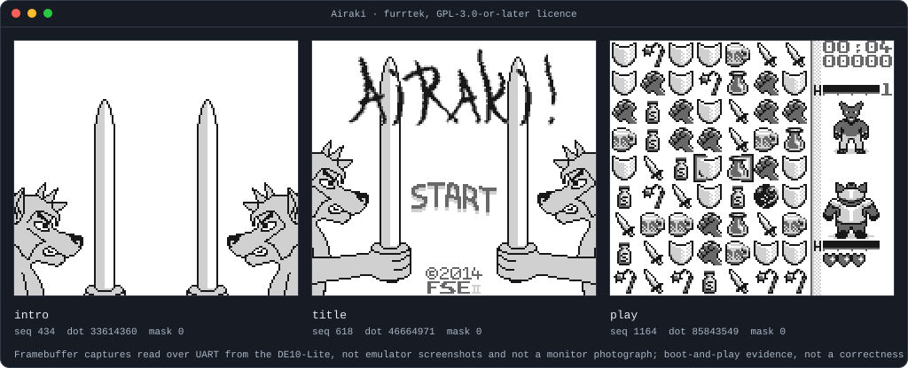
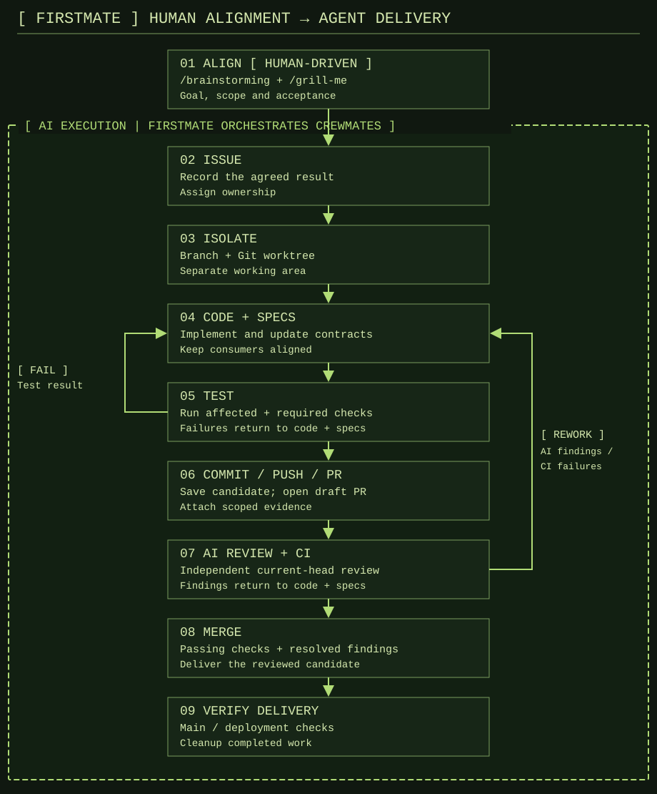
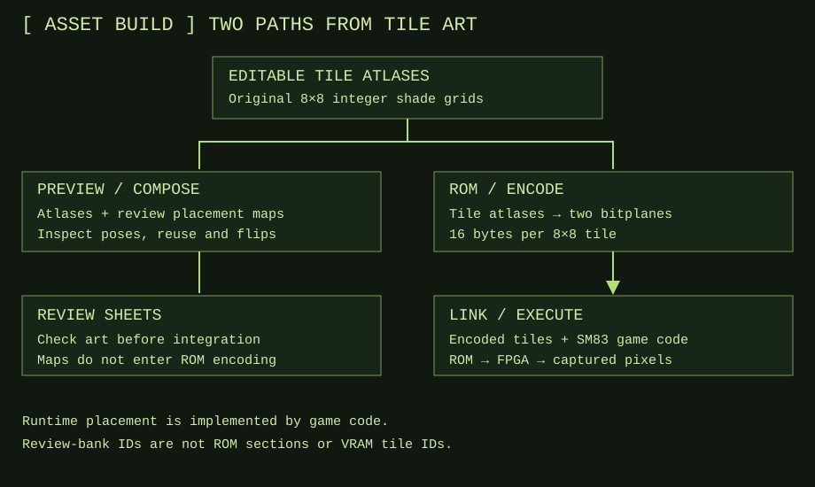

# The hard part is knowing it works

*Project retrospective · Amichai Ben-David · Evidence through 14 September 2026*

I am a chip design engineer at NVIDIA, previously at Intel. Earlier this month I
was away on reserve duty with no physical access to my desk. Before leaving I had
plugged a Terasic DE10-Lite into the wall, hung a UART adapter off it, and
installed a chat app on my phone. Over the following ten days AI agents built,
on that board, an original-DMG-compatible Game Boy: an SM83 CPU, the memory map,
the PPU, DMA, timers, interrupts and joypad, a VGA display path, a UART control
channel, an [assembler and linker](#software-stack), two original games, and a
launcher that loads any of them and hands you an on-screen pad.

<a href="../tools/n2m/host/LIVE_VIEWER.md"></a>

*My phone, showing pixels the board returned over UART. Not a photograph of a
monitor.*

That picture was the story I set out to tell, and it is the least interesting
thing here. Getting the work produced turned out to be the easy half. The whole
job — the part that consumed my judgement, and every hour I would call
engineering — was establishing that the work was actually right. This is an
article about how that confidence gets built, and the Game Boy is the setting
rather than the subject.

## The thing nobody warns you about

### Agents removed the bottleneck I expected and created one I didn't

I expected the constraint to be output. A module a day, maybe; the PPU would
take a week. That constraint disappeared almost immediately. A bounded change
with a written contract and a test came back in minutes, and it came back
plausible: correct package qualification, a sensible state machine, an
assertion, a passing simulation and a paragraph explaining the choice.

What replaced it was a question I had never had to ask at this rate. *How do I
know?* Not "does it compile" or "did the test pass" — those are cheap and the
agent answers them before I see the branch. How do I know that the test was
testing the right thing, that the contract it was written against was the
contract I meant, and that the passing result says something about the artefact
I am going to program onto a board.

Review is the classical answer, and it is still a good one, but reading rate is
a human constant. Production rate is not, any more. The gap between them is the
new bottleneck, and it does not close by reading faster. It closes by choosing
instruments that do not scale with my attention.

### Plausible is the failure mode, not broken

Broken is not the danger. Broken announces itself: the elaboration fails, the
assertion fires, the frame comes back blank. The dangerous output is the one
that is coherent, well-argued, internally consistent and wrong — and agents are
extraordinarily good at producing exactly that, because coherence is what they
optimize.

Three of the most expensive mistakes in this project were mine, not the agents'
(<a href="#my-mistakes">below</a>), and every one of them had that shape. Each
was a sentence I wrote that read perfectly, that an agent implemented
faithfully, and that was wrong in a way no amount of care in the implementation
could have recovered. A plausible specification propagates perfectly. That is
the whole problem in one line.

So the interesting question stops being "how do I get more code" and becomes
"what instruments can find a mistake that my own reasoning cannot see". There
are only a few, and they are different in kind from each other: a test that does
not share my assumptions, a reader who is trying to break my argument, and
occasionally a human being standing in front of the hardware. The rest of this
article is about those three.

### What this project is, briefly

<a id="the-project"></a>nand2mario is an original-DMG-compatible Game Boy
implemented in SystemVerilog for the DE10-Lite, with VGA video, UART loading and
control, an original SM83 software toolchain and original games. It targets the
monochrome DMG family under the [project charter](../src/project-charter.md): a
32 KiB mapperless profile with no cartridge RAM, and silent output — the audio
registers are served so the CPU never faults, but they are never powered and
nothing is synthesized. Gameplay stays in software; the FPGA
implements the platform, not the game. The [appendix](#appendix) describes what
got built and links the owning specifications; the [README](../../README.md) is
the entry point for the repository itself.

The work is done by agents under rules that live in the repository. One
orchestrator is my single point of contact. It selects an issue and delegates it
to a <a id="crewmate"></a>**crewmate** — this repository's word for a
subordinate agent working one bounded task in its own Git worktree, under the
caps in [AGENTS.md](../../AGENTS.md#work). A different crewmate reviews the
result before it merges. I borrowed that single-contact shape from Kun Chen's
[Firstmate](https://github.com/kunchenguid/firstmate); "firstmate" is my word
for the pattern, not repository vocabulary.

<a id="spec-driven"></a><a id="issue-driven"></a>Two words carry most of the
weight in what follows. **Issue-driven** means every change begins as one GitHub
issue stating a single observable result and three to five checkable success
criteria; nothing gets built that is not an issue first. **Spec-driven** means
the behaviour itself is owned by a written specification in the wiki, beside the
code, and the implementation and its tests are judged against that document
rather than against the author's summary. The two together mean something
specific and, as it turns out, dangerous: the artefact an agent implements is a
document I wrote. Everything downstream inherits whatever is in it.

## Your own tests share your misunderstandings

### Self-consistent wrongness

Suppose I misread the Game Boy's OAM DMA timing. I write that misreading into a
specification. An agent implements the RTL from that specification. Another
agent writes the reference model from the same specification, and a third writes
the directed tests.

<a id="reference-model"></a>A **reference model** is an independent software
implementation of the same contract, which a test compares the hardware against.
<a id="directed-tests"></a>**Directed tests** are hand-written stimulus aimed at
one named behaviour, with the expected result written out by hand. Both are
strong instruments and both are, here, downstream of my sentence.

Every one of those checks passes. They agree because they descend from the same
sentence. The test suite is not measuring the hardware against the Game Boy; it
is measuring the hardware against my reading of a document, and it will keep
reporting green for as long as that reading stays consistent with itself. More
tests of the same kind do not help. They inherit the defect along with
everything else.

This is not a hypothetical worry about agents. It is the ordinary condition of
any verification effort where one person's understanding seeds both the design
and its checks. Agents make it sharper only because they make it cheap to
produce a great deal of self-consistent material very quickly, and because they
will not push back on a premise the way a colleague might.

### Our own games can't catch a mistake they were built on

The two games this repository builds — Springtrail, a scrolling platformer, and
Stackdrop, a falling-block game — are ordinary SM83 software, deliberately. No
game-specific hardware path exists; nothing in the RTL knows what a courier is.
That was the right call, and it is not enough.

Springtrail was written by agents against the same interface documents as the
hardware it runs on. If the documents are wrong about JOYP, the game reads JOYP
the wrong way and the hardware implements JOYP the wrong way, and the courier
walks. A playthrough that reaches the WON screen proves that two halves of one
misunderstanding fit together.



*Real frames read back from the board over UART, shown as an animation of
selected checkpoints — and exactly the kind of evidence that cannot rule out a
shared mistake, because the game and the hardware were built from the same
documents. The [capture
provenance](../showcase/README.md#current-springtrail-state-comparison) records
what was compared.*

### Independence has two axes: the oracle and the stimulus

<a id="oracle-and-stimulus"></a>It took me longer than it should have to see
that "independent test" is not one property. It is two, and they are bought
separately.

The **oracle** is whatever says the answer is right. The **stimulus** is
whatever drives the design. A test can have an independent oracle and captive
stimulus, or captive oracle and independent stimulus, and those two combinations
fail in completely different ways.

The [SameBoy adapter](../src/dv/baseline/SPEC.md#independent-emulator-and-retirement-traces)
in `src/dv/sameboy/` buys the oracle, and buys it deeply. It runs the pinned
third-party SameBoy core `213a12ce` alongside the design and compares ordered
retirement traces.

<a id="retirement-trace"></a>A **retirement trace** is the stream of
`(epoch, sequence, kind)` records that each completed instruction or interrupt
entry emits, serialized over an ABI both sides share. The adapter checks every
architectural value, every fetched byte and every completed-dot count exactly,
plus every visible pixel before VGA conversion, and fails at the first
difference. That is far stronger than "the game booted". If my reading of the
CPU is wrong, SameBoy's reading disagrees at the first instruction where it
matters.

But SameBoy runs *our programs*. The stimulus is still ours. It exercises the
paths Springtrail happens to take, in the order Springtrail happens to take
them. An unusual sequence nobody here thought to write is invisible to it, no
matter how good the oracle is.

The [Mooneye targets](../../src/dv/mooneye/README.md) buy some of both, and buy
very little of either. They run one case — `acceptance/bits/reg_f.s` from a
third-party hardware acceptance suite — with `mooneye-corrupt` and
`mooneye-missing` as fault-injection variants of that same case, there to prove
the checker can fail rather than to widen coverage. One case is one case.

### What it costs to buy the other axis

Foreign stimulus is what the repository was missing, and homebrew games are how
you buy it. Eight freely licensed Game Boy games by eight authors who have never
seen this project, each pinned by SHA-256 and fetched at run time, none of their
bytes committed. They drive the CPU, PPU, timers, interrupts, joypad and memory
in combinations nobody here chose, for reasons nobody here knows.

The oracle you get in exchange is crude. There is no [reference
model](#reference-model) for somebody else's game, so no pixel is compared
against an expectation. All you learn is what the board displayed, not that it
displayed the right thing. That is a real and severe limit, and it is the price
of the axis.


*Springtrail and seven third-party images, every frame read back from the board.
The ninth cell is not a game: it says what the picture leaves out, which is the
only reason the picture can be published on its own.*

The right way to describe this is "widen", not "deepen" and certainly not
"first". The repository already held the design at arm's length twice, narrowly.
Eight full games make the narrow thing wide. They do not make it deep, and they
localize no fault: a game that plays tells you nothing about *where* a defect
would be if there were one.

## The two games that didn't run taught me more than the six that did

### Six played, two never drew a frame

Of the eight homebrew images, six boot and play: Airaki, GB Wordyl, Max Pirate,
Alien Invasion, Square Fall and Unstoppable Knight. Counting Libbet and the
Magic Floor, which the project had run earlier, seven of the nine pinned
third-party images play. Each capture is a `host snapshot`: the packed 160×144
framebuffer the board returned over UART in a recorded session, with the loaded
image's SHA-256 verified and all 32,768 bytes read back before the run.



*furrtek's Airaki, pinned by digest, playing on this hardware. Nobody here chose
which registers it touches or in what order.*

The six that played were satisfying. The two that didn't are the reason the
exercise was worth doing.

### Wyrmhole and Rex Run never turn the LCD on

Wyrmhole and Rex Run both load, both execute, and neither ever produces a frame.
`SNAPSHOT` answers `NO_FRAME`. The board reported `LCDC`, `STAT`, `LY` and `BGP`
all `0x00` throughout, while the [retirement](#retirement-trace) counters
climbed steadily — a CPU that is very busy doing nothing.

Each ROM says why, and both say the same thing. Both wait for the LCD *before*
they enable it:

- **Wyrmhole**, at `0x6370`, immediately before the `LCDC` write at `0x6377`
  that is first on its init path: `LDH A,[rLY]` / `CP 144` / `JR C,-6`, then
  `XOR A` / `LDH [rLCDC],A`. It polls `LY` until VBlank so it can switch the LCD
  off safely. With the LCD already off, `LY` is parked at 0. This is the only
  `LY` read in the image; it writes `LCDC` in four other places, all past this
  point.
- **Rex Run**, at `0x117A`: `LDH A,[rSTAT]` / `AND 3` / `CP 1` / `JR NZ,-8`,
  then `LDH A,[rLCDC]` / `AND 0x7F` / `LDH [rLCDC],A` at `0x1186`. It waits for
  `STAT` to report mode 1, which the mode field never reports while the LCD is
  off. The three instructions at `0x1174`–`0x1179` are `LDH A,[rIE]` / `AND 0` /
  `LDH [rIE],A`, so interrupts are masked and nothing can break it out.

### This wasn't a bug, it was a contract difference

A real DMG's boot ROM hands control to the cartridge with `LCDC` = `0x91`, the
LCD already running, so both loops exit on their first iteration there. This
platform has no boot ROM. Its <a id="entry-state"></a>**entry state** —
`dmg-direct-v1`, the register and memory condition a program finds when it
starts here,
[defined](../src/rtl/interfaces/MAS_interfaces.md#direct-entry-and-reset) in the
interface contract — begins with the LCD and audio off, and the contract says in
so many words that this is *not* a claim about DMG power-on or Nintendo
post-boot state.

So both games are correct for the machine they target, and this machine is
correct for the contract it declares. It is not a PPU defect, not a CPU defect
and not a timing defect. It is a documented difference between two entry states,
and these two games are the first third-party code to depend on it. The other
six enable the LCD themselves before waiting on it, which is why they are
unaffected.

Closing the gap would mean entering third-party images with the post-boot
register state instead of the project's own. That is a change to the entry
contract, not a bug fix, and nothing here proposes it.

### Only foreign stimulus could have found it

This is the part I keep coming back to. No test in this repository could have
produced that finding, and not because the tests are weak.

Our own games start by enabling the LCD, because they were written against [the
same entry contract](#entry-state) the hardware implements. The [SameBoy
adapter](#oracle-and-stimulus) applies the same documented `dmg-direct-v1`
initial state on both sides by design — that is what makes the comparison valid
— so the difference cancels exactly. The Mooneye case does not touch the LCD. A
[directed test](#directed-tests) would have had to be written by someone who
already suspected the answer.

The finding required a program written by a stranger, for a slightly different
machine, that happened to care. That is not a gap in our test plan that better
planning would have closed. It is structurally outside what stimulus we author
can reach, which is the entire argument for buying the other axis.

### How I knew it was really the loop

"Retirements climb steadily, consistent with a tight polling loop" would have
been a reasonable place to stop, and it would have been much weaker than what
the numbers actually support.

Each sampling interval is 60 frames: 4,213,440 dots. Wyrmhole's loop is three
instructions costing 12 + 8 + 12 = 32 dots. Rex Run's is four costing 12 + 8 + 8
+ 12 = 40. Both divide the interval with **remainder zero**: 4,213,440 ÷ 32 =
131,670 whole iterations, and ÷ 40 = 105,336. Multiply by instructions per
iteration and the predictions are 395,010 and 421,344 retirements. The board
reported exactly those figures, on every interval — three intervals for
Wyrmhole, two for Rex Run, with no variation.

A zero remainder leaves no room for a partial iteration, and no room for any
other instruction anywhere in those 4.2 million dots. That is stronger than a
consistent rate: across the whole observation each CPU executed that loop and
nothing else. The two figures are also mutually exclusive. Wyrmhole running Rex
Run's loop would have retired 421,344 per interval; Rex Run running Wyrmhole's
would have retired 395,010. Each read its own.

I like this because the confidence came from arithmetic that could have failed.
Had the remainder been 17, or had one interval read 395,013, the explanation
would have been wrong and I would have known immediately. A claim that cannot
come out wrong is not evidence, and most of the work of verification is
arranging for claims that can.

## Review catches what tests structurally cannot

### Three stuck buttons in one tool

The on-screen gamepad is a small Python window. You click or press keys, it
writes a button mask to the board over UART. It is about as simple as a tool in
this repository gets, and it shipped three separate defects that all had the
same symptom: a button the board thought was still held.

**One.** A constant `MODIFIERS = 0x4 | 0x8 | 0x20000` filtered out key events
carrying modifier bits. Tk's `0x8` was read as Alt. On Windows it is Mod1, and
Windows latches NumLock into Mod1. The filter applied only to key-downs, so with
NumLock on, every press was discarded and every release sailed through. I hit
this myself: the mouse buttons worked and the keyboard did nothing.

**Two.** Windows reports right Shift's press as `Shift_R` and its release as
`Shift_L`, both on keycode 16. Only `Shift_R` was mapped, and the keycode
fallback could not rescue the release, because keycode 16 is `VK_SHIFT` and was
not among the eight button codes. The press registered, the release vanished,
and Select stayed on at the board until the window lost focus or exited.

**Three.** In the launcher, the Back control was wired `back=show_menu` — go to
the menu, and nothing else. No release at all. With the pad panel destroyed,
neither the key-up path nor the focus-loss release that the previous fix had
added could rescue a held button.

### Each one shipped through a hole no test could see

The pad's tests are not thin. They run against a fake endpoint with no board and
no window, and they cover the button logic directly.

The first two defects lived in `edge`, a pure function the tests call. But every
test passed `edge` a state value it had chosen itself — `0`, or a deliberate
Ctrl or Alt bit — and no test used a state value a real Tk window had produced.
For the Shift pair, every test fed `edge` a keysym it had chosen, and none
modelled a press and a release arriving under *different* keysyms, because it
had not occurred to anyone that they could. The third defect lived inside a
widget callback, and a window cannot be asserted headlessly at all.

That is the honest shape of it, and it generalizes past this tool. A test suite
can only disagree with the author along axes the author thought of. Where the
real input comes from outside the program — a window manager, an operating
system's idea of which keysym a key release carries, another person's ROM — the
suite is testing a model of the world that the author also wrote.


*Both halves matter. A checker nobody has watched fail is a checker with an
unknown failure mode, which is why the fault-injection targets exist at all. It
still cannot cover an input it never receives.*

### The fix was structural, not vigilance

The tempting response to three bugs in one place is to be more careful. That
does not work, and it does not survive the next author.

What actually changed was where behaviour is allowed to live. The pad's widgets
moved into a `PadPanel`; the meaningful work stayed in a display-free `Driver`
the tests drive directly; and Back's behaviour became a `leave_pad` function
called by a one-line binding rather than written inside one. The rule the tool's
page now states is blunt: a window cannot be asserted headlessly, so behaviour
does not live in the widget layer.

That is not a promise that the next defect will be caught. It is a reduction in
the size of the surface that testing structurally cannot reach, to something
small enough to name and small enough to read in one sitting. That is the
realistic goal — not eliminating the untestable region, but shrinking it until
review can cover what is left.

### An adversarial reader is a different instrument from a test suite

A reviewer is not a slower test. It is a different measurement entirely. A test
asks "does this behave as specified"; a reviewer can ask "is this the right
specification", "is this number actually what you measured", and "does your
evidence support the sentence you wrote". None of those questions can be
automated here, and all three found real problems.

The reviewers in this project are agents — a different [crewmate](#crewmate)
from the one who wrote the change, reading the current commit against its
contract. It works because the reviewer has no investment in the author's
framing, not because it is smarter. Independence of the reader is the same
purchase as independence of the oracle, made on the other side of the loop.

### When the reviewer was wrong

The best example I have of review working is one where the reviewer was
mistaken.

Adding a row of footer text to the games gallery came down to how much vertical
clearance was left below the tiles. The author's pull request gave a number. The
reviewer checked it, found it wrong, and filed a correction as minor, because
the margin turned out *larger* than claimed and so the decision held either way.
The author then checked the reviewer and found that both had measured the wrong
element: the binding one was the bottom row's tile credits, and the real
clearance was 18px — exactly one line of leading, and less than half of what
either party had stated.

The decision still stood. But it stood on a much tighter margin than anyone had
believed, and that number is now a comment in the generator beside the
coordinate it constrains. Neither the author nor the reviewer had it alone; the
exchange produced it. That is why "the reviewer approved it" is a weaker
statement than "the reviewer and the author disagreed about something specific
and resolved it."

## I wrote the bug three times

<a id="my-mistakes"></a>Under [spec-driven, issue-driven](#spec-driven)
development, the artefact an agent implements is a document. Mine. Three times
in this project the document was wrong, and each time the agent did exactly what
it said.

### My acceptance criterion named a module that isn't in the product

Issue #426 asked for host memory reads from a paused board. One of its success
criteria said the OAM late-write path must be shown not to straddle a pause, and
it named the module: `n2m_oam_late_write.sv` advances its phase machine on
`clk_sys` with no `gb_tick` gate, so either a write in flight when `paused`
asserts must be proven to complete before a host OAM read is accepted, or reads
must be held off until that machine is idle, with an assertion covering
whichever rule was chosen.

That is a precise, checkable, satisfiable criterion about a module that is never
instantiated in the product hierarchy. It appeared in a board source list, but
nothing in `src/rtl` or `src/fpga` instantiates it; its only two instantiation
sites are a testbench and a verification system. An agent could have satisfied
the letter of that criterion completely, closed the issue, and left the board
exposed.

The real owner of the hazard is `n2m_dma_service`, whose slot counter advances
every `clk_sys` edge ungated by `gb_tick`, so a started job can straddle a pause
for up to 22 cycles. The author of [PR
#436](https://github.com/amichai-bd/nand2mario/pull/436) found this, led the
pull request with it, and fixed the actual hazard instead — threading an
`oam_sequence_active` signal through to a peek-ready gate, with assertions on
both rules. The pull request says plainly that this reaches outside the issue's
stated scope. A follow-up later moved the misleading module out of the product
source lists entirely.

I want to be precise about what saved this. Not a test: a test against my
criterion would have passed. The author read the criterion, went looking for the
module in the hierarchy, and did not find it.

### My ordering made the game uncontrollable

Issue #538 added stepped execution to the remote viewer, and I specified the
per-cycle ordering: freeze the input batch, execute each press with its release
verified, advance the step, take one complete snapshot.

That order is correct for free-run, where dots are advancing continuously and a
bounded press lands inside them. It is wrong for stepped, and wrong in a way
that is obvious once stated. With the core halted, a press applied and then
released before the step advances is applied and released across *zero* emulated
dots. The game never observes it. `HOST_REG_INPUT` is a plain button mask with
no pending-press latch — there is nothing to hold the edge until time moves.

An agent implemented that specification faithfully and produced a game that
cannot be played. Independent review of [PR
#543](https://github.com/amichai-bd/nand2mario/pull/543) found it, with an
endpoint trace showing the press and the release both occurring while paused and
before any dots ran, and wrote the conclusion better than I would have: stepped
mode does not make a gravity game playable, it makes it uncontrollable. The fix
is press, step with the mask still held, release and verify — the order the
project's own play script had been using all along.

The detail I find most instructive is why the tests passed. The only press that
ever reached the game was one sharing a batch with a free-run-to-stepped
transition. No test issued a press while already stepped. The suite covered the
feature and missed the only case the feature exists for.

### My scope change lived in a chat message and not in the issue

Issue #556 specified a local on-screen gamepad that would decode and display the
board's framebuffer, step by default, and report stale frames. Partway through I
decided to drop frame display, and with it stepped mode, and I told the author
so in a message.

I never wrote it into the issue. The issue's timestamps show it: last updated 23
seconds after creation, zero comments, while the tool being built had no frame
display at all. Three of its eight success criteria were unmet as written, and
`Closes #556` would have closed an issue describing a different tool than the
one that shipped.

Independent review of [PR
#558](https://github.com/amichai-bd/nand2mario/pull/558) caught it and blocked
on it. The issue was then revised, with a note recording that the revision
should have been made when the decision was taken. The review also flagged
residual stale sentences in the revised text, which is its own small lesson
about how hard it is to edit a document back into agreement with reality once it
has drifted.

### Where the authority actually sits



*Alignment is the human-in-the-loop step: the goal, the scope and what will
count as done. After that the agents own the issue, the worktree, the code and
specs, the tests, the pull request, the independent review and the merge. Failed
tests and review findings go back to code without asking me. Only a change to
the agreed scope comes back up.*

Three failures, one cause. In every case the code was right against the document
and the document was wrong, and no amount of care downstream could have
recovered it.

This is the part of agent-driven development I was least prepared for. I came in
assuming my job was to check the output. It is not, or not mainly. My job is the
input, and the input is unusually load-bearing because agents do not push back
on a premise the way a colleague does. A human engineer handed criterion 426
would probably have muttered "wait, is that module even in the build?" — which
is exactly what the author agent eventually did, but only because the workflow
gave it standing to say so and a reviewer to say it to.

So the practical conclusion is not "write better specs", which is advice nobody
can act on. It is that the specification needs the same adversarial reading as
the code, from someone whose job is to disbelieve it. All three of these were
caught downstream of me, by an author who read past the wording or a reviewer
who checked an issue's edit history against a pull request's claims. That is the
control that matters, and it is cheap. It is much cheaper than the board being
wrong.

## Three moments needed a person

Almost everything in this project was done by agents, and I have tried to be
honest about how little of it needed me. But three moments did, and they are
worth separating out, because what they have in common is specific.

### Pressing KEY0

The DE10-Lite's `board_reset_n` comes from the onboard KEY0 button. Bring-up
established that the released level is not inverted — the design came out of
reset and answered over UART, which proves that much. But the asserted direction
had never been exercised. Nobody had pressed the button. The [bring-up
page](../src/board-bring-up.md) said so in as many words: unverified, needs
physical presence.

So I pressed it, and reported what I saw, which was that the monitor went dark
and did not recover. My first reading was that I had broken something.

I had not. That is the specified behaviour. `board_reset_n` drives the clocking
block's global reset, which reaches the whole system; global reset clears
transport state, frame ownership, mailbox phases, valid flags and counters, and
the display path drives RGB zero with sync inactive until a complete frame
exists. With the emulated state cleared and no image loaded, there is no frame,
so the screen stays black. The dark screen *was* the answer. The asserted
direction works.

I am recording this while [issue
#512](https://github.com/amichai-bd/nand2mario/issues/512) is still open and the
bring-up page still says nobody has pressed it, because the observation has not
been written back into the wiki yet. That is a real gap in the record, and it is
the correct place to mention it rather than round it off.

### Looking at a monitor

Every VGA test in the repository passes. Raster geometry, buffer ownership, bank
reuse, active-swap failures, source-to-VGA RGB replicas with canonical CRCs,
block-RAM inference, constrained timing. A frame could be scanned and read back
over UART and compared pixel for pixel. None of it answers whether a physical
monitor, fed by this board's actual analogue output, displays a picture.

[Issue #417](https://github.com/amichai-bd/nand2mario/issues/417) asked exactly
that question, and no agent could answer it. It closed when I connected a
monitor and looked. That single observation also closed GAP-006 — the clock,
reset and CDC gap in the preflight register, open since the register was created
on 4 September, roughly nine days in all, and the last P0 blocker in it to
close.

The record is careful about what this bought: one direct visual observation, for
one bitstream, one image and one monitor. Not a timing measurement, not a signal
quality measurement, and not tolerance across displays, which stays open in a
separate gap. That is a small claim. It was also the only claim that a simulator
was structurally unable to make.

### Capturing keystrokes from my own window

When the gamepad ignored my keyboard, no agent could reproduce it. The tests run
against a fake endpoint with no board and no window, and the behaviour depended
on what a real Windows Tk window puts in a real event.

So I captured the events from my own window and pasted them in. `state=0x00008`
on the key-downs. The same bit on `Shift_R`'s press, and `state=0x00009` with
keysym `Shift_L` on its release, both on keycode 16.

Those few lines found not one defect but two. The `0x8` explained the dead
keyboard. The `Shift_R` / `Shift_L` pair was something nobody was looking for,
and it was the worse of the two: a dead keyboard is obvious and a Select button
silently stuck on at the board is not. The resulting issue is titled for both,
because both were in the same capture.

### What that says about the division of labour

The three moments have one structure. Each required an observation that no
amount of reasoning, simulation or code could produce, because the fact being
observed lived outside the system's model of itself: a physical button, an
analogue display, an operating system's event stream.

That is a small and well-defined class, and it does not grow with the size of
the project. It is not "the human checks the agent's work" — I was a poor
checker and the record shows it. It is "the human is the only available
instrument for a few specific measurements". Knowing which measurements those
are, in advance, is worth more than a general commitment to supervision, because
a general commitment gets spent on the ninety-nine occasions where it adds
nothing and is exhausted by the hundredth.

## Evidence has to survive being copied out of context

### A picture travels without its caption

The games gallery is an animated SVG. It is exactly the kind of thing that ends
up in a post, a chat, a slide, with the caption stripped off. So it has to be
true standing alone, and everything it implies has to be true too.

Its title strip reads "Eight of the games that run on the DE10-Lite", not "the
eight games". That is a deliberately weaker sentence: eight tiles are not a
total, and saying "eight games run here" would have been false, because
Stackdrop also runs and has no capture archive to draw a tile from. The ninth
cell is not a game at all. It is a panel headed "Not the complete set" that
names Stackdrop, names Wyrmhole and Rex Run as pinned images that load and
execute but never enable the LCD, and states that seven of the nine pinned
images play.

Building the disclaimer into the artwork rather than the caption cost one cell
in a three-by-three grid. The alternative was a picture that told a small lie
whenever it travelled, which is most of the time.

### Understating your own rigour is the same error as overstating it

An earlier draft of the paragraph explaining why other people's games are
evidence said the homebrew games gave independence "our own tests structurally
cannot have". It read well and it was false. The [SameBoy
adapter](#oracle-and-stimulus) and the Mooneye targets already provide exactly
that kind of independence — narrowly, but they provide it — and the repository's
own specification says so.

Review blocked on it. The corrected sentence is that the repository already
holds the design at arm's length twice, narrowly, and eight full games *widen*
it. The gallery's own footer changed a single word, from "our own tests cannot
give" to "our own games cannot give", which is the true statement.

I want to name this failure mode precisely, because I think it is
under-discussed. Modesty is not automatically safe. "We had no independent
check" is a claim about the world, and it was wrong, and a reader who believed
it would have concluded that a CPU trace comparison against a pinned third-party
emulator did not exist. An overstatement invites unwarranted trust; an
understatement hides a real control and makes the eventual accurate description
look like a retreat. Both are errors in the same direction: the record no longer
says what is true.

### Attested versus captured

In [PR #546](https://github.com/amichai-bd/nand2mario/pull/546), one of the
success criteria was that Stackdrop could be played through the authenticated
viewer. I played it, in both viewer modes, over the tunnel, and reported that it
worked. No frames were retained.

The pull request does not say the criterion was demonstrated. It says the row
clear is evidenced by retained artifacts, and the viewer play is **attested, not
captured** — and separately, that no frames of the owner's viewer play were
retained and none are cited. That distinction survived review, because review
had blocked on the criterion being claimed more broadly than the evidence
showed.

Three words. They are the difference between a record that can be checked later
and a record that is a memory of mine wearing the clothes of evidence. I am the
owner of the project; my say-so is worth something. It is not worth a frame
hash, and the record should not let a future reader confuse the two.

### Boot-and-play is not a correctness proof, and saying so costs nothing

The homebrew page could have said that other people's games run correctly on
this hardware. Instead its second paragraph says the opposite of
what a marketing instinct wants: this is boot-and-play evidence, not a
correctness proof; no [reference model](#reference-model) exists for any of
these games, so no pixel here was compared against an expectation; the record
says what the board displayed, not that it displayed the right thing.

Every one of those sentences reduces the apparent achievement, and none of them
reduces the actual achievement by anything at all. What they buy is that the
remaining claims can be relied on. A page that has already told you what it
cannot prove is a page you can read quickly, because you no longer have to
discount it.

That is the whole return on honest evidence, and it compounds. The cost of
writing "attested, not captured" is three words once. The cost of a record you
have to audit before trusting is paid on every future reading, by everyone.

## What I'd carry into the next one

### Write the failure into the record, not around it

The two games that never draw a frame are the most valuable result on the
homebrew page, and they are the one section with no picture in it. The reviewer
who measured the gallery's clearance was wrong, and writing that down rather
than quietly correcting it is why the generator now carries the right number
beside the coordinate it constrains. My three specification mistakes are in this
article because a record containing only successes is not a record without
failures; it is a record whose failures are unaccounted for.

This is not a moral point. It is that the alternative costs more. An incident
written down honestly is a control for next time. An incident rounded off is a
thing you will do again, plus a record you now have to discount.

### Three human moments beat three hundred supervised ones

The most surprising number in this project is three. Three occasions where a
person was genuinely required, across ten days and roughly three hundred merged
changes. I spent far more attention than that, and most of it bought nothing,
because I was reviewing code — which [reviewers](#crewmate) do better than I do
at that volume — instead of doing the two things only I could do: getting the
specification right, and standing in front of the hardware.

I would not describe any of this as trusting the agents. Trust is not the
mechanism and it is not the goal. What I have instead is a set of instruments
that can each come out wrong: a foreign program that can hang, a reader whose
job is to disagree, arithmetic with a remainder that could have been nonzero,
and occasionally my own eyes on a monitor. Confidence is what those produce when
they are pointed at different things and none of them fails. That is what
verification has always been. What changed is only that producing the work is no
longer the expensive half.

<a id="appendix"></a>

## Appendix: what actually got built

[The system](#the-project) is a DMG-family Game Boy in SystemVerilog on the
DE10-Lite: SM83 CPU, memory map, PPU, DMA, timer, interrupts, joypad, UART and a
VGA display path, with 25 MHz as the system architecture. The 25 MHz choice was
for timing closure and it preserves the emulated 4.194304 MHz Game Boy tick —
the game is not sped up. Programs run as ordinary SM83 software through normal
Game Boy interfaces, and UART controls converge with physical controls at the
same joypad boundary, so software needs no private host MMIO. The
[README](../../README.md) and the [ownership map](../ownership.md) are the entry
points; [repository statistics](../project-statistics.md) hold size and delivery
measurements, which measure activity and not correctness.

### The software stack

<a id="software-stack"></a>The repository builds its own SM83 toolchain rather
than depending on a prebuilt image, and five pieces of it are referred to
throughout this article. The **assembler** turns SM83 source into objects with
symbols, sections, expressions and relocations. The **linker** resolves them and
the **packager** emits a 32 KiB mapperless ROM. The **builder** —
`tools/build.py` — is the single entry point that drives software builds,
simulation, the test catalogue and FPGA compilation, recording deterministic
manifests, hashes and logs as it goes. The **host tools** own UART: loading with
full byte-for-byte readback, execution and pause control, register and memory
inspection, input masks and frame snapshots. The contracts are the [build
specification](../tools/n2m/SPEC.md) and the [software-toolchain
specification](../tools/sw/SPEC.md).

The toolchain is checked against a pinned independent RGBDS oracle, which is the
same purchase as everything else here: an assembler that agrees only with itself
is not an assembler you can debug against.


*Recorded command output, not a live terminal; the [session
notes](../showcase/README.md#build-and-tests) say which fields were shortened.*

Two games are built here. [Springtrail](../src/sw/springtrail/SPEC.md) is a
silent monochrome scrolling platformer with walking, running, jumping,
collision, pause, retry and win states, collectibles, an enemy and a HUD.
[Stackdrop](../src/sw/stackdrop/SPEC.md) is a falling-block game. A
[launcher](../tools/n2m/host/LAUNCHER.md) lists every image the board can run —
both of ours and every pinned third-party image, with Wyrmhole and Rex Run
listed and marked as not booting rather than hidden — then loads the chosen one,
resets it, runs it and hands over to an on-screen pad in the same window and the
same UART session.


*Recorded command shapes, not a live capture.*

### RTL: make register intent visible

I cared what the code looked like, not only whether it passed. Modules use
explicit boundaries and package-qualified declarations, so the owner of a type
is visible where the type is used, without a wildcard import dragging an
implicit set of names into scope:

```systemverilog
n2m_cpu_pkg::cpu_execute_request_t execute_request;
n2m_cpu_pkg::cpu_execute_result_t execute_result;
```

Registers go through named macros carrying the clock, reset and enable contract.
This line from the [tile decoder](../../src/rtl/display/dmg_tile_pixel.sv) is a
rising-edge register with reset taking priority over enable:

```systemverilog
`DFF_RST_EN(valid_s1, valid_s0, clk, enable, reset, 1'b0)
```

The [macro definitions](../../src/rtl/common/macros.svh) hold the nonblocking
assignments; call sites express intent instead of repeating process boilerplate,
and separate forms cover the other reset and enable contracts. The convention is
recorded in the [RTL style reference](../src/rtl-reference-style.md), which
makes it a recurring review expectation rather than a preference I have to
restate.

### Memory: simulate the primitive we build

The shared [Intel RAM wrapper](../../src/rtl/common/n2m_intel_ram.sv)
instantiates `altsyncram` with MAX 10 and M9K selected, and that same instance
is compiled both for Questa against Intel's installed vendor model and for FPGA
synthesis. This matters more than it sounds. An extra output register would
change the consumer's latency, read/write collisions need an explicit contract,
and reset does not clear a physical RAM. The wrapper gates requests and validity
and checks illegal overlaps. Simulation preload feeds the vendor model an
initialization file through a simulation-only parameter path; it does not swap
in a zero-latency array. Fit and timing checks answer the separate question of
whether the composed hardware meets its physical constraints.

### Graphics: characters built from 8x8 tiles

Game artwork follows the hardware's native representation. An 8x8 tile is two
bits per pixel stored as two bitplanes: 16 bytes. Larger characters are composed
from pieces, and maps reference shared tiles with placement and flip
information, so a pose costs a handful of tile IDs rather than a bitmap. The
editable sources are integer shade grids and placement maps; the SVG sheets are
generated review views, not authoritative art.


*A review sheet, not an FPGA capture. The composed poses show which 8x8 pieces
are reused, which is how a shared-tile mistake becomes visible before it reaches
a ROM.*



*Previews check the art. Execution and captured pixels check its integration.
They are different questions, and the diagram keeps them apart.*

### Verification

Questa simulates the RTL and the vendor memories. Python and cocotb organize
stimulus, independent expectations and result processing, driving the simulated
UART with the product client rather than a private testbench path, so the tests
exercise the tool people actually use. Budgets are explicit: normally at most
120 seconds per simulation and 300 seconds for an ordinary pre-merge aggregate,
counting setup, build, run, checking and cleanup, with named exceptions that
have to be authorized in advance. A simulation must compile, elaborate, run
*and* check an expected result; a successful process exit is not evidence, and
an unexplained warning is a failure.

The [integration verification specification](../src/dv/integration/SPEC.md) owns
the tiers and what each one is allowed to conclude. It is the document that
decides whether any claim in this article is worth anything, and it is
deliberately not this article's job to summarize it.

### Repository layout

```text
src/
  rtl/       Synthesizable hardware and shared interfaces
  dv/        Verification, models, checkers and third-party adapters
  sw/        Original games and their editable assets
  fpga/      Board integration
tools/      Host clients, builds, software tools and wiki publishing
wiki/       Owning contracts, architecture, presentations and articles
.agents/    Reusable agent skills
worktrees/  Isolated issue checkouts; generated output in each workdir/
```

---

*Written with AI assistance from my own account of the project and from dated
repository evidence. Technical claims link to the source, test, issue or pull
request that produced them. This article is editorial history dated 14 September
2026; the linked specifications, not this page, define current behaviour.*
