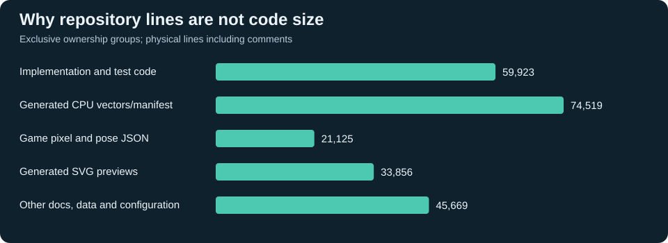
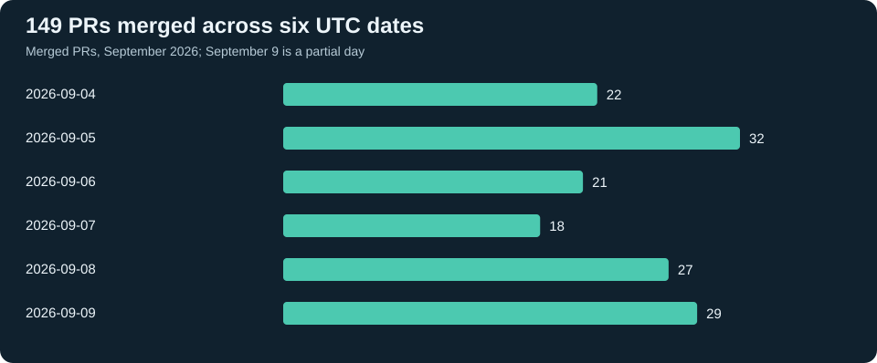
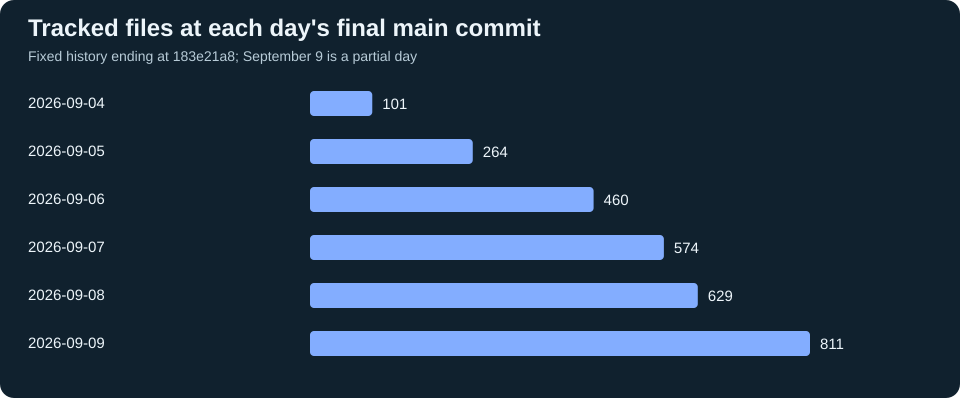

# Repository statistics

**811 tracked files, 153 main-history commits and 149 merged PRs across six UTC dates.**
The repository combines Game Boy RTL, independent verification, FPGA integration,
host tools, original game software, artwork and delivery automation.

This is a dated measurement, not a live dashboard or a completion estimate.
Source snapshot: [183e21a8](https://github.com/amichai-bd/nand2mario/commit/183e21a8e3e70cec96f5cb7afcf946ea80cbb036).
GitHub collection completed **2026-09-09T20:24:43.692734+00:00**; requests are sequential, not an atomic snapshot.
This page and its own delivery are outside the source snapshot.

## Size and disciplines

The tracked tree contains **235,092 physical lines**, **229,279 nonblank lines**
and **10,950,314 bytes**. These are repository text lines, **not 235,092 lines of executable code**.
JSON assets/fixtures, generated vectors and SVG previews contribute heavily.
Comments remain included; no language parser estimates statement counts.

The six implementation/test categories (RTL, FPGA HDL, DV code/fixtures, software
assembly, host implementation and host tests) total **59,923 physical lines in
516 files**. This includes comments and program fixtures; helper code under agent
skills belongs to its separate ownership category.



| Discipline | Files | Physical lines | Nonblank lines |
|---|---:|---:|---:|
| Agent skills and instructions | 63 | 2,069 | 1,695 |
| DV configuration, data and documentation | 56 | 22,324 | 21,823 |
| DV generated vector data and manifest | 3 | 74,519 | 74,519 |
| FPGA integration and proof HDL | 11 | 598 | 593 |
| FPGA metadata and documentation | 2 | 1,913 | 1,908 |
| FPGA timing constraints | 15 | 99 | 99 |
| Game pixel assets and pose data | 10 | 21,125 | 21,125 |
| Host tooling data and documentation | 21 | 4,633 | 4,608 |
| Host tooling implementation | 78 | 9,943 | 9,131 |
| Host tooling tests and fixtures | 66 | 8,322 | 7,501 |
| RTL HDL | 72 | 7,713 | 7,548 |
| RTL documentation and provenance | 6 | 796 | 669 |
| RTL verification code and program fixtures | 255 | 27,813 | 26,655 |
| Repository configuration and other documentation | 19 | 2,624 | 2,509 |
| Software assembly (including conformance fixtures) | 34 | 5,534 | 5,506 |
| Software metadata and documentation | 20 | 715 | 700 |
| Wiki documentation and presentations | 70 | 10,496 | 8,834 |
| Wiki generated SVG art | 10 | 33,856 | 33,856 |

Categories are exclusive path/type classifications defined by the collector.
Verification includes testbenches, reference models and fixtures; it is not product RTL.
Software assembly includes diagnostics and conformance programs as well as game code.
Generated declarations and original/external-derived data are not measures of handwritten effort.

## Directory structure

| Root directory | Files | Physical lines | Nonblank lines |
|---|---:|---:|---:|
| (root) | 4 | 265 | 228 |
| .agents | 62 | 1,931 | 1,578 |
| .github | 12 | 763 | 689 |
| cfg | 3 | 1,631 | 1,630 |
| src | 484 | 163,149 | 161,145 |
| tools | 165 | 22,898 | 21,240 |
| wiki | 80 | 44,352 | 42,690 |
| worktrees | 1 | 103 | 79 |

`worktrees/` here counts only its tracked lifecycle README. Actual agent checkouts,
ignored `workdir/` outputs, simulation logs, compiler installations and Git metadata
are excluded. No nonregular entries or binary files occur in this snapshot.

## File types

| Extension | Files | Physical lines | Nonblank lines |
|---|---:|---:|---:|
| (none) | 5 | 108 | 95 |
| .asm | 33 | 5,416 | 5,388 |
| .c | 3 | 190 | 186 |
| .css | 4 | 147 | 146 |
| .do | 3 | 165 | 165 |
| .html | 11 | 607 | 607 |
| .in | 1 | 2 | 2 |
| .inc | 1 | 201 | 201 |
| .js | 3 | 269 | 264 |
| .json | 49 | 99,330 | 99,329 |
| .md | 169 | 15,107 | 12,539 |
| .patch | 1 | 22 | 22 |
| .py | 264 | 27,457 | 24,897 |
| .rgbasm | 2 | 51 | 51 |
| .sdc | 15 | 99 | 99 |
| .sv | 204 | 26,400 | 25,964 |
| .svg | 10 | 33,856 | 33,856 |
| .svh | 4 | 24,085 | 24,069 |
| .txt | 7 | 815 | 690 |
| .yaml | 11 | 46 | 46 |
| .yml | 11 | 719 | 663 |

The `.sv` total includes both design and verification. The `.svh` total includes
large generated CPU test-vector tables. JSON line counts depend strongly on formatting;
SVG previews encode pixels as text, so neither should be compared with algorithm size.

## Growth and delivery timeline





| UTC date | Main commits | Merged PRs | Tracked files | Physical lines | Day snapshot |
|---|---:|---:|---:|---:|---|
| 2026-09-04 | 26 | 22 | 101 | 4,194 | [91140fc6](https://github.com/amichai-bd/nand2mario/commit/91140fc6249cffecbc5826ebb3aa46ba6e9cd1cf) |
| 2026-09-05 | 32 | 32 | 264 | 26,143 | [dae3dad8](https://github.com/amichai-bd/nand2mario/commit/dae3dad8bc45d6545935bef8dfd4a553c27579ca) |
| 2026-09-06 | 21 | 21 | 460 | 133,506 | [6371df65](https://github.com/amichai-bd/nand2mario/commit/6371df6514000fbdc3ba055350b2a0a9747e48cf) |
| 2026-09-07 | 18 | 18 | 574 | 151,978 | [214edc72](https://github.com/amichai-bd/nand2mario/commit/214edc725f47a95929c892b2095948d138e2e2d5) |
| 2026-09-08 | 27 | 27 | 629 | 160,224 | [c2279938](https://github.com/amichai-bd/nand2mario/commit/c2279938805731be5f02a6117a225fb34c7fcd32) |
| 2026-09-09 | 29 | 29 | 811 | 235,092 | [183e21a8](https://github.com/amichai-bd/nand2mario/commit/183e21a8e3e70cec96f5cb7afcf946ea80cbb036) |

Daily source size is measured at the last first-parent commit on that UTC date,
up to the fixed snapshot. A later removal can reduce size while improving the product.
Commits and PRs are separate counts: squash delivery hides author-branch commit churn.
All **153 reachable commits** are on the first-parent history in this snapshot.

## The issue-to-merge loop

The documented [agent flow](../.agents/skills/agent-flow/SKILL.md) connects an assigned
issue to an isolated worktree, draft PR, scoped checks, independent current-head
review, squash merge and cleanup. The user sets direction and approves artwork;
agents carry out implementation and review under that contract.

| GitHub measure at collection | Result |
|---|---:|
| Issues, excluding PRs | 165 |
| Closed / open issues | 150 / 15 |
| PRs: merged / closed without merge / open | 149 / 1 / 1 |
| Merged PRs targeting main | 149 |
| Merged PRs with a GitHub closing-issue reference | 144 / 149 |
| Distinct issues in those closing references | 143 |
| PRs merged within one hour of opening | 121 / 149 (81.2%) |
| Median PR open-to-merge | 11 min 37 sec |
| PR open-to-merge, 75th / 90th percentile | 45 min 3 sec / 2 hr 40 min 53 sec |
| Longest PR open-to-merge | 31 hr 59 min 59 sec |
| Median issue creation-to-current-closure, excluding reused #7 | 33 min 15 sec (149 issues) |

Closing references are GitHub metadata, not proof that every planned milestone is
finished. The other five merged PRs are the explicitly authorized checkpoints
PRs #162, #163, #167, #169 and #179 in the [PR policy](agents/pull-requests.md),
which preserve unfinished acceptance in their milestone issues. The
collector does not infer links from commit titles. PR elapsed time includes waiting
and review but **omits coding before the PR was opened**. Issue elapsed time can
include backlog and reopen cycles. Neither measures active agent time, test runtime,
human time saved or cost. Open work is absent from merged-PR duration samples.

Three concrete deliveries illustrate the loop:

| Result | Issue → PR | PR open-to-merge |
|---|---|---:|
| IF/IE interrupt registers | [#133](https://github.com/amichai-bd/nand2mario/issues/133) → [#145](https://github.com/amichai-bd/nand2mario/pull/145) | 26 min 27 sec |
| DMA/HUD graphics qualification | [#308](https://github.com/amichai-bd/nand2mario/issues/308) → [#313](https://github.com/amichai-bd/nand2mario/pull/313) | 30 min 58 sec |
| Approved core art and asset skill publication | [#309](https://github.com/amichai-bd/nand2mario/issues/309) → [#314](https://github.com/amichai-bd/nand2mario/pull/314) | 3 min 3 sec |

These are publication intervals, not end-to-end feature development times. PR #314
followed earlier artwork creation and user approval. Its [review record](https://github.com/amichai-bd/nand2mario/pull/314#issuecomment-5607898177)
provides a concrete current-head review example. A shared GitHub identity cannot
independently establish who authored each line; the page does not claim 100% AI authorship.

## Reproduce and interpret

The [read-only collector](../tools/wiki/repository_stats.py) and its
[collection contract](tools/wiki/SPEC.md#repository-statistics) define the counting rules.
Run the fixed revision to reproduce source totals; GitHub counters will reflect
the later collection time. Keep generated JSON under ignored `workdir/`.

```text
python tools/wiki/repository_stats.py --revision 183e21a8e3e70cec96f5cb7afcf946ea80cbb036 --output workdir/repository-stats --github --exclude-closed-issue 7
```

Git supplies regular tracked blobs directly, so local uncommitted files and line-ending
conversion cannot affect totals. Physical lines count decoded text lines, including
a final unterminated line; nonblank removes whitespace-only lines. UTF-8 text is
decoded without a leading BOM. Percentiles interpolate between adjacent sorted samples.
The GitHub query paginates issues and PRs and checks closing-reference truncation.
Issue #7 is reused for this page and excluded from issue-duration statistics.

For current product acceptance, use the [charter](src/project-charter.md),
[current phase](agents/bootstrap-plan.md#current-phase) and open issues. Size and merge
volume showcase the breadth of work; they do not establish hardware readiness,
feature completeness or correctness.
