# Showcases

Eight animated SVGs show what using the repository looks like. Three are the
README showcases the [project overview](../../README.md) embeds: a build and
test run, a board session over UART, and a Springtrail playthrough. Three are
terminal sessions the lesson decks
[Reproducible builds](../presentations/reproducible-builds.html),
[UART debugging](../presentations/uart-debugging.html) and
[Verification](../presentations/verification.html) embed as images: a prompt,
each command typed in, the output it really printed, the next command. Two are
on this page: Libbet and then Springtrail playing on the DE10-Lite, every frame
read back off the board.
All are generated by
[tools/wiki/showcase.py](../../tools/wiki/showcase.py); regenerate with:

```text
python tools/wiki/showcase.py
```

Every pixel of every other loop is drawn on the host. The two board loops are
the exception, and they are the only place the wiki shows a frame the FPGA
produced.

Each file is self-contained: CSS keyframes only, no script, no external
resource, so GitHub and the wiki decks play them as ordinary images. The authored SVG is
the finished still. Under a reduced-motion preference nothing animates and the
complete final state is shown. Text wraps at a column count sized for the
widest system monospace font GitHub resolves `ui-monospace` to (about 0.6em
per character on macOS/Linux, versus Consolas's 0.55em on Windows), so no line
is clipped by the 800px viewBox on any platform; long lines continue on the
next row, broken at a space or after a JSON separator so no field is cut. The
terminal loops type each command in one character at a time, at a fixed
per-character column, with one blinking block cursor that follows the
keystrokes and then waits on the prompt row while output prints, the way a
real shell session reads.

## Build and tests



Real command output captured in one session at commit `5ce0aa0` on
2026-09-11, from the author worktree with the ordinary Python 3.14 build
environment and the isolated Python 3.12.14
[DV environment](../../src/dv/python/README.md) for the simulation:

| Shown line | Source |
|---|---|
| `sw build springtrail --tag readme --json` | The printed JSON, keeping `attempt`, `cache`, `commit`, `rom`, `status` verbatim; `artifacts`, `inputs` and other fields are shortened with `…` |
| `python -m unittest tools.n2m.tests.test_core_art tools.n2m.tests.test_sprite_preview` | Complete unittest output |
| `check --tag readme` | Complete output; the same run in `--json` mode reported `"status": "PASS"` after `tools/n2m/tests` |
| `sim test python-joypad --tag readme` | Complete output of the first, uncached run; the cocotb summary line is the `grep -o` result from the retained `sim.log` |

## Board session



A recorded session, not a live capture, and no bytes were sent to a board for
this page. The command lines and every reply field follow the
[host command contract](../tools/n2m/host/SPEC.md) and the
[generated interface records](../cfg/interfaces.md); `--json` output prints one
sorted JSON object per command, shortened here with `…`. Values:

- `load` verifies all 32768 bytes; the image hash is the `image.gb` from the
  build above.
- `status` after a verified load reads `STATE` 0 (PAUSED), `IMAGE_VALID` 1,
  `PROFILE` 1 (direct) and `INPUT` 0, the checks `load` itself performs.
- Dots follow the [Springtrail timing model](../../src/dv/springtrail/milestone.py):
  the core pauses at dot 0 after load, `run-dots` executes exactly the requested
  count, and source frame 0 completes at 76964 + 65663 = 142627 dots, so the
  snapshot after 210672 dots reports `epoch` 2, `seq` 0 and that dot.
- `crc-proof` requires zero input, so the mask returns to 0 first; its result
  repeats the paused counters before and after the two-second silence.
- The endpoint build ID, the retirement counters, sequence tokens and frame
  hashes are elided as `…`.

## Game playthrough



Every pixel comes from the independent Springtrail references under
`src/dv/springtrail`: [hud_reference.image](../../src/dv/springtrail/hud_reference.py)
renders the frame for a game state, and
[interactions_reference.update](../../src/dv/springtrail/interactions_reference.py)
advances it. `showcase.story()` drives one scripted playthrough with the same
`update()` the reference model's own tests use: the title screen, a Start edge
(mask 128) into PLAY, a run (Right+B, mask 33), a jump (mask 49) that clears a
level gap, a pause and resume (mask 128 each), more running, and a collision
with the patrolling enemy that ends in RETRY. Asserts on the exact tick, mode,
`player.x` and `grounded` pin this sequence to the reference rules, so a
behavior change there fails the generator instead of silently drawing a
different game. Fourteen real states along that playthrough are rendered as
full frames (including the camera scroll `hud_reference.image` derives from
`player.camera`) and shown in sequence, each held long enough to read, with
the jump sampled at four points of its arc; the HUD word row
(`TITLE`/`PLAY`/`PAUSED`/`RETRY`) is part of every rendered frame, not added
separately. The JOYP pills, mask readout and legend line name the UART
`host input` mask `update()` consumed to produce each shown state: mask 49
(Right+B+A) only on the tick of the A edge that starts the jump, mask 33
while airborne.

## Libbet on the board



[Libbet and the Magic Floor](../../tools/n2m/dependencies.json) v0.08 is third
party: Damian Yerrick's game under the Zlib licence, pinned by SHA-256 in the
dependency manifest and fetched at build time rather than vendored. The frames
below are redistributed under that licence; the loop, this page and
[the play record](../../src/dv/libbet/README.md) carry the attribution. Nothing
of the game's source is committed here.

Captured in one session on 2026-09-12, wall 46.8 s, on wire build
`a89840f93897a03d3b212751303fe72e` (ABI 1) over COM3, driven by
[src/dv/libbet/play.py](../../src/dv/libbet/play.py):

```text
python tools/build.py host load --external libbet --uart-port <verified-port>
python src/dv/libbet/play.py showcase --uart-port <verified-port> \
    --expected-build-id <reviewed-wire-id> --hold 3 --intro-seconds 8
```

`load` verified all 32768 bytes of the pinned image
`3607412031c8287c…`. The session began and ended paused, `INPUT` 0,
`INPUT_SOURCE` 0, `INPUT_EFFECTIVE` 0, sequence certain; it ended at dot
47883868 with 688776 retirements. `RESET`, `RUN`, an 8-second wall-paced wait
and `HALT` reach the title; every later step is exact `RUN_DOTS` of 70224 dots a
frame, so each sample's sequence and completion dot are reproducible. Each press
is applied with `INPUT`, held three frames, sampled, then released; the 28
samples are the title, the frame after Start, six ten-frame samples through the
fade-in, and four eight-frame samples after each of the four directions.

| Sample | seq | dot | CRC32 | Content |
|---|---|---|---|---|
| `title` | 456 | 33605475 | `c05d7d63` | Title: story, `Select: demo \| Start: play` |
| `after-start-release` | 457 | 33675699 | `c05d7d63` | Last title frame; LCD off while the floor loads |
| `start+10` .. `start+30` | 463, 473, 483 | 34503311 .. 35907791 | `12947b17`, `30d9ac84`, `efdf8655` | Fade-in |
| `start+40` .. `start+60` | 493, 503, 513 | 36610031 .. 38014511 | `edf319b6` | 2x2 tutorial floor, HUD `0 Combo 0% 0/04` |
| `left-held` .. `left+32` | 516 .. 548 | 38225183 .. 40472351 | `c4edbdc5` | Faces left; no valid neighbour, no roll |
| `up-held` .. `up+32` | 551 .. 583 | 40683023 .. 42930191 | `2761bee7`, `3665d188`, `0bad497d`, `7c414ab1`, `8e5a9220` | The valid roll; HUD reaches `1 Combo 25% 1/04` |
| `right-held` .. `right+32` | 586 .. 618 | 43140863 .. 45388031 | `215d6acf`, `5a6b2249` | Faces off the floor; the wrong move busts the combo to `0 Combo` |
| `down-held` .. `down+32` | 621 .. 653 | 45598703 .. 47845871 | `7cb4a859`, `cab1534d` | No roll: the reverse of a one-shade roll is invalid; then the idle animation |

Applied inputs, at their applied dots: Start 128 at 33628396,
0 at 33839068; Left 2 at 38052508, 0 at
38263180; Up 4 at 40510348, 0 at
40721020; Right 1 at 42968188, 0 at
43178860; Down 8 at 45426028, 0 at
45636700. Every hold is exactly three 70224-dot frames.

### Against the earlier record

Sixteen of these 28 samples are also in the
[recorded play session](../../src/dv/libbet/README.md), which ran on the earlier
wire build `bb02588d127b72ce6458a07ff1145c57`. All sixteen matched: the same
sequence, the same completion dot, the same CRC32, with no exception.

The two sessions did not start from the same dot. Only the intro is wall paced:
`RUN`, an 8-second sleep, then `HALT`, which stops inside a frame rather than on
its boundary, so the two runs halted 2796 dots apart. Every applied input dot
here is exactly 2796 lower than the record's, and the final dot is 47883868
against the record's 47886664, the same 2796. Retirements are equal at 688776.

Frame identity survives that offset intact. A frame completes on the grid the
reset established, not on the halt, so both runs report the same sequence and
the same completion dot for every shared sample, and the same pixels. The
constant offset is the better evidence: an exact-`RUN_DOTS` sequence entered at
a different point in the same frame lands on the same frames, on the same dots,
with the same content.

Of the 12 samples with no counterpart in the record, 8 duplicate a frame the
record already saw: `start+40` and `start+50` carry `edf319b6`, the record's
`start+60`, and the remaining 6 repeat a settled `c4edbdc5`, `5a6b2249` or
`7cb4a859`. So 24 of the 28 frames published here carry a CRC32 the earlier
record also observed, and 4 are new pixels: `start+20` `30d9ac84`, `start+30`
`efdf8655`, `up+16` `0bad497d` and `up+24` `7c414ab1`, all mid-transition frames
the coarser record did not sample.

The input behavior the loop shows is the behavior that record derives from the
game's own source.

## Springtrail on the board



Springtrail is this repository's own game, built from `src/sw/springtrail` at
each launch. Every frame here is a `host snapshot` the board returned during
one recorded [frame proof](../../src/dv/springtrail/FRAME_PROOFS.md) session,
not a host rendering; `game-start.svg` above is the same game drawn by the
reference model, and this loop is the board playing it.

Captured in one session on PENDING-DATE, wall PENDING-WALL s, on wire build
`87d5f0280a2afad8be6b85dc601141cc` (ABI 1) over COM3, driven by
[src/dv/springtrail/frame_proofs.py](../../src/dv/springtrail/frame_proofs.py):

```text
python src/dv/springtrail/frame_proofs.py full --showcase --uart-port <verified-port>     --expected-build-id <reviewed-wire-id> --tag sc440
```

The launcher built image `35aae757bde0ec9a…` from current sources, derived its
startup anchor 167840 and refused any other bytes; the session began and ended
paused, `INPUT` 0, UART source, sequence certain. `--showcase` changes nothing
about the proof: the same frozen script, the same 627 checkpoints reached with
exact `RUN_DOTS`, the same inputs at the same dots and the same ten proof
captures with the same CRC32s as an unsampled `full` run (the host test
`test_showcase_sampling_adds_frames_without_changing_the_proof` holds the two
runs equal). It adds one paused `SNAPSHOT` at each of 48 frozen checkpoints, and
each sample was compared against all 23040 pixels of the block-aware reference
image before it was retained, exactly as a proof capture is; eight of the 48
are proof captures themselves and re-list the frame already read. The samples
are the title, the spawn, eleven frames of the run to the first gap, twelve
through the held jump over it, the jump over the patrol, the ring wrap, the
one-VBlank hop under the brick, the third jump, the clamped camera and the goal,
WON, the Start restart, the run into the first gap and RETRY.

| Sample | k | seq | dot | CRC32 | Content |
|---|---|---|---|---|---|
| PENDING-TABLE | | | | | |

`k` is the game index: frame `k+1` displays the model state after `k` sampled
updates, and the snapshot is taken at checkpoint `C(k+2)`. The mask column of
the loop is the JOYP mask that produced the shown state. Applied inputs, at
their VBlanks: PENDING-INPUTS; every reply dot equalled its checkpoint.

## Frame archives and encoding

A board loop does not re-read the hardware when it is regenerated. The capture
session is ingested once by
[tools/wiki/board_frames.py](../../tools/wiki/board_frames.py) into a committed
archive under `tools/wiki/board_frames/`, holding the session's provenance and,
per sampled frame, its sequence, completion dot, applied JOYP mask, the CRC32
the capture driver recorded for it (Libbet: the packed bytes the board returned;
Springtrail: the unpacked shade indices, the value `FRAME_PROOFS.md` records per
capture), and the encoded payload the SVG embeds:

```text
python tools/wiki/board_frames.py libbet-board <session folder> --note "..."
python tools/wiki/board_frames.py springtrail-board <session folder> --note "..."
python tools/wiki/showcase.py
```

No packed frame and no decoded PNG is committed; the archive is the only copy of
the pixels, and `showcase.py` rebuilds the SVG from it byte for byte.

The payload is a 2-bit indexed PNG per frame, inline as a `data:` URI. Ingest
measures both candidate encodings on the sequence it is given and records the
result in the archive's `encoding` block: the rect runs
[`showcase.paths()`](../../tools/wiki/showcase.py) draws for `game-start.svg`
against indexed PNG. On the 28 Libbet frames the rect runs cost
3,623,166 bytes against 28,896
for indexed PNG, 125
times smaller, because a Libbet frame fills the screen and the rect form pays
per horizontal run; on the 48 Springtrail frames, sparser but scrolling, PENDING-RUNS
bytes against PENDING-PNG, PENDING-RATIO times smaller. The rect form exists because the
project README sanitizes the loops it embeds; these two are wiki-only, so the
smaller encoding wins. An inline `data:` URI fetches nothing, so the loops stay
as self-contained as the rest.

## Reproducible builds



Real command output captured in one Git Bash shell at commit `396b0b4` on
2026-09-11, from the author worktree with the ordinary Python 3.14 build
environment. The two clean tags and the forced miss are all the
[software build](../tools/sw/SPEC.md) at that commit:

| Shown line | Source |
|---|---|
| `sw build springtrail --tag lesson-a --json`, then `--tag lesson-b` | The printed JSON, keeping `attempt`, `cache`, `commit` and `status` verbatim and the first 16 hex digits of `fingerprint`; `artifacts`, `inputs` and the other fields are shortened with `…`. Both clean tags report `MISS` and the same fingerprint `e3a381f906d5ee45…` |
| `sha256sum …/8f9e24a33197/image.gb …/9ad388c6093e/image.gb` | Complete output: both images hash to `616de11b49e0…5c983` |
| `sw build springtrail --tag lesson-a --json` again | Same shortening; `cache` is `HIT` and `reused_from` names the commit |
| `printf '; lesson: …\r\n' >> src/sw/springtrail/world.asm` | Appends one comment line with the file's CRLF line ending; no output |
| the build after it | `cache` is `MISS` with a new attempt `76c8b79b8fe7` and fingerprint `dbb46f91643c8b0d…`, because `world.asm` is a fingerprinted input |
| `sha256sum …/76c8b79b8fe7/image.gb` | Complete output: the same `616de11b…` hash, because the assembler ignores the comment |
| `git checkout -- src/sw/springtrail/world.asm` | Restores the tracked file; no output |

## UART debugging



The recorded "Start at 8 s: title, play, one roll" session from the
[Libbet play record](../../src/dv/libbet/README.md), shown as the host
commands that produce it. Not a live capture: no bytes were sent to a board
for this page. The command lines and every reply field follow the
[host command contract](../tools/n2m/host/SPEC.md) and the
[generated interface records](../cfg/interfaces.md); `--json` output prints
one sorted JSON object per command, shortened here with `…`. Values:

- `status` reads the record's wire build `bb02588d127b72ce6458a07ff1145c57`,
  ABI 1, and the paused valid image with input 0 the session began from.
- `load --external libbet` reports the pin's `size` 32768 and SHA-256
  `3607412031c8287c…` from the [dependency manifest](../../tools/n2m/dependencies.json);
  `verified_bytes` 32768 is the complete readback the load performs.
- `run` returns no payload (`null`); `halt` returns the recorded halt at dot
  33631192.
- The first `snapshot` is the title frame, `seq` 456 completed at dot
  33605475; the second, after the Start hold, is `seq` 457 at dot 33675699.
  The snapshot epoch and every pixel hash are elided.
- `input --mask 128` at dot 33631192, three `run-dots --dots 70224` (the
  record's three-frame hold, 70224 dots each, to 33841864) and `input --mask 0`
  at 33841864 are the record's applied and released dots.

## Verification



From retained Questa receipts under `workdir/builds/` of the primary checkout,
not a fresh capture: the single Questa seat was held by other work when this
loop was made. Each `--json` line shortens the retained `result.json` (the
report the command prints) with `…`; each `grep` line is the real grep result
on the retained `sim.log`:

| Shown line | Source |
|---|---|
| `sim test python-joypad --tag standalone-verify2 --json` | The `standalone-verify2` receipt, run at commit `f6fff8f` with the isolated Python 3.12.14 [DV environment](../../src/dv/python/README.md): `cache`, `python_results` and `status` verbatim |
| `grep -o "TESTS=.*" …/python-joypad/sim.log` | The cocotb summary line from that receipt's log |
| `sim test builder-smoke-fail --tag deliberate-failure --json` | The `deliberate-failure` receipt, run at commit `c89b47d`: `cache`, `status` and `error` verbatim except the receipt path elided as `…` |
| `grep -o "Fatal: .*" …/builder-smoke-fail/sim.log` | The `+inject_failure` fatal line from that receipt's log; the [builder contract](../tools/n2m/SPEC.md) names this deliberate-failure target |
