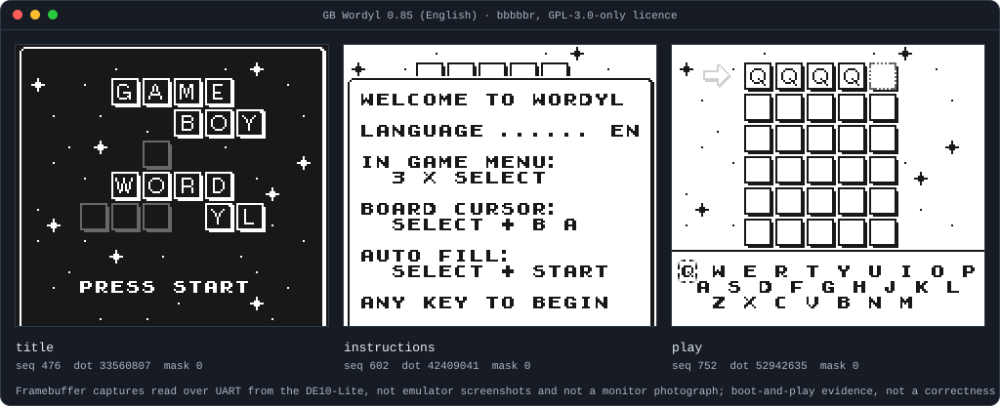
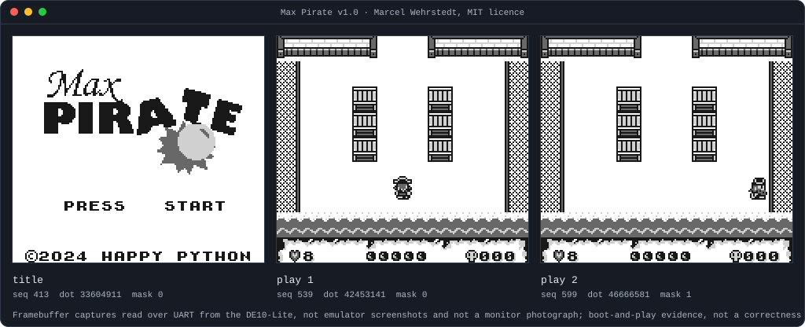
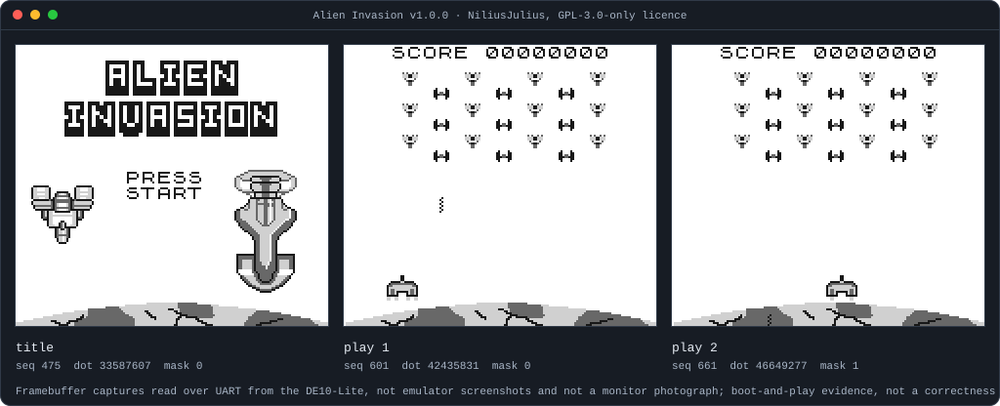
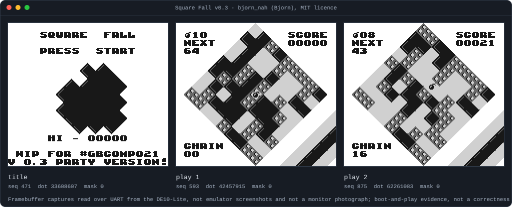
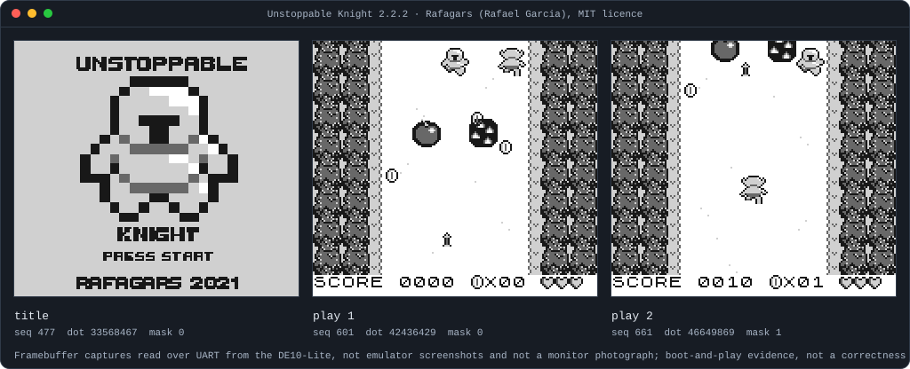

# Other people's games on this Game Boy

Eight freely licensed homebrew Game Boy games, written by eight other people,
booted and played on the DE10-Lite running this repository's DMG.

**What these pictures are.** Every frame below is a `host snapshot`: the packed
160x144 framebuffer the board returned over UART during one recorded session.
They are not emulator screenshots, not host renderings and not photographs of a
monitor. **What they are not.** This is boot-and-play evidence, not a
correctness proof. No reference model exists for any of these games, so no
pixel here was compared against an expectation; the record says what the board
displayed, not that it displayed the right thing. The
[verification tiers](../src/dv/integration/SPEC.md#verification-tiers) own what
counts as proof, and none of it is claimed here.

**Why it matters.** The hardware supports the 32 KiB direct profile, cartridge
type `0x00` with no mapper and no cartridge RAM
([interfaces](../src/rtl/interfaces/MAS_interfaces.md)). Every game below is a
ROM-ONLY image that fits that profile, so it runs with no RTL change. Until
this page, [Libbet](README.md#libbet-on-the-board) was the only third-party
image the project had run: a sample of one.

**Attribution.** These games belong to their authors and stay under their own
terms. Each section names the author and the exact licence, and links the
artifact this repository pins. Nothing of any game's source or bytes is
committed here: each image is fetched at run time from its pinned URL and
refused unless its SHA-256 matches the
[dependency manifest](../../tools/n2m/dependencies.json).

## How each capture was made

```text
python src/dv/homebrew/play.py play <pin> --load \
    --uart-port <verified-port> --expected-build-id <reviewed-wire-id>
```

`--load` runs `host load --external <pin>`, which verifies the pinned SHA-256
and reads all 32768 bytes back before the run
([host commands](../tools/n2m/host/SPEC.md)). The driver then resets, reaches
the first screen on wall time, and walks that game's frozen input script with
exact `RUN_DOTS` of one 70224-dot frame, so every later sample's sequence and
completion dot are reproducible. Each session began and ended paused, with
`INPUT`, `INPUT_SOURCE` and `INPUT_EFFECTIVE` all 0 and the sequence certain.
[The session record](../../src/dv/homebrew/README.md) holds the scripts, the
applied inputs and their dots, and what each game did.

Two of the eight are pinned to a third-party redistribution rather than an
author release, because their authors publish no release asset; each says so in
its own section and in the manifest.

<!-- SESSION-SUMMARY -->

## Wyrmhole

Quinn Painter, **MIT**.
[Source](https://github.com/QuinnPainter/Wyrmhole) ·
[pinned artifact](https://github.com/QuinnPainter/Wyrmhole/releases/download/1.1/Wyrmhole.gb)
(release `1.1`, asset `Wyrmhole.gb`).


## Airaki

furrtek, **GPL-3.0-or-later**.
[Source](https://github.com/furrtek/Airaki) ·
[pinned artifact](https://raw.githubusercontent.com/gbdev/database/434b8d35af69d6bf8184fe1bc9a4c41294c8ad42/entries/airaki/airaki.gb).

The pinned bytes are a **third-party redistribution**, not an author release:
the artifact is the `gbdev/database` blob `entries/airaki/airaki.gb` at commit
`434b8d35af69d6bf8184fe1bc9a4c41294c8ad42`, because furrtek publishes no
release asset. The licence text is pinned separately in furrtek's own
repository.


## GB Wordyl

bbbbbr, **GPL-3.0-only**.
[Source](https://github.com/bbbbbr/gb-wordle) ·
[pinned artifact](https://raw.githubusercontent.com/gbdev/database/434b8d35af69d6bf8184fe1bc9a4c41294c8ad42/entries/gb-wordyl/GBWORDYL_0.85_en.gb).

The pinned bytes are a **third-party redistribution**, not an author release:
the artifact is the `gbdev/database` blob
`entries/gb-wordyl/GBWORDYL_0.85_en.gb` at the same commit, because bbbbbr
publishes no release asset. GB Wordyl is itself an expanded fork of
stacksmashing's original; the licence text is pinned in bbbbbr's repository.



## Max Pirate

Marcel Wehrstedt, **MIT**.
[Source](https://github.com/MWehrstedt/MaxPirate) ·
[pinned artifact](https://github.com/MWehrstedt/MaxPirate/releases/download/v1.0/maxpirate.gb)
(release `v1.0`, asset `maxpirate.gb`).



## Rex Run

elseyf, **GPL-3.0-only**.
[Source](https://github.com/elseyf/rex-run-gb) ·
[pinned artifact](https://github.com/elseyf/rex-run-gb/releases/download/v1.0/rex-run.gb)
(release `v1.0`, asset `rex-run.gb`).

A Game Boy port of the Chrome offline dinosaur game. The repository carried no
`LICENSE` file at the release commit, so the pinned licence text is the later
commit that added it; the manifest records which.


## Alien Invasion

NiliusJulius, **GPL-3.0-only**.
[Source](https://github.com/NiliusJulius/Alien-Invasion) ·
[pinned artifact](https://github.com/NiliusJulius/Alien-Invasion/releases/download/v1.0.0/Alien-Invasion.gb)
(release `v1.0.0`, asset `Alien-Invasion.gb`).



## Square Fall

bjorn_nah, **MIT**.
[Source](https://github.com/bjorn-nah/square_fall) ·
[pinned artifact](https://github.com/bjorn-nah/square_fall/releases/download/v0.3/square_fall_v03.gb)
(release `v0.3`, asset `square_fall_v03.gb`).

The repository carried no `LICENSE` file at the release commit, so the pinned
licence text is the later commit that added it; the manifest records which.



## Unstoppable Knight

Rafagars, **MIT**.
[Source](https://github.com/Rafagars/Unstoppable-Knight-GB) ·
[pinned artifact](https://github.com/Rafagars/Unstoppable-Knight-GB/releases/download/2.2.2/knight.gb)
(release `2.2.2`, asset `knight.gb`).



## Reproducing these images

The frames are not re-read from hardware when the page is regenerated. Each
session is ingested once into a committed archive under
`tools/wiki/board_frames/homebrew-<pin>.json`, which holds the provenance, the
pin and, per frame, its sequence, completion dot, applied JOYP mask, CRC32 and
the indexed-PNG payload the SVG embeds. See
[frame archives and encoding](README.md#frame-archives-and-encoding).

```text
python tools/wiki/board_frames.py homebrew-<pin> <session folder> --note "..."
python tools/wiki/showcase.py
```
