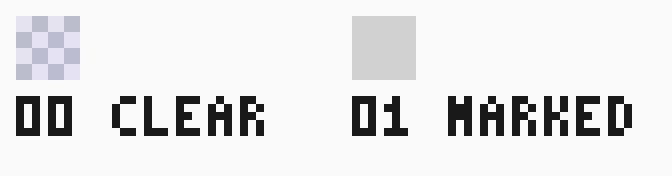

# Original v0.5 acceptance

The [charter](../../project-charter.md#release-acceptance) owns the full release
criteria. This fixture uses the [v0.5 owner composition](../../rtl/system/MAS_system.md),
our software builder and original `src/sw/v05/main.asm`. It does not establish
physical execution or a later release.

## Original program and image

The program disables interrupts and the LCD, assigns SP, IF, IE, scroll and
palette explicitly, and clears all 1024 map bytes and tile 0 through CPU writes.
It creates tile 1 as eight low-plane FF/high-plane00 rows. Map address 9800 holds
a fixed marker; addresses 9900 through 9907 hold the eight input cells.
All other map entries remain tile 0. BGP is E4 and LCDC91; sprites/window are off.

Each VBlank wakes CPU HALT with IE=1 and IME=0. The program selects direction row 20,
reads/inverts/masks its low nibble, then selects action row 10 and packs that
inverted nibble into bits 4–7. Register C retains the complete pressed mask.
The eight low bits are written to eight adjacent tile-map cells in order.
It clears all IF bits before the next HALT. VBlank is therefore no longer
pending at entry; JOYP bit 4 cannot wake through IE=1. No interrupt stack entry,
STOP, timer or DMA operation occurs.

Bits 0..7 correspond to Right, Left, Up, Down, A, B, Select, Start. In a normal
frame the fixed marker covers x0..7/y0..7 at shade 1. A pressed bit i adds
shade 1 at x(8*i)..(8*i+7)/y64..71. Every other pixel is shade 0. The first enabled
frame is the PPU contract's blank frame, with every pixel shade 0.

### Previews

The [program preview generator](../../../tools/sw/SPEC.md#program-previews)
runs the literal instruction recipe in `reference.py` against the built ROM and
renders the tiles and map its VRAM writes produce. The program uses no objects
or window; the tile bank sheet shows shade 0 as the review checkerboard.




The idle frame has no input. The Right+A frame applies mask 11 at dot 50000,
inside the bounded acceptance window. The last frame holds every button so all
eight input cells are visible. Regenerate with a fresh tag from the worktree root:

```text
python -m tools.sw.program_art --tag program-review
```

The command writes `workdir/builds/program-review/program-art/v05/`; the four
SVG files are copied here unchanged. Unchanged inputs reproduce identical
bytes; the [focused test](../../../../tools/n2m/tests/test_program_art.py) checks
the committed views against the literal image above.

<a id="revised-milestone-matrix"></a>

## Milestone matrix

The [composed fixture](../../../../src/dv/v05/tb_python_v05.sv) uses the following
bounded window, fault, complementary and endurance requirements.

- Build the exact original ROM twice and compare all bytes. Default composed
  execution to supported Intel preload with real initialization and loader
  adoption; separately qualify actual full UART upload/readback.
- Run continuously from reset/initialization through the first normal frame's
  input rows. Apply Right+A during the first CPU HALT before the first VBlank.
  The apply-dot window is 50000..52000, after first HALT42008 and before
  VBlank107646; exactly0x11 is accepted and the UART reply must match its apply dot.
  Request final pause no earlier than 145132 (normal frame 1 row 72 start; row 71's
  last pixel is 144835), with at most 2000 additional dots. Compare every expected
  retirement field, program write and source pixel through actual pause, including
  command latency. Derive the count from the fixed schedule and pause boundary,
  never from observed pixels. Preserve blank startup, cross-frame update, actual
  final pause/completion and independent progress watchdog.
  The next wake177872 is later than the maximum pause147132. Thus all valid
  pauses require6357 retirements (6281 setup plus76 update), with the last HALT
  at108156. Expected pixel count is23040 plus, for each y0..143,
  `clamp(pause_dot-(112300+456*y)+1,0,160)`:34561 at145132 and35360 at147132.
  This includes partial active rows after the requested bound; collectors do
  not stop when the controller requests HALT.
- Qualify complementary timer/IRQ/HALT and DMA/HRAM/160-byte transfer proofs.
  Qualify actual image, source-pixel and stopped-progress mutations with unchanged
  independent expectations and exact failing results.
- On the verified FPGA image, qualify full real UART loading/readback and all
  eight button presses/releases plus Right+A/release, checking input registers
  and full sampled frames against the literal image above. Existing evidence
  is reusable only with explicit relevant-source qualification.
- Before execution, declare at least 10 seconds of continuous FPGA endurance,
  exact inputs, progress/reset/hang checks, sampled full-frame checkpoints and
  its finite total budget. End PAUSED/input0 with a certain session. Samples do
  not establish every retirement or pixel during endurance, nor a human monitor
  observation. Declare the broader matrix aggregate and measured result.

Every new simulation follows the 300-second total cap, targeting120 seconds;
ordinary pre-merge aggregate target is 300 seconds. Record actual per-test and
aggregate costs in the acceptance evidence, including any unmet target. Do not
launch the obsolete long target. FPGA compilation is separately measured.

## Original timing and legacy input schedule

Dots below count completed enabled ticks, not host wall time. The literal
instruction recipe includes the direct-profile NOP/JP frontend. Setup enables
LCD at C=41984 and retires the first HALT at 42008. No host pause is permitted
from RUN until the selected bound completes; CPU HALT leaves ticks live.

The pinned PPU mapping puts VBlank at C+65662+n*70224. T3 captures it before
wake T4 at C+65664+n*70224. The first following LD A,20 retires eight dots later.
Each complete update contributes 76 retirements; its final HALT is 508 dots after
wake T4. All eight tile writes finish during VBlank, before the next visible fetch.

Normal frame 1 starts at completed dot 112300; pixel(x,y) occurs at
112300+456*y+x+(frame-1)*70224. Its final pixel is D=177667, well before the
former60-interval limit. The following legacy full schedule is retained for
trace interpretation only, not authorized execution or current acceptance.
It checked startup frame 0 as blank and every pixel of normal
frame 1. The watch interval (D,D+600*70224] then includes exactly normal frames 2
through 601, ending at 42312067. There is no omitted leading/trailing visible
portion in this interval. Every retirement from the direct entry through the
final host pause is checked, including any post-bound command latency.

For transition j=1..18, issue the UART input while running after
D+20*j*70224+20000. The accepted applied-dot reply must fall between that value
and 2000 dots later. This lies during CPU HALT, long before the next VBlank
sample. The new image first appears at normal frame 20*j+3. The frozen masks are:

| j | Mask | Expected action |
|---|---|---|
|1,2|01,00|Right press/release|
|3,4|02,00|Left press/release|
|5,6|04,00|Up press/release|
|7,8|08,00|Down press/release|
|9,10|10,00|A press/release|
|11,12|20,00|B press/release|
|13,14|40,00|Select press/release|
|15,16|80,00|Start press/release|
|17,18|11,00|Right+A press/release|

Input values in this table are hexadecimal. Apply-dot journal entries are
validated against these fixed windows and the observed public input boundary;
DUT register or pixel values never choose expectations. The final HALT command
may occur only after the bound, and must complete within 2000 additional dots,
before the next source frame begins. Observers remain live until that pause.

## Independent checks

The named `python-v05-physical` system-boundary proof reuses the bounded
original program and its sole effective Right+A event. It selects PHYSICAL
through UART while paused with both shadows zero, then accepts public coherent
mask17 off-tick during50000..52000. UART writes2 and17 affect only the host
shadow while PHYSICAL is selected. Selecting UART with both shadows17 creates
no extra event; a subsequent physical commit0 remains isolated. Source and
shadow readbacks and public effective/source observations must match each
prescribed state. Every retirement, write and pixel remains checked through
the actual bounded final pause. `python-v05-physical-mask` changes the actual
physical connection17 to1 and must fail the unchanged applied-input checker.
The [driver notes](../../../../src/dv/python/v05/README.md#physical-system-boundary)
record the exact state sequence. This test does not exercise ADC acquisition.
The separate [controls composition](../../rtl/system/MAS_system.md) implements
that path; actual wiring, calibration and physical verification remain an
[open controls gap](https://github.com/amichai-bd/nand2mario/issues/156).

`src/dv/v05/program.json` owns original literal bytes and instruction cycles;
`reference.py` applies the program's register/flag effects without reading DUT
instruction decode or choosing the next instruction from an actual trace.
Conditional JR takes 2M when not taken. Every full retirement field and program
write is compared, including IF, IE, input mask, HALT and event timing. PPU
VBlank and JOYP events use their reviewed A/B contracts. No missing or extra
retirement is accepted during sleep.

The source-pixel observer checks each visible pixel directly, including startup
and all intervening frames; immutable snapshots are not the every-frame oracle.
For blank frame 0, the completed-dot schedule is `C+93+x` on row0 and
`C+92+456*y+x` on rows1..143. Literal boundaries are42077,42532 and107443.
This is the selected digital mapping from pinned
[scan reset/alternation](https://github.com/MiSTer-devel/Gameboy_MiSTer/blob/7a5ff50528cd9c1d13ffb675e7df8506bffaa078/rtl/sprites.v#L153)
and [fetch/shift control](https://github.com/MiSTer-devel/Gameboy_MiSTer/blob/7a5ff50528cd9c1d13ffb675e7df8506bffaa078/rtl/video.v#L915).
LCD-off scan index1 takes78 ticks to finish; six fetch ticks and eight clipped
positions place the first visible pixel atC+93. The next line resets atC+453,
starts index0 and first publishes atC+548; subsequent lines recur every456 dots.
The [pixel qualifier](https://github.com/MiSTer-devel/Gameboy_MiSTer/blob/7a5ff50528cd9c1d13ffb675e7df8506bffaa078/rtl/video.v#L1181)
uses pre-edge raw X. Public tags count the completed edge. The existing normal
frame formula is unchanged. These are source-derived digital phases; Mooneye's
coarse mode/LY brackets do not independently measure exact pixel edges.
An independent active-system-edge watchdog enforces the timing contract and
rejects reset, host pause or missing progress during the acceptance window.
Full pixel/retirement traces are retained. Public waveform windows cover useful
startup/input/update boundaries without recording clocks for the entire run.

Two fresh software-build tags must produce identical complete images. The real
UART loader must read back that complete image. Actual corrupt-load and producer
pixel mutations must fail for their specified reasons. Python execution requires
a failing checker and result XML, the exact intended mismatch, and a nonzero
outer builder exit. Retain the raw simulator exit separately: cocotb can report
a failed test while the simulator exits zero. That zero does not establish a
passing test and must never be reported as a nonzero simulator exit.
Composed Intel-model and constrained-fit evidence requires current relevant-input
qualification. The revised matrix above owns current milestone acceptance;
the separate six-frame mode does not establish this window or endurance criteria.

## Six-frame test mode

The shorter complete-path proof uses the same original program and monitors, supported
Intel preload with verified software hash, and real UART loader adoption,
INPUT and HALT commands. It does not stand in for actual loading/readback.

Its fixed inputs are Right press/release at completed dots 267891..269891 and
338115..340115. The same HALT/VBlank update contract predicts the changed image
at normal frame 4 and released image at frame 5. Completion is 458563, after all
six frames (blank plus five normal), 138240 pixels and every retirement/write
through actual final pause within2000 further dots. The legacy full target still
encodes 42312067, 602 frames and 18 transitions, but is not authorized to run.

A stopped-tick mutation during CPU HALT at dot 50000 must reach the existing
active-time watchdog and failing Python/XML/outer result. Focused host tests
also reject early completion, missing input/pixel/retirement and extra writes.
Real-UART startup/readback and actual image/pixel mutations remain separate
checks. Six-frame completion does not replace qualification of the matrix above.

## Wall-time limit

Every new simulation obeys the [300-second total wall budget](../../../tools/n2m/SPEC.md#test-wall-budget).
Legacy targets retain historical stimulus only; lowering their timeout does not
make them feasible or passed. Physical evidence retains its explicit sampling limitations.
