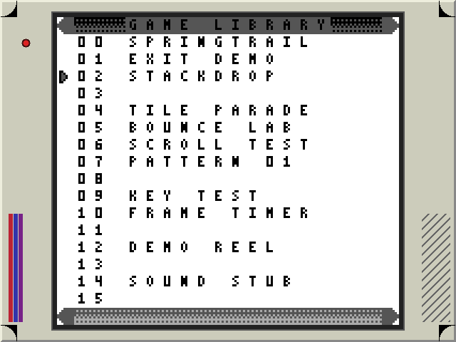
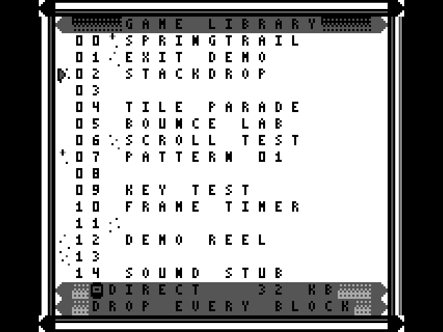
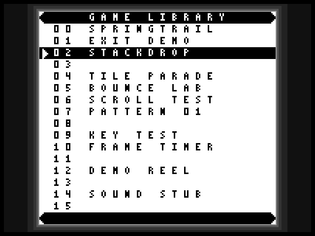

# VGA bezel design directions

Three mockups of what a bezel drawn by the FPGA would look like on the monitor,
with the RTL each one needs. Nothing here is implemented: the
[VGA MAS](MAS_vga.md#scanout) still owns the current output, where borders,
blanking and invalid display banks are black. The mockups change no RTL, no menu
and no image geometry; they exist so the owner can pick a direction and a cost
before any of that is written.

## What the border is

The [geometry authority](../../clocks-resets-cdc.md) scales the 160x144 image
three times and centres it at x=80..559, y=24..455. That leaves an 80-pixel band
on the left and right and a 24-pixel band on top and bottom: 99,840 of the
307,200 active pixels, 32.5% of the screen, all black today.

Two facts shape every direction below:

- The top and bottom bands are exactly one 8x8 tile tall at the image's own
  three-times scale, so tile-sized decoration lines up with the image edge.
- On a plain 8x8 grid of screen pixels the image is exactly columns 10 to 69 and
  rows 3 to 56 of 80 by 60 cells. The border is 1,560 whole cells with no
  partial cell, so a ROM-backed tile bezel tiles it exactly.

The board's VGA output is a 4-bit resistor ladder per channel. Every colour in
these mockups is one of those 16 codes per channel, so what the previews show is
what the pins can drive.

## Reproducing the previews

Run from the worktree root:

```text
python -m tools.sw.vga_bezel --tag vga-bezel
```

The [preview contract](../../../tools/sw/SPEC.md#vga-bezel-previews) owns the
command and its outputs.
[`directions.json`](../../../../tools/sw/vga_bezel/directions.json) owns the
colours and band widths and is the file to edit; the renderer owns the shapes.
The image inside every frame is the real plated-list menu, built by the
[menu reference](../../../../src/dv/menu/reference.py) from the committed font
and plate art, placed at the scanout's own coordinates. The catalogue is the
preview sample library of our own images and empty slots, not a real read.

## 1. Handheld shell



A moulded shell around a recessed screen: a light body with a bevelled outer
rim and rounded screen corners, a dark well two steps down into the image, a
power dot, an accent stripe on the left band and a slanted speaker grille on the
right. It is the only direction that uses colour.

- **RTL approach: ROM-backed tile border.** Rounded corners, the stripe and the
  grille are cheaper to store than to compute, and the art stays editable
  without touching logic. The border's 1,560 cells hold 61 distinct 8x8 cells,
  36 once the four mirrors are folded together. A cell index addresses a tile
  ROM; a 4-bit palette index per pixel addresses a 12-entry colour register
  file.
- **Memory:** 61 tiles x 64 pixels x 4 bits = 15,616 bits of tile ROM, plus
  1,560 x 6 bits = 9,360 bits of map: 24,976 bits, three M9K blocks. Folding the
  mirrors gives 36 tiles in exactly one M9K at the cost of two flip bits per map
  entry, 21,696 bits and the same three blocks. Either way it is 1.6% of the
  device's 182 blocks and about 2% of the composed design's current
  1,056,616 memory bits.
- **Logic:** an estimated 250 to 400 logic elements for the cell address, the
  border-only map index, the flip and palette stages.

## 2. Plated frame



The menu's own plate, continued outside the image: a black field, a gray
hairline, then a white rail notched every 24 pixels, and the plated-list plate
caps at the four corners. The corner tiles are the committed menu art
[`direction-a-tiles.json`](../../../../src/sw/menu/assets/design/direction-a-tiles.json)
scaled three times, so the bezel and the header plate are the same drawing.

- **RTL approach: coordinate pattern generator, with two tiles in logic.** The
  outward distance from the image rectangle selects field, hairline or rail by
  comparison; the notch is a 5-bit counter along the band; the four corners are
  24 by 24 windows onto two 8x8 tiles at the image's own scale.
- **Memory:** none. The two cap tiles are 2 x 64 x 2 = 256 bits of LUT ROM.
- **Logic:** an estimated 200 to 300 logic elements, under 0.6% of the device's
  49,760.
- Three border colours total, all gray. It is the direction that changes the
  screen's character least while still reading as deliberate.

## 3. Dark vignette



The minimal option: a bright hairline against the image edge stepping down
through four gray levels to black at the rim. No shapes, no colour, nothing to
draw.

- **RTL approach: coordinate pattern generator.** One outward distance from the
  image rectangle, four threshold comparisons, and an 8-pixel black rim so the
  bezel never touches the edge of the visible area.
- **Memory:** none.
- **Logic:** an estimated 100 to 160 logic elements, under 0.4% of the device.
- Six border colours, all gray. 19 distinct border cells, which is why no ROM is
  worth its address logic here.

## Cost summary

| Direction | Approach | Border colours | Distinct 8x8 border cells | Memory | Logic estimate |
|---|---|---|---|---|---|
| Handheld shell | ROM-backed tile border | 12, colour | 61 (36 folded) | 24,976 bits, 3 M9K | 250-400 LEs |
| Plated frame | Pattern generator plus two tiles | 3, gray | 23 (11 folded) | 256 bits in logic | 200-300 LEs |
| Dark vignette | Pattern generator | 6, gray | 19 (9 folded) | none | 100-160 LEs |

The colour, cell and bit counts are exact: the renderer counts them from the
frame it draws and the [focused test](../../../../tools/n2m/tests/test_vga_bezel.py)
holds this table to them. The logic-element figures are design-time estimates
from the comparators and registers each approach needs, not a fit. An actual
Quartus fit and both reference-frequency timing analyses decide them.

## What a bezel must not disturb

Every direction is presentation only, in the pixel domain, outside the scaled
image. That keeps the existing contracts if the implementation holds to four
rules.

- **The image stays exact.** The bezel drives RGB only where the scanout's
  `image_area` is false, so the frame RAM read, the three-times scaling, the
  DMG shade conversion and the blank path's white image are untouched. The test
  checks all 207,360 image pixels of every mockup against the menu reference.
- **Blanking and sync stay exact.** The bezel must be forced black outside
  active video and must sit before the final RGB register, not after it, so no
  pipeline stage is added, the two-stage coordinate and sync alignment survives,
  and the register's asynchronous reset still shows black with a stopped pixel
  clock. The final register widens from the 2-bit shade to 12 bits of RGB.
- **Snapshot readback is unaffected.** `SNAPSHOT`/`READ_FRAME` is assembled from
  the system-domain observer stream, before presentation selection, so packed
  frame bytes, their CRCs and the
  [board test card](../../board-bring-up.md) proxy that compares a read-back
  frame against its reference cannot see a bezel at all.
- **The raster oracles must learn it.** Both independent oracles,
  [`tb_vga.sv`](../../../../src/dv/vga/tb_vga.sv) and the
  [Python reference](../../../../src/dv/python/vga/reference.py), expect RGB 0 at
  every active pixel outside the image, so a bezel fails them until they compute
  the same border function themselves. The cheap route is a compile-time
  selection defaulting to no bezel: the existing `vga`, `vga-lcd` and
  `python-vga-crc` targets keep their black-border expectation, and one new
  target checks the bezel against an independent border model. The frozen frame
  CRCs cover the reconstructed image only and do not change.

One thing the mockups cannot settle: the shell direction is the first colour
this project would put on the VGA pins. The
[display observation](../../board-bring-up.md#display-observation) on a
connected monitor covers gray levels only, so a coloured bezel needs its own
look at the real screen.
