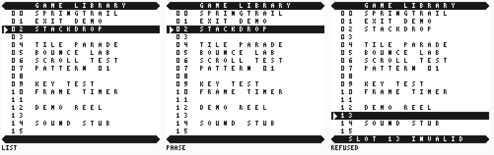
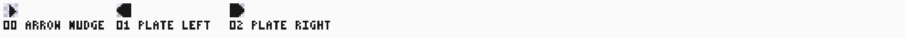
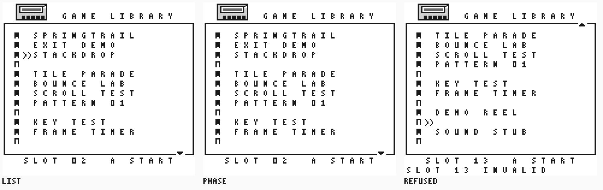
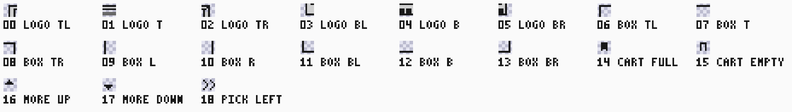
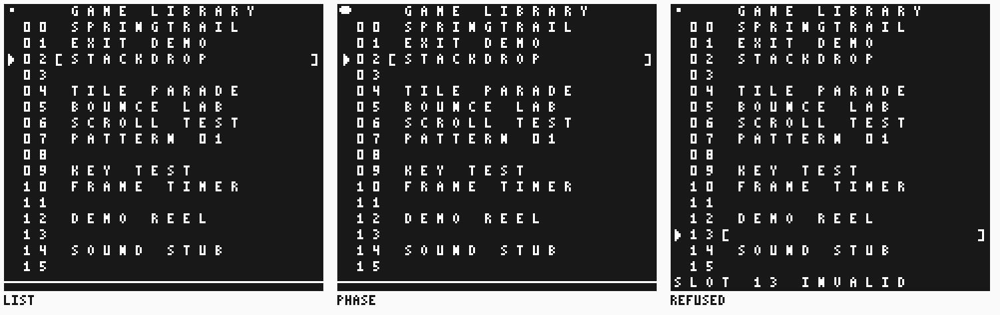
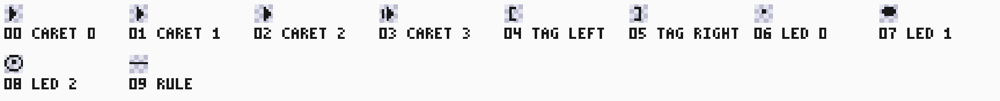

# Menu design directions

Three proposals for the console-style game picker of
[issue #767](https://github.com/amichai-bd/nand2mario/issues/767). The owner
chose **direction A, the plated list**, on 2026-09-17 and it is implemented:
the [menu contract](SPEC.md) owns the frame the
[menu image](../../../../src/sw/menu/main.asm) draws,
[`reference.py`](../../../../src/dv/menu/reference.py) checks and the
[frame budget](SPEC.md#frame-budget) measures. B and C stay here as the
considered alternatives. A second pass over the chosen
direction is rendered in [menu v2 ideas](DESIGN_V2.md); nothing there is chosen
or implemented.

Each direction reuses the 39 approved font tiles and adds original 8x8 art of
its own. The screens below are the same three states for every direction: the
fresh list with the cursor on slot 2, the next animation phase, and a refused
selection on empty slot 13. The sample library is our own images and empty
slots, not a real catalogue read.

Reproduce every sheet from the worktree root:

```text
python -m tools.sw.menu_art --tag menu-design
```

The [preview contract](../../../tools/sw/SPEC.md#menu-design-previews) owns the
command; the shade JSON under `src/sw/menu/assets/design/` owns the new pixels.

## Cost model

Every cycle figure below is counted, not measured: each instruction of the
[menu image](../../../../src/sw/menu/main.asm) is added up from its SM83
timing, branch by branch. VBlank is ten lines of 456 dots, 1140 M-cycles.
Costs are M-cycles.

Direction A's implementation measured the real frames instead, and the counted
model was optimistic where it mattered: the twenty-cell status redraw costs
1067, not the 950 counted here, which left 73 M-cycles of headroom rather than
190. Reading the status row as prebuilt tiles instead of walking the text path
each frame is what made A fit with room to spare. The
[measured table](SPEC.md#frame-budget) is the live figure; treat everything
below as a design-time estimate good to about fifteen percent.

| Work | Cost | Where |
|---|---|---|
| Plain map-write loop | 8 per cell | `LD [DE],A`, `INC DE`, `DEC B`, `JR NZ` in `BlankLoop` |
| Inverse toggle loop | 10 per cell | `LD A,[HL]`, `ADD A,39`, `LD [HL+],A`, `DEC B`, `JR NZ`. The `DE` form of the same loop costs 12, because it needs `LD [DE],A` and a separate `INC DE` |
| Text path | 26 to 49 per cell | `DrawText`'s body is 16; `CharTile` adds 10 for a zero, 14 for a space, 18 for a dash, 26 for a digit and 33 for a letter, because it tests the ranges in that order |
| Base frame work | 200 | `ReadButtons` 67, idle `Navigate` 29, finished `Catalogue` 19, `ShowCursor` early-out 15, `ShowStatus` preamble 37, and 33 for the five `CALL`/`RET` pairs and the loop's `JR` |

The text path's spread is why a status row is expensive: `NOT READY` padded to
twenty cells is eight letters and twelve spaces, 8 x 49 + 12 x 30, about 750.

Today's cheapest frame is the base work alone, 200 (18%). A cursor move adds
`ShowCursor`'s two `CursorCell` calls and writes, about 265 (23%). Today's peak
is that twenty-cell status redraw, 750 plus base, about 950 (83%). Both bound
every figure below, and the peak already uses most of VBlank.

## A. Plated list





The header and status rows become solid plates with rounded caps, and the
selected slot is a full-width inverse bar. The layout keeps all sixteen slots,
their numbers and the sixteen title cells exactly where they are today, so only
the shades change. The animation is a one-pixel nudge of the cursor arrow inside
the bar.

- Tiles: 82 of the 256 in the `$8000` block. 43 added: the 39 font glyphs
  inverted, two plate caps and the nudged arrow with its inverse.
- Bytes: 688 of tile data plus about 140 bytes of code, on top of the image's
  current 1380 bytes. ROM0 has 14492 bytes free, so this is about 6% of the
  headroom.
- Per frame: a cursor move rewrites both affected rows through the inverse
  toggle loop, 40 cells at 10, so 400, plus about 50 of row setup and arrow
  writes, plus base, about 650 of 1140 (57%). An animation phase costs one
  cell. A's peak is the status row, whose text path gains an `ADD A,39` per
  cell: about 790 plus base, about 990 (87%), against 950 (83%) today. **That
  leaves about 150 M-cycles of headroom, 13% of VBlank.** The direction fits,
  but there is no room for a second full-width redraw in the same frame, and
  the implementer should confirm the real frame on hardware.
- Reference: [`tilemap`](../../../../src/dv/menu/reference.py) gains a `phase`
  argument, builds the inverse bank as `3 - shade` from the same font JSON, and
  adds 39 to every tile of the cursor row. `expected` gains `phase-N` names.

## B. Cartridge shelf





A two-row cartridge emblem heads the screen, the list sits in a drawn box, and a
hint bar names the selected slot. Each row carries a filled or hollow cartridge
icon for a loadable or empty slot, and blinking chevrons mark the selection. The
box shows twelve slots at a time with scroll markers, so the slot number moves
from the row to the hint bar.

- Tiles: 58. 19 added: six emblem tiles, eight box pieces, two cartridge icons,
  two scroll markers and one chevron pair.
- Bytes: 304 of tile data plus about 320 bytes of code for the window top,
  staged redraw and hint bar; about 4% of the free ROM0.
- Per frame: a cursor move costs two chevron writes and the hint bar's two
  digits, about 45 plus base, about 245 (21%). A scroll step is the cost:
  twelve rows of sixteen title cells re-read through the banked window on the
  text path, where titles are letter-heavy, about 7900 plus per-row setup,
  about 8600 - seven and a half VBlanks. Staged one row per frame it barely
  fits, about 900 to 960 (around 84%), at today's peak, and the list visibly
  rebuilds for twelve frames, about 0.2 s per step. A 256-byte WRAM shadow of
  the titles drops the cells to the inverse toggle's 10, about 2600 in total,
  which stages as three rows per frame over four frames (about 880, 77%).
- Reference: `tilemap` gains `phase` and derives the window top from the cursor
  (`min(max(cursor - 6, 0), 4)`). The staged redraw needs a `drawn_rows`
  argument of the same shape as today's `drawn_slots`, and the test has to model
  the staging schedule frame by frame. This is the largest reference change.

## C. Night deck





The whole screen inverts through BGP `$1B` instead of `$E4`: white text on a
black page, with no extra tiles for the theme. The selection is a four-phase
caret that slides one pixel at a time plus brackets around the title, a power
dot in the corner pulses, and the status row becomes a rule when there is
nothing to report. The grid is today's grid.

- Tiles: 49. 10 added: four caret phases, two brackets, three dot states and a
  rule.
- Bytes: 160 of tile data plus about 120 bytes of code; about 2% of the free
  ROM0. The cheapest direction.
- Per frame: a cursor move clears and redraws a caret and a bracket, four
  direct writes with their address setup, about 90 plus base, about 290 (25%).
  A phase frame writes two cells, about 230 (20%). The status row is unchanged,
  so the peak stays today's 950 (83%); the rule row replaces it with the plain
  loop, 160 plus base, about 360 (32%).
- Reference: `tilemap` gains `phase`, picks caret `phase % 4` and dot
  `phase % 3` exactly as the preview does, and draws the rule row when the
  status text is blank. The palette is applied once, so `frame` gains the BGP
  mapping the other directions do not need.

## Keeping every frame checkable

All three directions animate from one WRAM byte incremented once per frame loop
iteration. The loop already runs exactly once per frame from the `LY == 144`
poll, so that byte is the frame index modulo 256. A direction's `phase` is that
byte divided by its own hold, sixteen frames for A's nudge and eight for C's
caret, so the reference can compute any phase from the frame number alone with
no DUT state. The preview takes the divided `phase` directly. The hold belongs
in [SPEC](SPEC.md) beside the layout table so the image and the reference read
the same constant.
