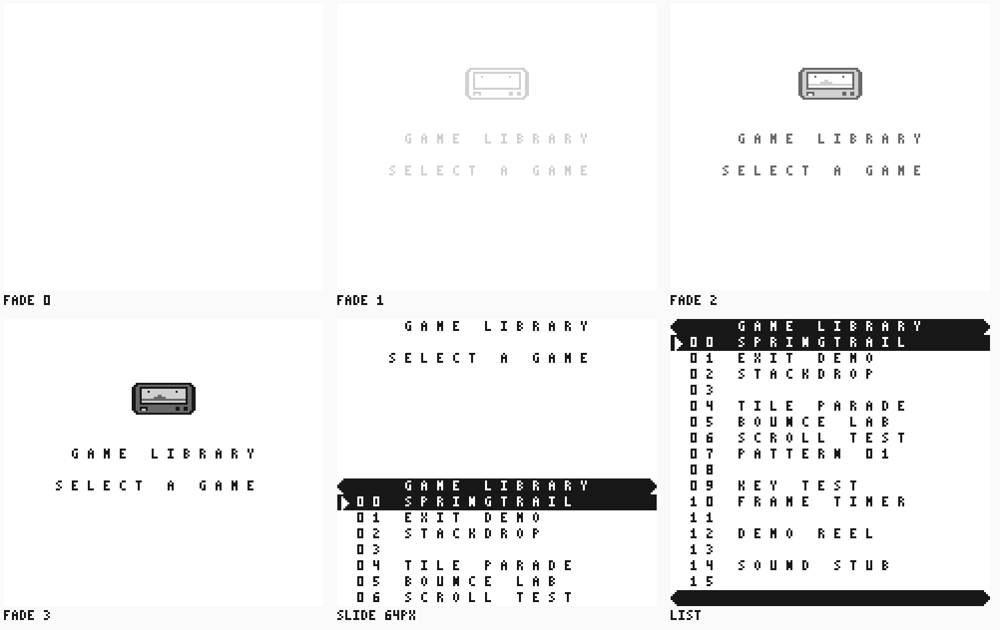
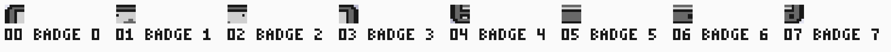
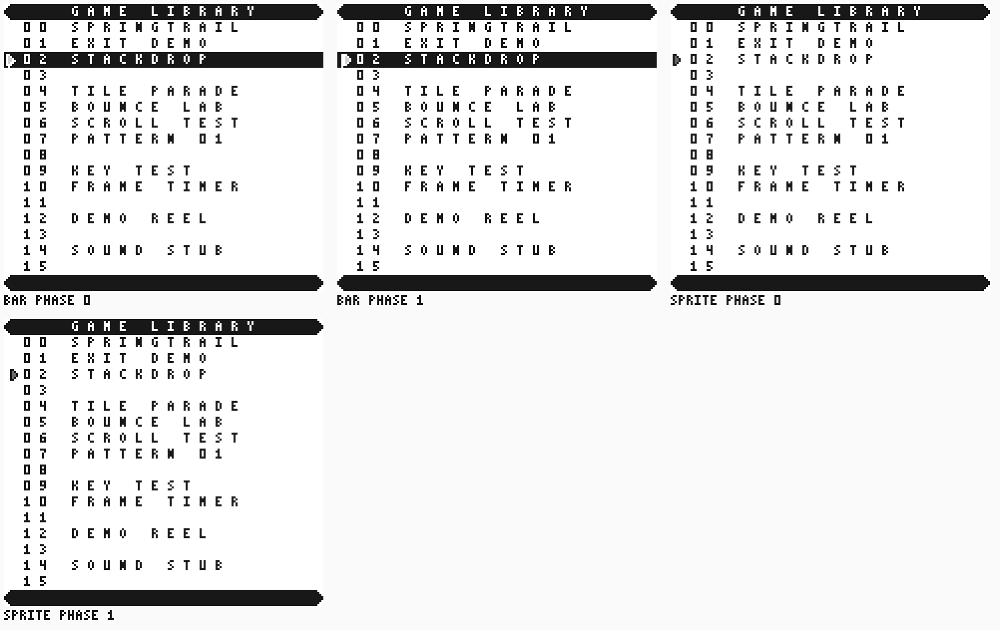
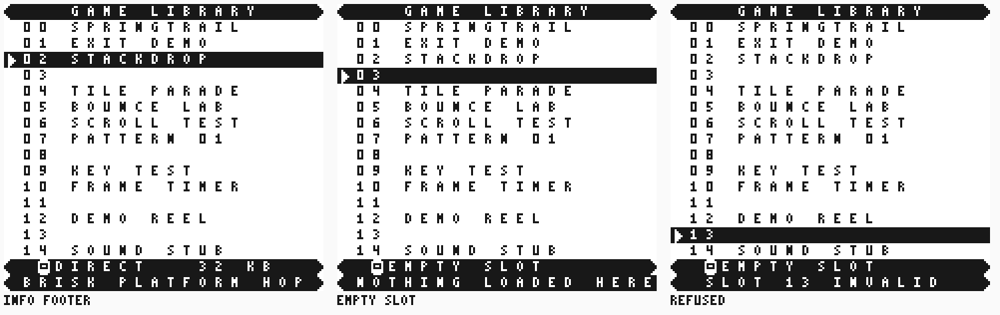
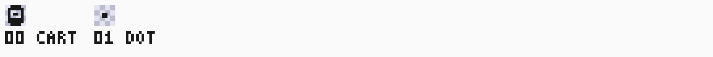
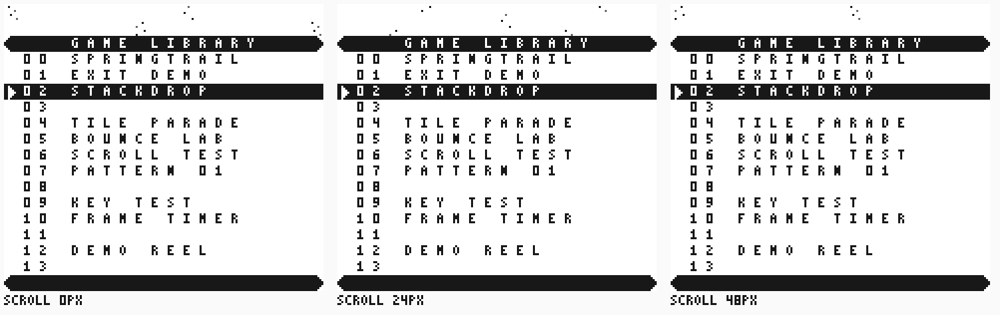
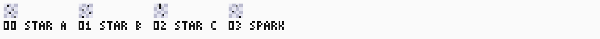
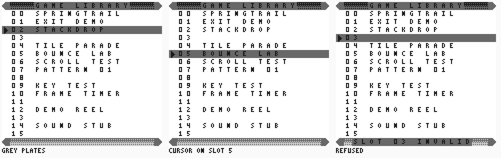
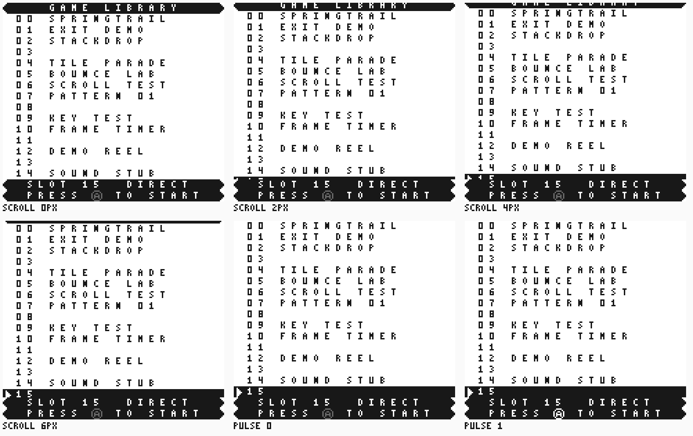
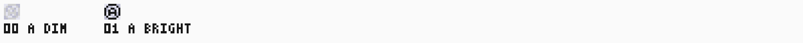

# Menu v2 ideas

Six rendered ideas for a second pass over the
[plated list](SPEC.md#frame-layout) the menu drew before them. The owner chose
all six; the [composite layout](#composite-layout) below is the single design
they combine into, and each idea ships as its own slice. The first pass and its
chosen direction stay in [design directions](DESIGN.md).

The six sheets are the original mockups: each was drawn over the 82-tile plated
list the image loaded when they were published, which is why their banks all
start with those 82 tiles. The menu's own bank has moved on since; the
[SPEC](SPEC.md#frame-layout) owns what the image draws today, and these sheets
stay as the proposals the composite decision was made from.

Reproduce every sheet below from the worktree root:

```text
python -m tools.sw.menu_v2 --tag menu-v2
```

The [preview contract](../../../tools/sw/SPEC.md#menu-v2-idea-previews) owns the
command; the shade JSON in `src/sw/menu/assets/design/v2-*.json` owns the new
pixels. The sample library is our own images and empty slots, not a real
catalogue read.

## Reading the costs

Tile and byte counts come from the generator's `summary.json` and are exact.
Cycle figures are counted from the [cost model](DESIGN.md#cost-model), not
measured, and are good to about fifteen percent; the measured
[frame budget](SPEC.md#frame-budget) is the live figure. VBlank is 1140
M-cycles. The plated list the sheets were drawn over measured 230 idle, 281 for
a nudge phase, 547 for a status redraw and 722 for a cursor move, which was its
peak; the [frame budget](SPEC.md#frame-budget) carries the shipped figures. Work
done with the LCD off at boot does not spend VBlank and is called out
separately.

| Idea | Bank tiles | Added tiles | Added tile bytes | Estimated peak frame | Reference change |
|---|---|---|---|---|---|
| [1. Boot splash](#1-boot-splash) | 90 | 8 | 128 | 236 (21%) while fading; 870 (76%) if a list row enters per frame | `bgp` and `scy` in `frame`, a splash layout, `expected('splash-N')` |
| [2. Sprite cursor](#2-sprite-cursor) | 84 | 2 | 32 | 254 (22%) replacing the bar; 746 (65%) beside it | an object pass over the frame: OAM entry, transparent shade 0, OBP |
| [3. Info footer](#3-info-footer) | 86 | 4 | 64 | 950 (83%) staged one footer row per frame | footer rows from the entry's `profile` and `length` |
| [4. Moving background](#4-moving-background) | 86 | 4 | 64 | 734 (64%) | a window layer and a wrapping 32x32 background at any scroll |
| [5. Mid-grey plates](#5-mid-grey-plates-and-dithered-gradients) | 127 | 45 | 720 | 722 (63%), unchanged | a grey bank in `bank_tiles`, grey and gradient cells in `tilemap` |
| [6. Smooth scroll and pulse](#6-smooth-scroll-and-a-press-a-pulse) | 86 | 4 | 64 | 430 (38%) per scroll step with prebuilt rows; 1030 (90%) walking the text path | fine `scy`, the window, and the ramp schedule frame by frame |

Each bank is well inside the 256 tiles of the `$8000` block, and the largest
addition is 720 bytes of tile data against the 14492 bytes ROM0 has free, so
none of the six is bounded by the 32 KiB image. Ideas 3, 4 and 6 combine: the
footer and the star band each cost slot rows, and the smooth scroll is what
brings the hidden slots back.

## Composite layout

The six ideas do not simply add up: three of them want the same two DMG
resources, the background scroll and the single window. This is the decision
that resolves them, and every slice is built against it.

### Layers

| Layer | Carries | Registers |
|---|---|---|
| Background | The header row and the slot rows, in the 32-row map | SCY for the splash slide and the scroll ramp; SCX unused |
| Window | The bottom plate alone: the information footer and the press-A hint | LCDC bit 5, WX 7, WY 128 |
| Objects | The cursor pointer, one entry | LCDC bit 1, OBP0 |

The window is opaque from its top left corner to the bottom right of the
screen, so it cannot be a band. Putting the list on it would freeze the list,
and the fixed header the window could then carry would cost the smooth scroll.
The list therefore rides the background, the window is pinned to the bottom two
rows, and **the header scrolls with the list**. No mid-frame scroll write is
needed anywhere, so interrupts stay disabled and the frame loop keeps polling
`LY`.

### Slot count

The window starts at WY 128, so the background shows screen rows 0..15: the
header and **fifteen slot rows**. Slot 15 is below the window at rest.

[Idea 6](#6-smooth-scroll-and-a-press-a-pulse) is what brings it back. Its SCY
ramp scrolls the header off the top when the cursor passes the last visible
row, which puts sixteen slot rows in the fifteen the window leaves. The cursor
reaches every slot 0..15 exactly as it does today; only the resting view is
shorter. Until that slice lands the menu keeps the shipped eighteen-row
background frame with all sixteen slots and no window.

### What each idea does under this decision

- [1. Boot splash](#1-boot-splash) keeps its four BGP fade steps and its SCY
  slide on the same background map, above the list. The splash is fourteen map
  rows, so the whole ramp is drawn with the LCD off and each frame of it costs
  one SCY write.
- [2. Sprite cursor](#2-sprite-cursor) **replaces the inverse bar**, it does not
  sit on it. A cursor move stops rewriting two rows of the map and becomes one
  OAM write, which is where the 468 M-cycles come from. The selection row is
  drawn like every other row.
- [3. Info footer](#3-info-footer) is the two window rows.
- [4. Moving background](#4-moving-background) changes shape here. DMG has one
  background layer and this decision spends it on the list, so a star band that
  drifts on its own is not available: it would need the list on the window,
  which the smooth scroll forbids. The stars instead fill the background cells
  the list leaves empty, column 0 and columns 17..19, as a rule the reference
  reproduces, and they ride the list's own SCY. The page gets its texture and
  the scroll ramp gets its parallax; there is no independent SCX drift.
- [5. Mid-grey plates](#5-mid-grey-plates-and-dithered-gradients) **replaces the
  black plates**. The header and the bottom plate are mid grey with dithered
  gradient fills and rounded grey caps, and their text is black on grey.
- [6. Smooth scroll and pulse](#6-smooth-scroll-and-a-press-a-pulse) owns the
  SCY ramp and the press-A badge on the window.

### Bank

Grey plates and a sprite cursor together retire the inverse bank: with no
inverse bar and no black plate, nothing is drawn as `3 - shade` any more, and
the [direction A](DESIGN.md) caps and nudged arrow leave the image with it. The
shipped bank is the 94 tiles listed in the [SPEC](SPEC.md#frame-layout): the 39
font tiles, the same 39 on a mid-grey page, the six authored grey cells, the
two pointer phases and the eight badge cells of the boot splash. Both derived
banks cost zero ROM bytes, because the font
uses only shade 0 and shade 3, so the grey copy is the font's low plane with
the high plane set.

## 1. Boot splash





A badge and two lines of text fade in through BGP, then the list slides up from
below. The four fade steps are BGP `$00`, `$40`, `$90` and `$E4`: the page
first, then the ink, then the mid shades, ending on the identity palette the
menu uses. The slide is an SCY ramp over the same 32-row background map, which
holds the splash above the list.

- Tiles: 90. 8 added, the badge's four by two cells.
- Bytes: 128 of tile data plus about 120 of map, fade table and code.
- Per frame: a fade step is one BGP write on an otherwise idle frame, about 236
  of 1140 (21%). The map is 32 rows, so an 18-row splash leaves 14 rows for the
  list; the last four list rows have to be drawn as they scroll in, at most 16
  title cells on the text path, about 870 (76%). A 14-row splash drops that
  cost to a single SCY write per frame, because the whole ramp is then drawn
  with the LCD off at boot, about 2880 M-cycles before the LCD comes on.
- Reference: `frame` gains a BGP mapping and an SCY offset, plus a splash
  layout beside `tilemap`. `expected` gains `splash-N` for the fade step and
  the slide frame. The fade table and its per-step hold belong in
  [SPEC](SPEC.md) so the image and the reference read the same constants; the
  frame counter that already drives the nudge names the step, so the reference
  still computes every frame from the frame number alone.
- Built: the 18-row splash, on the first menu boot after a reset only. A
  return from a game re-boots the image, and the menu tells that apart by the
  last selected index the loader keeps, so leaving a game shows the settled
  list at once instead of replaying the splash. The four wrapped rows are
  drawn as they scroll in. The estimate above put such a row on the text path at about 870 of
  1140; the image instead builds the four rows as finished cells at boot,
  with the LCD off, so a slide frame copies twenty bytes and measures 361-376.
  A press skips the splash, and a skip draws at most two of those rows a
  frame, which holds its peak at 658. The
  [SPEC schedule](SPEC.md#boot-splash) and
  [frame budget](SPEC.md#frame-budget) own the built behavior and the
  measurements.

## 2. Sprite cursor




An object pointer in the left column, in two phases one pixel apart. The first
two screens keep the inverse bar and put the pointer on it through the inverted
object palette; the last two drop the bar and leave the pointer alone on the
page. Dropping the bar is the cheapest frame of all six ideas, because the
cursor move stops rewriting two rows of the map.

- Tiles: 84. 2 added, the two pointer phases.
- Bytes: 32 of tile data plus about 60 of code for the OAM entry and LCDC bit 1.
  One object needs no OAM DMA; four direct writes inside VBlank are enough.
- Per frame: a cursor move writes the object's Y, X, tile and flags, about 24
  M-cycles. Replacing the bar, the move costs about 254 (22%) instead of the
  measured 722, which frees 468 M-cycles of VBlank. Kept beside the bar it adds
  to the measured peak, about 746 (65%). A phase change is one byte, about 240
  (21%).
- Reference: the frame stops being the tilemap alone. `frame` gains an object
  pass after the background: one OAM entry of Y, X, tile and palette flag, shade
  0 transparent, shades mapped through OBP0 or OBP1. Object-to-background
  priority and the ten-per-line limit do not bite with one object, but the
  reference has to state both. `expected('cursor-N')` keeps its name.

## 3. Info footer





The status plate grows to two rows and carries the selected entry's profile,
size and a one-line tagline; a refused selection replaces the tagline with the
message the status row shows today. The footer takes the bottom two rows, so
the list shows fifteen slots and slot 15 needs idea 6 or a shorter list.

- Tiles: 86. 4 added: the cartridge badge and the separator dot, plus their
  inverses for the plate, derived at boot like the inverse font.
- Bytes: 64 of tile data plus about 220 of code, profile words and size words.
- Per frame: both footer rows are 36 cells and they change with the cursor.
  Walked on the text path in one frame they cost about 1080 and overrun VBlank,
  so the footer has to stage one row per frame: the profile line about 670
  (59%), the tagline row about 950 (83%). Prebuilding all sixteen footers into
  WRAM instead costs 576 bytes and drops a move to two 18-byte copies, about
  390 (34%).
- Reference: `tilemap` gains the two footer rows and reads the entry's
  `profile` and `length`, which
  [`unpack_entry`](../../../../tools/n2m/host/library.py) already returns, so
  the fixture and the host reader need no change for those two fields.
- **The tagline has no catalogue field.** A
  [`catalogue_entry`](../../../../cfg/interfaces.json) is 32 bytes with 7
  reserved, and an 18-character tagline does not fit them. Carrying one means a
  new field or a new catalogue region, which changes the interface record, the
  host packer, the fixture and the menu together. That is its own issue, not
  part of publishing these previews.

## 4. Moving background





A slow star layer scrolled by SCX and SCY, with the header, the list and the
status plate on the window so they stay fixed.

The window is the reason this idea costs rows. On DMG the window is opaque from
its top left corner to the bottom right of the screen: it cannot be a band. Put
the list on the window and the background survives only above it, so the stars
become a band across the top. The preview sets WY to 16 for a two-row band,
which leaves sixteen window rows for the header, fourteen slots and the status
plate. A one-row band costs one slot instead.

- Tiles: 86. 4 added: three star tiles and a sparkle.
- Bytes: 64 of tile data plus about 90 of code for the window map, LCDC bit 5,
  WX/WY and the per-frame scroll.
- Per frame: two register writes, about 12 M-cycles. An idle frame is about 242
  (21%) and the peak stays the cursor move, about 734 (64%). Boot pays for the
  32x32 star map, 1024 cells at 8 M-cycles, about 8192 with the LCD off, plus
  the 340-cell window map.
- Reference: `frame` gains the window layer with its own map and WX/WY, and a
  background read that wraps the 32x32 map at any pixel scroll. The star map
  must be a rule the reference reproduces, not a blob. `expected` gains
  `scroll-N`; the scroll offset follows from the frame counter, as the nudge
  phase does.

## 5. Mid-grey plates and dithered gradients




The header plate, the selection bar and the status plate move to shade 2, with
dithered cells fading the plate ends into the page and rounded grey caps. Black
text on mid grey keeps the list readable while the plates stop dominating the
screen.

- Tiles: 127. 45 added: the 39 font glyphs on a grey page, derived at boot as
  shade 0 becomes 2, plus six authored cells, two caps and three dither fades
  and a bar shadow.
- Bytes: 720 of tile data if the grey bank is stored, or 96 if it is derived at
  boot like today's inverse bank, plus about 60 of code. Deriving costs about
  6240 M-cycles with the LCD off.
- Per frame: nothing changes shape. The selection bar still moves by adding a
  bank offset to each cell, so the measured peak stays about 722 (63%), and the
  gradients are drawn once at boot.
- Reference: `bank_tiles` gains the grey bank beside the inverse bank and
  `tilemap` uses it for the bar, the plates and the gradient cells. The frame
  stays background only, identity palette, no scroll, so this is the smallest
  reference change of the six.

## 6. Smooth scroll and a press-A pulse





The list rides SCY two pixels per frame, so a cursor move past the visible rows
slides instead of jumping, and a fixed hint sits on the window at the bottom
with an A badge that pulses between mid grey and white. The first four screens
are one 8-pixel step; the last two are the pulse phases.

A fixed header cannot come with this. The window covers everything below its
top edge, so a bottom hint is free but a top header would have to hide the
whole screen; keeping a header fixed above a scrolling list needs a mid-frame
scroll write from an LCD interrupt, and the menu runs with interrupts disabled.
In the preview the header scrolls away with the list.

- Tiles: 86. 4 added: the two badge phases and their inverses for the plate.
- Bytes: 64 of tile data plus about 180 of code for the ramp, the window and
  the pulse.
- Per frame: the SCY write is about 6. Every fourth frame the view crosses a
  tile boundary and one new row of 20 cells enters: walked on the text path
  that is about 800, so about 1030 (90%), which is too tight to trust. Built
  from prebuilt row tiles, as the status rows already are, the new row costs 20
  cells at 10, about 430 (38%). The pulse is one cell, about 240 (21%).
- Reference: `frame` gains a fine `scy` with the 32-row map wrap and the window
  layer, and the check has to model the ramp frame by frame: which frame of a
  move carries which offset, and which row entered. With the pulse phase that
  is `expected('scroll-N')` and `expected('pulse-N')`. This and the object pass
  of idea 2 are the two largest reference changes.
