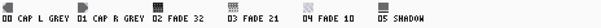
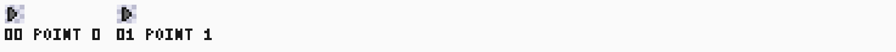

# Game menu

The [menu source](../../../../src/sw/menu/main.asm) is the original SM83
program in library image 16. It lists the game slots from the catalogue
through the banked window, moves a cursor with the joypad, starts the
selected game through the select register and shows the loader's result when
a selection is refused. The [loader profile](../../rtl/cartridge/MAS_loader_profile.md)
owns every register, bound and result code this page uses; the
[SDRAM layout](../../rtl/storage/MAS_sdram.md#address-space-layout) owns the
slot, catalogue and entry format; the [software toolchain](../../../tools/sw/SPEC.md#implemented-linker-and-packager)
owns the `dmg-loader-v1` package profile the image is built in. This page owns
the menu's behavior, memory use, frame layout and verification.

## Behavior

Boot, from the direct entry state with the LCD off:

1. Load the 102-tile bank into VRAM `$8000`: the 39 font tiles, the same 39 on
   a mid-grey page, the six authored grey cells, the two pointer phases, the
   eight boot splash badge cells, the four star cells, the two footer cells
   and the two [press-A badge](#the-press-a-pulse) phases. Clear the object
   table, blank the background map at `$9800`, paint the
   [star field](#star-field) over it, set OBP0 to `$E4` and draw the
   [boot splash](#background-map), the header plate, the
   [plate cell table](#the-information-footer) and the six status rows
   in WRAM. Blank the window map at `$9C00`, build the
   [bottom plate](#window) into it and set WX and WY; the window itself stays
   off until the list settles.
2. Read `$A000` bit 5 (`sdram_ready`) and `$A003` (the last selected index)
   once each. The status bit alone decides whether the titles are drawn at
   boot. Both together arm the [boot splash](#boot-splash): it needs the
   catalogue listed at boot, and it needs `$A003` to be `$FF`, which the
   loader leaves it only until the first selection since reset.
   - Armed, so this is the first boot and the catalogue lists: the splash
     runs. BGP starts on the first fade step and SCY at 0. Boot draws the slot
     numbers and titles of slots 0..12 only; the last three slot rows and the
     page row below them wrap over the splash and are built instead as four
     finished 20-cell rows in WRAM, with the LCD off, for the slide to copy.
     The cursor object stays off screen and the window stays off, so the
     splash shows neither the cursor nor the plate. The rows drawn here and
     the rows the slide draws account for all sixteen.
   - Not armed: no splash. BGP is `$E4` and SCY the settled 144, the window is
     on with its plate and the cursor object goes on slot 0. A menu that has been
     here before still lists every title at boot, so the list is whole in its
     first frame; a menu waiting for the SDRAM skips the catalogue and the
     frame loop retries it below.
3. With the catalogue available, commit bank 34 (the catalogue,
   `LIBRARY_CATALOGUE_ADDRESS / LIBRARY_WINDOW_BYTES`) to the bank register,
   wait for bit 6 (`window_ready`) and draw the title rows from the window.
   Every title is read here, so a select is live as soon as the list is.
4. Draw both [footer](#the-information-footer) rows of the cursor's slot into
   the window map, still with the LCD off, so the first displayed frame writes
   nothing. A boot that lists no catalogue draws neither.
5. Turn the LCD on: `LCDC = $93`, background and objects, while the splash
   runs, and `$F3` once the list is settled, which adds the window and names
   the second map.

Every frame, at the start of VBlank (`LY == 144`) and finishing inside it:

1. Read both JOYP rows, settling at least 24 dots after each row select, and
   keep the released-to-pressed edges in the generated `BUTTON_*` bit order.
   A held button acts once.
2. While the [boot splash](#boot-splash) runs it owns the frame and the steps
   below wait: no navigation, no catalogue row and no status redraw, so the
   press that skips the splash never reaches the list.
3. A Down edge moves the cursor one slot down, then an Up edge one slot up,
   clamped to slots 0..15; no wrap.
4. An A edge, once all sixteen title rows are listed, writes the cursor's
   slot index to the select register and polls `$A000` bit 7 until the
   loader is idle. An accepted select swaps the image and resets the core;
   the menu never resumes. A refused select leaves its result in `$A002` and
   the index in `$A003`. Before the catalogue is listed, A does nothing.
5. Delayed catalogue path: when bank 34 has not been committed and
   `sdram_ready` is now set, commit it; when it has been committed and
   `window_ready` is set, draw one remaining title row per frame. Every row
   is drawn the same way, because the cursor is an object and never re-banks
   a row. A frame whose nudge phase differs from the shown one draws the first
   eight cells of its row instead, and the next frame draws the other eight,
   so no VBlank carries a whole row and the [twinkle](#star-field) together;
   the [frame budget](#frame-budget) is why. The phase itself is untouched: it
   still follows the frame counter alone, and the sixteen rows take seventeen
   frames.
6. Move the cursor object only when the cursor changed, redraw the status
   row only when its key or index changed, and when the nudge phase changed
   rewrite the object's tile, the [star field](#star-field)'s own cells and,
   once the footer has drawn it, the [press-A badge](#the-press-a-pulse).
7. Once the list is whole, step the [scroll ramp](#the-scroll-ramp) when SCY
   is not at the view the cursor names, then draw at most one
   [footer](#the-information-footer) row: the upper row when
   the cursor has left the slot it describes, otherwise the lower row when it
   lags the upper one and no message is on it. A frame that has already drawn
   the status row or the star twinkle draws neither, so no VBlank writes two
   plate rows, and a frame that draws a catalogue row draws no footer row,
   takes no ramp step and spends nothing on either choice.
   An idle frame writes nothing.

The catalogue is read once, at boot or through the delayed path; the drawn
map is the menu's copy of the titles. Nothing after a selection depends on
`window_ready`.

The menu lists game slots 0..15 only. It reads all 17 catalogue entries
through the window but never lists entry 16, which is itself. A slot is drawn
with its title when its catalogue `valid` byte is `LIBRARY_CATALOGUE_VALID`;
any other entry is drawn as its slot number with a blank title. The cursor
visits every slot, so selecting an empty one is how the player sees
`INVALID_SLOT`. Length and profile are the engine's checks: a `valid` entry
with a wrong length is listed and its selection is refused with the same
result. The [footer](#the-information-footer) draws the selected entry's
`profile` and `length`, and its `tagline` from the
[tagline table](../../rtl/storage/MAS_sdram.md#address-space-layout) that
shares the catalogue region; no cell reads `crc32`. A 64 KiB
MBC1 image has one entry at the first of its two slots and an empty entry at
the second, so the menu lists it once and shows the second slot's number with
a blank title.

Selecting a slot whose image copies but fails the CRC leaves the console
paused with no valid image; the menu code cannot run, so the `BAD CRC` word
is reachable only through the status bytes if the hardware ever reports it
to a running menu. KEY1 or the host recover as the loader contract states.

A game may offer its own back-to-menu action: a direct-profile write of
`LIBRARY_GAME_EXIT_VALUE` (`$10`) to `$6000`-`$7FFF` returns to this menu
exactly like KEY1 ([game exit register](../../rtl/cartridge/MAS_loader_profile.md#game-exit-register)).
The menu itself is unchanged by it.

## Memory map usage

| Range | Use |
|---|---|
| `$0200`-`$0B83` | `code` section: entry `Start`, frame loop, boot splash schedule, star field, [footer](#the-information-footer), [scroll ramp](#the-scroll-ramp), drawing routines and text tables (2436 bytes) |
| `$1000`-`$13EF` | `assets` section: the 39 font tiles from `ASSET "Font"`, the six grey cells from `ASSET "GreyArt"`, the two pointer phases from `ASSET "Pointer"`, the eight badge cells from `ASSET "Splash"`, the four star cells from `ASSET "Stars"`, the two footer cells from `ASSET "Footer"` and the two press-A badge phases from `ASSET "Pulse"`, 1008 bytes |
| `$4000`-`$7FFF` | The banked window; the image keeps the upper half `$FF` because the hardware maps SDRAM there. The linker refuses ROM1 sections in this profile |
| `$2000`-`$3FFF` write | Bank register: the menu writes 34 once per boot |
| `$6000`-`$7FFF` write | Select register: the cursor's slot on an A edge |
| `$A000`, `$A002`, `$A003` | Status byte, last result, last selected index |
| `$8000`-`$865F` | The 102-tile bank: font 0..38, the font on the grey page 39..77, grey caps 78 and 79, the gradient cells 80..83, pointer phases 84 and 85, the badge 86..93, the star cells 94..97, the footer's cartridge badge 98 and separator dot 99, the press-A badge's dim phase 100 and ink phase 101 |
| `$9800`-`$9BFF` | [Background map](#background-map), all 32 rows: the boot splash above the list |
| `$9C00`-`$9FFF` | [Window map](#window): blank but for the plate's two rows |
| `$FE00`-`$FE9F` | Object table; cleared at boot, then object 0 alone is the cursor |
| `$C000`-`$C104` | `vars`, 261 bytes: `Cursor`, `Previous` and `Pressed` buttons, `Pending` title row, `BankDone`, `Half` for the row split in two frames, `ShownCursor`, `ShownKey`, `ShownIndex`, `FrameCount`, `ShownPhase`, the splash's `SplashOn`, `SplashNumber`, `SplashRows`, `SplashSkip`, `BootSlots` and `BootDraw`, the star field's `StarCount`, `StarPtr` and `StarTable`, `SplashRowCells`, the four 20-cell wrapped rows built at boot, `StatusCells`, the six 18-cell status rows, the footer's `ShownFooterA`, `ShownFooterB` and `PlateDrawn`, and the [scroll ramp](#the-scroll-ramp)'s `Scroll` and `ScrollTarget` |
| `$C200`-`$C2FF` | `table`, 256 bytes: `PlateTiles`, the [plate cell table](#the-information-footer) built at boot. The section is page aligned, so a plate cell is one lookup |
| `$DFFE` | Stack pointer |

Interrupts stay disabled; frame sync polls `LY`. The joypad rows are
deselected (`PROFILE_JOYP_SELECT`) after each read.

## Frame layout

The frame is three layers, as the
[composite layout](DESIGN_V2.md#composite-layout) decided them.

| Layer | Carries | Registers |
|---|---|---|
| Background | The header row, the sixteen slot rows and the [star field](#star-field), in the 32-row map | SCY for the splash slide and the [scroll ramp](#the-scroll-ramp); SCX unused |
| [Window](#window) | The bottom plate alone: the [information footer](#the-information-footer) | LCDC bits 5 and 6, WX 7, WY 128 |
| Objects | The [cursor pointer](#cursor-object), one entry | LCDC bit 1, OBP0 |

No frame writes a scroll register mid-frame, so interrupts stay disabled and
the frame loop keeps polling `LY`.

### Background map

The map at `$9800` is 32 rows of 32 cells and carries the boot splash above
the list. The splash fills map rows 0..17, the 18 rows the screen shows at
SCY 0; the list's own 18 rows start at map row 18, so its last four rows wrap
into map rows 0..3, over the splash's own top rows, which the splash leaves
blank. The list's last row is the page: the bottom plate rides the
[window](#window) and the row it used to fill is behind the plate whenever the
list is settled. The slot rows carry the [star field](#star-field) in the two
columns they always leave blank. The settled view is SCY 144: the screen then shows map rows 18..31 and
0..3, which are the list alone, and nothing of the splash is on screen. Only
map columns 0..19 are written.

The splash is the badge and its two lines, from the
[approved sheet](../../../../src/sw/menu/assets/design/v2-splash-tiles.json):

| Map row | Columns | Content |
|---|---|---|
| 4 and 5 | 8..11 | The badge, bank tiles 86..89 over 90..93 |
| 8 | 4..15 | `GAME LIBRARY` |
| 10 | 3..15 | `SELECT A GAME` |

Every other splash cell is the blank tile. The badge and both lines are drawn
once, with the LCD off at boot.

### Boot splash

The splash runs on the first menu boot after a reset, when the catalogue is
available at boot. A return from a game re-boots this image, so the menu
decides again, and `$A003` is what tells the two apart: the loader keeps the
last selected index across the return, and leaves it `$FF` only until the
first selection. So the splash plays once, at power-up or after a host reset,
and a return from a game shows the settled list in its first frame, pixel
for pixel what it showed before. Any reboot after a selection starts settled
the same way, including one after a select the loader refused, because a
refused select writes `$A003` too.

The splash fades the page in through BGP
and then slides the list up through SCY, and the frame counter
alone decides every write, as it does the nudge phase. The schedule is four
constants, held here, in the [image](../../../../src/sw/menu/main.asm) and in
[`reference.py`](../../../../src/dv/menu/reference.py), which read the same
values: the fade `$00`, `$40`, `$90`, `$E4`, `FADE_HOLD` 2 frames a step,
`SLIDE_STEP` 16 and `SKIP_ROWS` 2. That makes 8 fade frames, 9 slide frames
and 17 displayed frames in all.

| Displayed frame | BGP | SCY | Wrapped rows drawn |
|---|---|---|---|
| 0, 1 | `$00` | 0 | 0 |
| 2, 3 | `$40` | 0 | 0 |
| 4, 5 | `$90` | 0 | 0 |
| 6, 7 | `$E4` | 0 | 0 |
| 8 | `$E4` | 16 | 1 |
| 9 | `$E4` | 32 | 2 |
| 10 | `$E4` | 48 | 3 |
| 11 | `$E4` | 64 | 4 |
| 12..15 | `$E4` | 80, 96, 112, 128 | 4 |
| 16 | `$E4` | 144 | 4 |

A slide frame draws the wrapped row its step first counts, after that row's
splash cells have left the top of the screen and before the list row it
carries reaches the bottom. The row is a flat copy of the twenty cells built
at boot, not the text path.

Any button skips. The edge latches; from then on each frame draws at most
`SKIP_ROWS` wrapped rows and takes the schedule's own number for the rows
drawn so far, ending on the settled frame. So a skip is two frames, each of
them a frame of the same schedule, and no VBlank carries more than half the
map. The edge is consumed by the splash and a held button raises no further
edge, so the list never acts on it and a skip cannot move the cursor or
select a game.

Frame 16 is the settled frame: SCY is 144, the list is whole, and the
[window](#window) and the cursor object come on together, which is when the
bottom plate first appears. It is also the
menu's own frame 0, because the frame counter and the shown nudge phase are
reset there, so the [nudge phase](#cursor-object) still follows from the menu
frame number alone whether the splash ran, was skipped, or never ran at all.

### The list

The visible frame is 20 by 18 cells and one object, identity palette
throughout: sixteen background rows, the window's two and the pointer. Shade 0
is the page, shade 3 the
ink and shade 2 the plates. The header and bottom rows are mid-grey plates: a
dithered gradient fill with a rounded grey cap in each outer column, carrying
text on the grey page, where the font's shade 0 becomes 2 and its ink stays 3.
The selection is the [cursor object](#cursor-object), not a map cell, so the
list itself is the same cells whatever the cursor does.

| Row | Layer | Columns | Content |
|---|---|---|---|
| 0 | Background | 0 and 19 | Left and right grey plate cap |
| 0 | Background | 1..18 | Header plate, the 3-to-2 gradient cell; `GAME LIBRARY` on the grey page at columns 4..15 |
| 1..16 | Background | 0 and 3 | The page or a [star](#star-field); column 0 is also where the cursor object draws |
| 1..16 | Background | 1..2 | Slot number `00`..`15` |
| 1..16 | Background | 4..19 | The 16 title bytes of a valid entry; blank for any other entry |
| 16 and 17 | [Window](#window) | 0 and 19 | Left and right grey plate cap |
| 16 | Window | 1..18 | The [footer](#the-information-footer)'s upper row: the [press-A badge](#the-press-a-pulse) at column 1, the cartridge badge at column 2 and the selected entry's profile and size at columns 3..18, on the 2-to-1 gradient fill |
| 17 | Window | 1..18 | The footer's lower row: the tagline of the selected entry, or the status text, centred on the grey page over the same fill |

The window covers screen rows 16 and 17 whenever the list is settled, so at
rest the background shows the header and fifteen slot rows and slot 15's own
row is behind the plate. The rows above are the resting view, SCY 144. A
cursor on slot 15 asks for the [scroll ramp](#the-scroll-ramp): the list
slides one row up, the header leaves the top of the screen and slot 15's row
takes screen row 15, above the plate, so every slot is reached and read. The
[composite layout](DESIGN_V2.md#slot-count) owns why the resting view is
fifteen rows.

The status text is unchanged; it is centred in the plate's 18 cells with the
leftover space biased left, so `SLOT 03 INVALID` starts at column 2 and
`SLOT 03 NOT READY` fills columns 1..17. Every cell the text does not reach
keeps the plate's gradient fill, and an empty message leaves the whole plate
filled. The image builds the six possible rows as tiles once, while the LCD is
off, so a redraw copies 18 bytes instead of walking the text path.

The six authored grey cells are the
[two caps, three gradient fades and a plate shadow](../../../../src/sw/menu/assets/design/v2-grey-tiles.json);
the frame uses the caps, the 3-to-2 fade on the header and the 2-to-1 fade on
the bottom plate. The 1-to-0 fade and the shadow are loaded with them and are
drawn by no cell today, as the footer's
[separator dot](../../../../src/sw/menu/assets/design/v2-footer-tiles.json) is. The 39 grey glyphs are derived at boot rather than
stored: the font uses only shade 0 and shade 3, so the grey copy is the font's
low plane with the high plane set.

Status row, from the status bytes each frame:

| Condition | Text |
|---|---|
| `$A000` bit 5 clear | `NOT READY` |
| `$A002` is `NONE` or `OK` | blank |
| `$A002` is `INVALID_SLOT` | `SLOT nn INVALID` |
| `$A002` is `CRC_MISMATCH` | `SLOT nn BAD CRC` |
| `$A002` is `NOT_READY` | `SLOT nn NOT READY` |
| any other `$A002` value | `SLOT nn ERROR` |

`nn` is `$A003` as two decimal digits, or `--` when `$A003` is not 0..16.
The text is centred in the plate's 18 cells as above; an empty one leaves the
plate's fill.

### The information footer

The [window](#window)'s two rows describe the slot the cursor is on. This is
[idea 3](DESIGN_V2.md#3-info-footer) of the menu v2 design.

The upper row carries the [press-A badge](#the-press-a-pulse) in plate cell
0, screen column 1, the cartridge badge in plate cell 1, screen column 2, and
then sixteen text cells at plate cells 2..17. Both badges belong to the footer
rather than to the plate, so the row writes them: a window that carries no
footer carries neither badge. For a `valid` entry those cells are the profile
word in six columns, two blank columns, the size in six, and the plate's own
fill in the last two: `DIRECT   32 KB` and `MBC1     64 KB`. For any other
entry they are `EMPTY SLOT`. The profile word is `DIRECT`, `LOADER` or `MBC1`
from the entry's `profile` ID; any other ID draws six dashes. The size is the
entry's 24-bit `length` in whole kibibytes, three digit columns with blanks
before the first digit, then ` KB`; a length that is not whole kibibytes, or
one of a thousand kibibytes and more, draws `---` instead of digits.

The lower row is the status row. It carries the entry's tagline, centred in
the plate's 18 cells exactly as the status text is, whenever no message is on
it; a message replaces it for as long as it is shown, and an entry whose
tagline record is all zero leaves the plate's own fill. The tagline is
`LIBRARY_TAGLINE_CHARS` characters every `LIBRARY_TAGLINE_BYTES` at
`LIBRARY_TAGLINE_ADDRESS`, behind the entries in the same catalogue region and
the same [window bank](../../rtl/storage/MAS_sdram.md#address-space-layout), so
reading one needs no second bank.

Both rows are drawn through a 256-byte table in WRAM, built at boot from the
same rule the list draws with: a byte maps to its glyph on the grey page, the
pad byte to the plate's gradient fill and anything the font cannot draw to the
dash. The table is page aligned, so a plate cell costs one lookup rather than
the text path's range ladder.

A frame draws at most one of these rows:

- The upper row whenever the cursor has left the slot it describes.
- Otherwise the lower row when it still describes the slot the upper row left,
  and no message is on it.
- Neither, when that frame has already drawn the status row, a catalogue row
  or the [star field](#star-field)'s twinkle.

So a cursor move settles the footer over two frames, the upper row first, and
no VBlank ever writes two plate rows. The boot draws both rows of the cursor's
slot with the LCD off, so the menu's first displayed frame writes nothing.

There is no footer until the list is whole: while the catalogue is still being
listed the upper row keeps the plate's fill and the lower one carries the
status row alone. The image hangs the footer off the branch the catalogue path
already takes when the last row is drawn, so a frame that draws a title row
spends nothing at all on the footer and the
[budget](#frame-budget) of that frame is what it was.

On the [delayed catalogue path](#behavior) that costs the footer one further
frame, deterministically. The flag that keeps two plate rows out of one VBlank
is set by the status redraw and the star twinkle and cleared only where the
footer is drawn, so while the footer is gated off it stays set: the bank commit
that clears `NOT READY` sets it, and nothing clears it until the gate opens.
The frame after the last title row therefore clears the flag and draws nothing,
the frame after that draws the upper row, and the one after that the lower row.
So the footer appears two frames after the list completes there, against the
one frame a cursor move costs on a settled list. Nothing of that path is near
its budget, and the delay is the same on every run, because the bank commit
always sets the flag before the gate opens.

### The scroll ramp

The list rides SCY, and the cursor alone names where it settles: slot 15
asks for `SCROLLED_SCY` 152, every other slot for the settled 144. When SCY is
not there, a frame moves it `SCROLL_STEP` 2 pixels toward it, so a move onto
slot 15 slides the list up over four frames, 146, 148, 150, 152, and a move
off it slides back over four, 150, 148, 146, 144. The move's own frame carries
the first step, beside the pointer and the footer's upper row. This is
[idea 6](DESIGN_V2.md#6-smooth-scroll-and-a-press-a-pulse) of the menu v2
design, and `SCROLLED_SCY` and `SCROLL_STEP` are held here, in the
[image](../../../../src/sw/menu/main.asm) and in
[`reference.py`](../../../../src/dv/menu/reference.py).

The header scrolls with the list: at 152 screen row 0 is slot 0's row and the
header is above the screen, and the window still covers rows 16 and 17, so
the map rows behind it, the page row and the splash's own top, never show. No
row is drawn for the ramp. Slot 15's row has been in the map since boot or the
delayed path, behind the plate, so the entering row costs nothing; the design
note's estimate of a prebuilt row was for a longer list than the one this
layout scrolls. No mid-frame scroll write is needed either, so interrupts stay
disabled.

The [cursor object](#cursor-object) rides its row: its Y is lifted by however
far SCY is past 144, so on the way up the pointer draws over the plate's rows
for the frames its row is still behind them, as an object with its priority
flag clear does, and sits on screen row 15 once the list is scrolled.

The ramp steps only once the list is whole, from the branch the
[footer](#the-information-footer) hangs off, so a frame that draws a delayed
title row pays nothing for it. A cursor moved onto slot 15 while the catalogue
is still listing waits at the resting view, its pointer over the plate as
before, and the ramp starts in the frame after the last row. The target is
kept as a byte the cursor move writes, so the settled frame's test costs
thirteen M-cycles.

### Star field

The two columns the list always leaves blank carry a star field: column 0, the
page the cursor object draws on, and column 3, between the slot number and the
title. DMG has one background layer and the
[composite layout](DESIGN_V2.md#what-each-idea-does-under-this-decision) spends
it on the list, so the stars are cells of the list's own map rather than a band
of their own: they wrap with its 32 rows and ride its SCY, and there is no SCX
drift. No title cell is ever a star, so the field does not depend on the
catalogue and the slot-row draw path never evaluates the rule.

A map cell at column `x` of map row `y` carries a star when

```text
((3 * x + 5 * y) xor (y >> 2)) and 3 == 0
```

and only on the sixteen slot rows, map rows 19..31 and 0..2. That names eight
cells, all of them on screen when the list is settled. The rule is incremental
by design: a step along a row adds 3 and a step down a column adds 5, so the
image carries the sum instead of multiplying, and the exclusive-or of the row's
own high bits breaks the lattice the plain sum would draw.

A star's cell is star tile `(x + y + phase) mod 4` of the four, where `phase`
is the [nudge phase](#cursor-object): the same frame-counter bit that nudges
the cursor. The field therefore twinkles once every 16 frames, follows from the
frame number alone, and changes in the same frame as the pointer. The image
keeps the cells it painted in a short table, so a twinkle rewrites eight cells
rather than walking the map.

### The press-A pulse

The badge in the footer's first plate cell is the hint that A starts the
selected slot. It has two phases, the
[authored art](../../../../src/sw/menu/assets/design/v2-pulse-tiles.json) on
the grey page: the dim phase draws the A in shade 1 and the ink phase in
shade 3, both on the plate's grey. The phase is the [nudge phase](#cursor-object),
bit 4 of the frame counter, so the badge, the pointer and the
[star field](#star-field) change in the same frame and the pulse follows from
the frame number alone: `phase-N` names both. The footer's upper row writes
the badge whenever it is drawn, and the phase change rewrites it once the
footer exists; before the list is whole there is no footer and no badge, so
the delayed path's twinkle frame pays only for that test.

The dim phase is why the grey copy is not the font's: the font's derivation
sets the whole high plane, which would turn shade 1 into shade 3. The badge's
copy sets the high plane only where the low plane is clear, which moves shade
0 to 2 and keeps 1 and 3, and `reference.greyed` is the same rule.

### Window

The window carries the bottom plate alone. It is opaque from its top left
corner to the bottom right of the screen, so it cannot be a band: at WX 7 and
WY 128 it takes the last two screen rows and nothing else. Its map is the
second one, `$9C00`, which LCDC bit 6 selects while bit 5 turns the window on;
the background keeps `$9800`. The map is blanked and the plate built into it
with the LCD off, and the window comes on with the cursor, on the settled
frame, so the splash shows neither.

The plate's two rows are the [information footer](#the-information-footer):
its upper row describes the selected slot and its lower row is the status row.
The window draws through BGP, like the background.

### Cursor object

The cursor is object 0 and the only object the menu uses. Its X is `8`, the
screen's left edge, and its Y is `24 + 8 * slot - (SCY - 144)`, so it sits in
column 0 of the selected slot's row wherever the [scroll ramp](#the-scroll-ramp)
has put that row. Its flags are zero: no flip, palette OBP0, and no
background priority, so it draws in front of the background and the window
wherever its shade is not 0. Shade 0
is transparent, which is why the pointer's page shows through. One object
never meets the ten-objects-a-line limit, and the rest of the object table is
cleared at boot so nothing else is on screen. A cursor move writes the Y byte
alone and touches no map cell; a ramp step writes it again.

A frame counter byte advances once per frame
loop iteration, after that iteration's writes, and bit 4 of it is the nudge
phase: on phase 1 the object's tile is the second pointer, the same arrow one
pixel to the right, so the cursor ticks every 16 frames. The same bit twinkles
the [star field](#star-field) and pulses the [press-A badge](#the-press-a-pulse),
so the page, the pointer and the plate change together. The loop runs exactly once
per displayed frame and an iteration's writes appear in the frame its counter
names, so the phase follows from the frame number alone with no console
state: displayed frame `m`, counted from the menu's first display-eligible
frame, carries phase bit 4 of `m`, which
[`reference.phase_of_frame`](../../../../src/dv/menu/reference.py) computes.

### Frame budget

VBlank is ten lines of 456 dots, 1140 M-cycles, and every frame body finishes
inside it. [`tb_menu_system`](../../../../src/dv/menu/tb_menu_system.sv)
measures each body from the `RET` that leaves the `LY == 144` poll to the next
call into it, prints it as `MENU_COST` and fails with `MENU_VBLANK_OVERRUN`
above the budget, so the figures below are measured, not counted. An image
swap resets the core and its dot counter, so the first frame after a return is
measured from the new epoch's first poll rather than across the swap.

| Frame | M-cycles | Share of VBlank |
|---|---|---|
| Idle, or a sampled press that changes nothing | 291-305 | 26-27% |
| Cursor move and the [footer](#the-information-footer)'s upper row | 694-947 | 61-83% |
| Cursor move across the [scroll](#the-scroll-ramp) boundary: the ramp's first step with the upper row | 753-957 | 66-84% |
| Scroll ramp step alone: SCY and the pointer's Y | 344-346 | 30% |
| The footer's lower row | 536-941 | 47-83% |
| Nudge phase change: one object byte, the eight star cells and the [press-A badge](#the-press-a-pulse) | 500 | 44% |
| Boot splash fade frame, one BGP write | 166-196 | 15-17% |
| Boot splash slide frame drawing one wrapped row | 361-376 | 32-33% |
| Boot splash slide frame after the map is whole | 199-270 | 17-24% |
| Skipped splash frame, two wrapped rows | 599-673 | 53-59% |
| Refused select with a 20-character status redraw | 599 | 53% |
| Delayed catalogue: the not-ready boot frame, idle | 233 | 20% |
| Delayed catalogue: the bank commit and the plate's status redraw | 511 | 45% |
| Delayed catalogue: one title row | 476-1124 | 42-99% |
| Delayed catalogue: the first half of a row and the nudge phase change | 631-955 | 55-84% |
| Delayed catalogue: the second half of that row | 443-780 | 39-68% |

The list rows come from `menu-frame`, the nudge from `menu-phase`, the refused
select from `menu-refused`, the ramp from `menu-scroll` and
`menu-select-last`, the splash rows from `menu-splash` and
`menu-frame-fault` and the delayed rows from `menu-delayed` and
`menu-delayed-worst`, each measured on
the image this page specifies. The footer's two rows are measured on the same
targets: the upper row is cheapest on an empty slot
and dearest on a profile word with a three-digit size, and the lower row is
cheapest with no tagline and dearest with eighteen characters of one. The first
list frame is not a class of its own: the bottom plate and both footer
rows of the boot cursor's slot are built into the window map with the LCD off,
so that frame writes nothing and measures the idle.
Every settled frame pays the footer's own early-out and the
[scroll ramp](#the-scroll-ramp)'s thirteen-cycle compare, which is why the idle
frame measures 291-305 rather than the 238 it did before the footer, and the
star twinkle and the status redraw each cost the seven to twelve M-cycles that
keep a footer row out of their frame.

The ramp and the pulse are the classes this image adds. A move onto slot 15
carries the ramp's first step beside the upper row, about 60 M-cycles for the
SCY write and the pointer's Y, and the badge that every upper row now writes,
about 26, so the move onto `LAST SLOT` measures 957 and the move back off it,
onto an empty slot, 753. The three steps that follow a move are 344-346, an
idle frame plus the step. The nudge frame grew from 457 to 500 for the badge's
own cell and the test that keeps it off the delayed path.

A delayed title row is still the peak, 1124, 16 M-cycles inside the budget and
unchanged by the footer, the [scroll ramp](#the-scroll-ramp) and the
[pulse](#the-press-a-pulse), and the not-ready idle frame is still the floor at
233. The peak is the sixteen letter cells of
`SIXTEEN CHAR ROW`, the fixture's widest title, drawn one row to the frame. It
is the one frame with no room left, so anything added to the title path has to
be measured here first; the [footer](#the-information-footer) is drawn and the
ramp stepped only
once the list is whole, from the branch the catalogue path already takes, so
neither adds anything to that frame. The pulse's only cost on this path is the
test that keeps it off, on the frame that changes the phase. The
peak of every settled path is lower: the move onto slot 15 costs 957, 183
M-cycles inside the budget, the [footer](#the-information-footer)'s
lower row at most 941, and the skipped
splash frame that used to hold that place costs 673. The skip frame is
`menu-frame-fault`'s own second frame, whose skip settles the list, turns the
window on and carries the LCDC write
too. The cap on the skip is what holds that
margin: a skip that finished the map in one VBlank cost 1342 and overran, and
1010 with the rows prebuilt as cells. Two
things keep the ordinary splash cheap: the four wrapped rows are built as
cells with the LCD off, so a slide frame copies twenty bytes instead of
walking the text path, and no frame draws more than two of them. The cursor
object pulled the list's own peak down the same way: a move used to rewrite
two rows of 19 map cells for 722 M-cycles, and it now writes one byte.

The delayed catalogue path draws one title row per frame, and `menu-delayed`
measures every one of them: the menu boots with `sdram_ready` clear, so the
list settles with the slot numbers alone and each frame after the bank commit
draws one more row. Every row is drawn the same way now that no row is
re-banked under a bar, so the row's own text is the whole difference: a blank
title costs 476 and the sixteen letter cells of the widest one 1124, which is
99% of the budget and the most expensive frame the menu draws.

Those row frames are consecutive, so one of them always falls on a multiple of
16, where the [nudge phase](#cursor-object) changes and the pointer's tile and
the eight star cells are rewritten: 194 M-cycles, the 432 of a nudge frame
against the 238 of an idle one. A whole row plus that is past the budget, so
that frame draws the first half of its row and the next frame the other half,
as the [behavior](#behavior) states. `menu-delayed` measured the pair at 631
and 443 on a blank row. Which row is split follows from when the SDRAM answers,
so `menu-delayed-worst` splits the widest title, the most expensive row the
path can carry: 955 for the half that also twinkles and 780 for the other,
against the 1124 the whole row costs. The split is what holds the margin; the
sum would be 1333. The twinkling half carries the fifteen M-cycles that keep
the [press-A badge](#the-press-a-pulse) off a list that has no footer yet.

No flow boots the menu with the bit clear today. The boot copier holds
`sdram_ready` low only in `WAIT_SDRAM`, `CHECK` and `COPY` and raises the menu
select in `BOOT`, after them
([boot copier](../../../../src/rtl/storage/n2m_boot_copier.sv)); every other menu boot is
a swap the [loader engine](../../../../src/rtl/cartridge/n2m_loader_engine.sv)
performs, and it reads SDRAM only while `sdram_ready` is set, so the swap
cannot finish before the bit is; and the bit never falls after reset, because
the controller's `initialized` is set once
([SDRAM controller](../../../../src/rtl/storage/n2m_sdram_ctrl.sv)) and the
copier only moves forward. The path is therefore the image's defence against a
loader that boots the menu before the library answers, and the fixture drives
it at the system boundary by holding the system's `sdram_initialized` line low
across the boot.

Title bytes map to font tiles: `A`-`Z` to tiles 0..25, `0`-`9` to 26..35,
`-` to 36, zero and space to the blank tile 37; any other byte draws the
dash so a foreign title stays visible. The sixteenth title byte is header
`$0143`, the CGB flag when the title is 15 bytes long: `$80` and `$C0`
there draw the blank tile, and any other value follows the same rule as the
other cells. Those two values in cells 1..15 still draw the dash. Tile 38 is
the font's arrow, which the object cursor replaced; no cell names it.

### Font


The [font atlas](../../../../src/sw/menu/assets/font-tiles.json) is one row
of 39 8x8 tiles: the approved
[core font](../springtrail/CORE_ART.md#effects-icons-and-text) glyphs `A`-`Z`,
`0`-`9` and dash (core tiles 56..92, copied because assets stay inside their
target tree), an all-zero blank and an original right-pointing arrow. The
[reference test](../../../../src/dv/menu/test_menu_reference.py) requires the
copied glyphs to equal their core sources. Reproduce the sheet from the
worktree root with
`python -m tools.sw.preview src/sw/menu/assets/font-tiles.json --tag <tag> --frame-width 8 --frame-height 8 --scale 8`;
the checkerboard is the review tool's transparency convention, not menu pixels.

### Plate and pointer art





The twelve authored tiles are the
[six grey plate cells](../../../../src/sw/menu/assets/design/v2-grey-tiles.json),
the
[two pointer phases](../../../../src/sw/menu/assets/design/v2-cursor-tiles.json)
and the
[four star cells](../../../../src/sw/menu/assets/design/v2-stars-tiles.json);
the 39 grey glyphs are derived from the font at boot rather than stored. The
owner chose the plated list in [design directions](DESIGN.md) and then the six
[menu v2 ideas](DESIGN_V2.md), whose composite layout owns how the remaining
ideas fit; this page owns every frame the image draws.

## Verification

The Verilator matrix below is the preliminary evidence; the board evidence is
[session 10](../../board-bring-up.md#session-10-reflash-with-the-composite-menu)
of the bring-up record. The board has no physical joypad and a UART round trip
outlasts the one-frame classes, so
[`board_menu.py`](../../../../src/dv/menu/board_menu.py) holds the core
host-paused and steps it one frame at a time (`RESET`, `RUN_DOTS` of 70,224
dots, `INPUT`, `SNAPSHOT`), comparing every capture through
[`board_compare.py`](../../../../src/dv/menu/board_compare.py) with
`reference.py` against the catalogue read from the board. That session read
back every frame class of this page pixel for pixel: the seventeen
[splash](#boot-splash) frames, both nudge phases sixteen frames apart, the
staged and settled [footer](#the-information-footer) of every cursor move
with a tagline and with `EMPTY SLOT`, the four frames of the
[scroll ramp](#the-scroll-ramp) onto slot 15 and the four off it, the refused
select with `SLOT 11 INVALID` kept across a move, the select that started a
game and the menu after the host return. The earlier
[game library sessions](../../board-bring-up.md#game-library-sessions) proved
the same path on the plated list, and the owner's physical KEY1 hold returned
from a running game to a pixel-exact menu frame.

`python tools/build.py sw build menu --tag <tag> --json` builds the image;
its result records `profile: dmg-loader-v1` and `profile_id: 2`.

[`reference.py`](../../../../src/dv/menu/reference.py) composes the expected
frame from this page's layout rules and the font's shade JSON, never from
the ROM or the DUT, and builds the 102-tile bank from the font, the grey copy
of each glyph, the authored grey cells, the two pointer phases, the badge,
the four star cells and the grey copies of the two footer cells and the two
press-A phases. `frame`
draws the background at a pixel `scy`, wrapping the 32-row map, then the
window over its last two rows when the list is settled, then the cursor object
on its row, with shade 0 transparent.
`star_here` and `star_tile` are the [star field](#star-field)'s own rule, so
the field is reproduced rather than stored; `scroll_target(cursor)` and
`scroll_ramp(scy, cursor)` are the [scroll ramp](#the-scroll-ramp)'s, the SCY
a cursor settles at and the SCY of each frame after a move there.
`frame(entries, cursor=0, footer=None, phase=0, scy=144, result=0, index=255, sdram_ready=True)`
returns the 23040 row-major shades for a catalogue given as
[`parse_catalogue`](../../../../tools/n2m/host/library.py) rows (`valid`,
`profile`, `length`, 16 `title` bytes and a `tagline`, per slot); a row that
carries only `valid` and `title` renders as an unknown profile of zero length.
`footer` names the slots the [footer](#the-information-footer)'s two rows
describe while a move has not settled, and defaults to the cursor's own slot
for both. `footer_line`, `size_text` and `tagline_line` are the footer's own
text rules.
`check_pixels(packed, entries, **state)` compares a
`host snapshot` frame (5760 packed bytes) pixel for pixel and raises
`MENU_PIXEL x= y= expected= actual=` at the first difference;
`expected('menu', entries)`, `expected('cursor-N', entries)`,
`expected('footer-A-B', entries)`, `expected('phase-N', entries)`,
`expected('scroll-N', entries)` and
`expected('splash-N', entries)` name the
fresh menu, a moved cursor with its footer settled and the list scrolled as
that slot asks, the frame after a move to
slot A whose lower footer row still describes slot B, which carries the
ramp's first step when the move crosses the scroll boundary, a nudge phase,
which is the press-A pulse phase too, frame N of the four-frame ramp onto slot
15 with its footer settled, and a
[boot splash](#boot-splash) frame. `splash_state(number)` is the schedule
itself, the BGP, SCY and rows drawn of displayed frame `number`, and
`skip_schedule(number)` the frames a skip shows counted from displayed frame
`number`, the last frame whose draw has completed when the press is sampled.
`splash_at_boot(index, sdram_ready)` is the boot decision itself, which
`test_menu_reference.py` covers for the cold boot and the return. The board session reads the stored catalogue
with `host library status` and passes its rows.

[`fixture.py`](../../../../src/dv/menu/fixture.py) is the registered `menu`
preload builder: it builds the image and the
[`exit-demo`](../../../../src/sw/exit-demo/main.asm) game, lays out a library
with the built `EXIT DEMO` image in slot 1 (a solid bar on map row 8; Start
writes the game exit register), stub games in slots 0, 2, 7, 8, 9, 10 and
15 (slot 10 carries the CGB flag `$80` and slot 8 the CGB-only flag `$C0` in
header `$0143`), a 64 KiB MBC1 stub game in slots 5-6 whose bank 2 returns
through the game exit register, an empty slot 3, a valid entry with a
foreign length in slot 4 and the menu at 16. Five of those slots declare a
tagline and the rest none, so the [footer](#the-information-footer)'s lower
row is drawn both ways. It writes `menu-library.hex`,
`menu-frames.hex` (the scripted menu frames, the [scroll ramp](#the-scroll-ramp)
frames, then the exit-demo game frame), `menu-marks.hex` (the built image's
`Frame` address, the address after its `CALL WaitVBlank` and its `Cursor`
byte, from the build's own symbol and listing records),
`menu-splash.hex` (every displayed frame of the splash schedule, which
only the splash fixture reads) and `menu-delayed.hex` and
`menu-delayed-worst.hex` (every displayed frame of the delayed catalogue path
at each alignment, one file per fixture) for the testbench. [`tb_menu_system`](../../../../src/dv/menu/tb_menu_system.sv)
runs the real `n2m_v05_system` with the SDRAM controller and device model,
swaps the menu in through the host return, selects the board joypad and
compares every captured display-eligible frame; the
[test plan](../../../../src/dv/menu/README.md) maps checks to targets.

| Target | Proves |
|---|---|
| `menu-frame` | The boot frame equals the reference for the fixture library; Down, Down, Up move the cursor with a pixel-exact frame after each press; Up at slot 0 and a repeated Up at slot 0 change nothing (one sampled press a frame; a press rides the frame that shows the previous press's result, and a repeated mask takes a release frame, which is compared too). Every frame is compared, so each move is checked twice: the staged [footer](#the-information-footer) in the frame that shows the move, and the settled one in the frame after |
| `menu-select` | Down then A commits 1 to the select register; the game boots in `DIRECT_ID` with epoch + 1 and `LIBRARY_STATUS` result `OK` index 1 |
| `menu-select-mbc1` | Five Downs reach the 64 KiB entry listed once at slot 5 (pixel-exact frames for the staged and the settled footer, which reads `MBC1     64 KB`, slot 6 blank); A commits 5 and the game boots in `MBC1_ID` with epoch + 1 and result `OK` index 5; its bank 2 code returns to the menu through the game exit register (epoch + 2, index still 5, the menu running in `LOADER_ID`) |
| `menu-exit` | Down then A starts the built `exit-demo` image in slot 1 with a pixel-exact bar frame; Start makes it write `$10` to `$6000` and the menu returns by itself: `LOADER_ID`, epoch + 2, result `OK` index 1, running without a host `RUN`, the boot frame pixel-exact again. The returned menu starts settled, with no splash, because `$A003` kept the slot |
| `menu-refused` | A on the empty slot 3 is refused: `LIBRARY_STATUS` reports `INVALID_SLOT` index 3 with `window_ready` still set and the frame shows `EMPTY SLOT` on the footer's upper row and `SLOT 03 INVALID` on its lower one; Up moves the upper row to slot 2 and keeps the message; A on slot 2 starts that game |
| `menu-phase` | The untouched menu animates by itself: displayed frame 15 still carries the plain arrow, the star field's first phase and the dim [press-A badge](#the-press-a-pulse), frame 16 the nudged arrow, its second phase and the ink badge, both pixel-exact, which pins the phase boundary for the pointer, the [stars](#star-field) and the pulse together. The return to phase 0 at frame 32 is not simulated: it costs sixteen more simulated frames and follows from the same bit-4 constant, which `test_menu_reference.py` covers |
| `menu-scroll` | The [scroll ramp](#the-scroll-ramp). Slot 14 is written into the menu's `Cursor` byte at a frame's first pixel by the testbench's [deposit seam](../../../../src/dv/menu/README.md#the-cursor-deposit), and the two frames after it are checked as a navigated move's, staged then settled; Down then crosses the boundary and the next four frames carry SCY 146, 148, 150 and 152, the header sliding off, `LAST SLOT` sliding in above the plate and the pointer riding its row over the plate, the footer staged on the first; Up on the scrolled frame ramps back over four frames to the settled slot 14. Every frame is pixel-exact and every ramp frame's VBlank is measured |
| `menu-select-last` | The same deposit and Down, the same four ramp frames, and A on the scrolled frame commits 15 to the select register: `LAST SLOT` boots in `DIRECT_ID` with epoch + 1 and result `OK` index 15, so every slot 0..15 is reachable and selectable |
| `menu-splash` | The untouched [boot splash](#boot-splash) runs its schedule: all 17 displayed frames match the reference frame by frame, fade then slide, and the last of them is pixel-identical to the menu's own frame 0. The nine slide frames are nine scroll offsets of the 32-row map, so they are also where the [star field](#star-field) is checked riding the list |
| `menu-delayed` | The delayed catalogue path: the menu boots with `sdram_ready` clear and shows the settled list with slot numbers alone, no titles and `NOT READY` on the plate; the frame after the ready bit rises carries the committed bank and the cleared plate, and each frame after it one more title row, except the frame that changes the nudge phase, which draws half its row and leaves the rest to the next one: nineteen frames, all pixel-exact, ending on the whole list with bank 34 and both window bits set. Every row's VBlank is measured against the [frame budget](#frame-budget) |
| `menu-delayed-worst` | The same path held seven frames longer, so the row split by the frame that changes the nudge phase is the sixteen-letter title rather than an empty slot: the most expensive delayed frame the path can produce, measured at 940 against the 1140 budget. A declared target wall allowance, in a label of its own, because that alignment is structurally seven frames longer than the ordinary per-simulation target permits |
| `menu-frame-fault` | The frame comparison rejects a forced wrong source shade with the exact `MENU_PIXEL` diagnostic |
| `src/dv/menu/test_menu_reference.py` | Font provenance, glyph mapping, layout rows, status texts, fixture library bytes, snapshot unpacking and the negative pixel check |

Every target runs within the ordinary wall budget and every label aggregate
inside the ordinary 300-second one, but three of these sit on the 120-second
per-simulation target rather than under it, and their frame counts say why:
`menu-phase` cannot see the phase boundary before frame 16, `menu-splash`
displays the whole splash schedule, and `menu-delayed` draws sixteen rows one
to the frame with one of them split in two. None of the three can be shortened
without dropping what it proves. `menu-delayed` measured 119.14 seconds with
the model already built, in a quiet window with the host load near two;
`menu-delayed-worst` measured 156.77 in the same window, seven frames longer again and
a declared wall allowance rather than a target of the ordinary budget. The
[catalogue](../../../../src/dv/builder/catalogue.yaml) records the wall of
each target's last run, so a run that rebuilt the model after an image change
records the build with it. `menu-frame` and `menu-frame-fault` carry `menu`;
`menu-select` and `menu-refused` carry `menu-library`, the selection paths;
`menu-delayed` carries a label of its own, because `menu-library` cannot hold
its wall as well - the three together exhausted the 300-second aggregate
budget and left `menu-select` unrun; `menu-delayed-worst` carries one of its
own too, so its declared allowance enters no ordinary aggregate. Both carry
`system` beside it, which is the aggregate above one RTL owner, a
milestone-scale label rather than a 300-second one;
`menu-phase` and `menu-splash` carry `menu-animation`; `menu-select-mbc1`
carries `mbc1`; `menu-scroll` and `menu-select-last` carry `menu-scroll`,
because neither `menu` nor `menu-library` can hold two more ramps inside the
aggregate budget. `menu-exit` carries only `system`, the aggregate above one
RTL owner, so it is run as a single target.

Simulated frames set those walls, so each fixture displays as few as its
checks allow: the skipped splash costs two frames, a press rides the frame
that shows the previous press's result, and only a repeated mask takes a
release frame. What is left is a floor. `menu-splash` displays the whole
18-frame schedule, which is why the fade holds two frames a step rather than
three. `menu-phase` displays 18 frames because the nudge is bit 4 of the
frame counter, so frame 16 cannot arrive sooner, `menu-delayed` displays 19
because the path draws one row a frame, sixteen rows cannot arrive sooner and
the split row costs a frame more, and `menu-exit` boots three
images (menu, game, menu) because the returned menu only starts settled after
a real select left the slot in `$A003`. What remains in those three is the
testbench's fixed cost per boot rather than stimulus;
[#811](https://github.com/amichai-bd/nand2mario/issues/811) tracks cutting
it. Every target also measures each
menu frame body against the [frame budget](#frame-budget); the fixtures other
than `menu-splash` hold A through the boot, which skips the splash and proves
the press is consumed, because an A the list saw would select slot 0.
