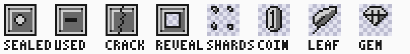
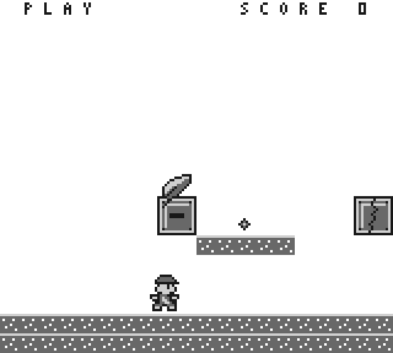

# Interactive block and collectible contract

This is the approved block/collectible contract for
[#303](https://github.com/amichai-bd/nand2mario/issues/303). It adds a block
layer over the unchanged terrain world: head-hit response, conditional
breakage, item release and persistent consumed state.
`src/sw/springtrail/blocks.asm` implements it against the independent
`src/dv/springtrail/blocks_reference.py`, which was frozen before the code.
The [movement contract](MOVEMENT.md) and the [power contract](POWER.md) are
unchanged; this page consumes the `PowerUp` and `GrantStar` entry points that
#302 exported for it.

## Reference boundary

Use kaspermeerts/supermarioland revision
`618d00ed6c330928e106719533c6e294ae5d5726`, [bank0][bank0]. Nothing is
vendored or rebuilt. Routine names locate external evidence only; this
implementation shares no addresses, tables or instruction sequences with it.
Every duration, threshold and coordinate below is an original choice unless a
row says otherwise.

## Confirmed local behavior

| Area | Confirmed rule | Evidence and limit |
| --- | --- | --- |
| Tile categories | The column loader distinguishes four interactive background tile values and routes three of them through a block/item handler. | `LoadNextColumn` checks `$70`, `$80`, `$5F` and `$81`, then `CheckBlockForItem`. Those tile numbers belong to that game's tileset and are not reusable here. |
| Contents lookup | A hit block consults a per-level table keyed by the block's map position rather than by a bit inside the tile. | `CheckBlockForItem` walks a level object list. The list format is level data, not behavior, so only the keyed-by-position shape is adopted. |
| Used state | A consumed block is rewritten in the map to a distinct used tile and stays solid. | `CheckBlockForItem` writes the used tile; no branch restores the sealed tile. |
| Breakage | Breakage is conditional on the player's power status, not on impact speed. | The block-hit path in bank0; the exact status comparison is inside the `INCBIN` dispatcher and is not established. |
| Hidden blocks | A hidden block is not solid until it is hit from below; afterwards it behaves as a used block. | The hidden-block branch in bank0. Its trigger geometry is sprite-relative there and is not a pixel oracle for this game. |
| Coin count | Coins accumulate in a counter separate from the score. | The bank0 coin increment. The bonus threshold and its reward live in the missing dispatcher, so no threshold reward is adopted. |

## Original resolution

The reference is silent or unusable for every quantity below, so these choices
are the contract.

### Layer and geometry

- Terrain is immutable. `world.asm`, `collision.asm` and the generated
  `columns.asm` are unchanged: no block occupies a terrain-solid cell, and no
  block state edits a terrain table.
- A block is a 16 by 16 pixel object anchored at a top-left world tile
  `(column, row)` and covering `column..column+1` by `row..row+1`. All blocks
  sit in rows 10 and 11, so every probe outside those two rows skips the block
  layer entirely.
- The level has exactly four blocks, all beyond the restored ring.
  `BlockTable` is a ROM table of
  `column, row, kind, content` bytes in this order:

| Index | Column, row | Kind | Content | Pixels |
| --- | --- | --- | --- | --- |
| 0 | 38, 10 | item | mushroom | x 304..319, y 80..95 |
| 1 | 52, 10 | brick | none | x 416..431, y 80..95 |
| 2 | 64, 10 | item | coin | x 512..527, y 80..95 |
| 3 | 88, 10 | hidden | star | x 704..719, y 80..95 |

Every block sits beyond column 31, so the thirty-two column ring that a
restart restores and every existing display fixture publishes is unchanged.

- A brick's content is always none; an item or hidden block always has a
  content. The reference model asserts both, so a content-carrying brick is
  rejected at the table rather than handled by an untested branch.
- Every block's bottom edge is y 96. A grounded player's top edge is y 112 and
  the jump profile lifts it 41 pixels, so each block is reachable from the
  ground below it and none obstructs ordinary walking.

### States and solidity

Each block has one state byte: 0 intact, 1 used, 2 broken. `CellSolid` is the
single solidity oracle for player motion, the support probe and the shot. It
returns solid for a terrain cell whose value is 11, and otherwise consults the
block layer:

| Kind | Intact | Used | Broken |
| --- | --- | --- | --- |
| item | solid | solid | not reached |
| brick | solid | not reached | passable |
| hidden | solid only to an ascending head scan | solid to every scan | not reached |

A terrain-solid cell is never overridden, so the block layer can only add
solidity in rows 10 and 11 at the table's columns, or remove the solidity it
added itself. Collision and appearance therefore read the same state byte.

### Head hit and resolution

- The ascending vertical scan in `StepPlayer` records the first solid cell it
  finds as `HitColumn`, `HitRow` and `HitValid`. First means lowest column,
  which is the existing scan order; no nearest-to-center rule is introduced.
- `ResolveBlockHit` runs immediately after `StepPlayer` and before the enemy
  step, the shot, the game timer, fall death, enemy contact, items and the
  goal. It clears `HitValid` and resolves at most one block per update.
- A hit on a cell outside the table, or on a block that is not intact, changes
  nothing. The player still stops under the ceiling, as before.
- An intact item or hidden block becomes used and releases its content.
- An intact brick breaks only while the power state is large or thrower: it
  becomes broken. A small player's hit leaves it intact, with no state, coin or
  effect change.

### Contents

| Content | Effect on release |
| --- | --- |
| coin | `Coins` increases by one and saturates at 255 |
| mushroom | `CALL PowerUp` |
| star | `CALL GrantStar` |
| none | nothing |

Coins do not change the displayed score. The HUD's approved glyph set has no
digit above 4, so the displayed score stays the four legacy collectibles and
`Coins` is an undisplayed counter. No coin threshold grants a reward: the
reference's bonus count and its reward are inside the missing dispatcher, and
this game has no lives, so inventing one would not be reference-backed.

### Release effect

One 16 by 16 effect object exists at a time. Releasing a content or breaking a
brick sets `EffectTile` to the content's tile base (shards for a break),
`EffectX` and `EffectY` to the block's top-left world pixel, and `EffectTimer`
to 16. Every PLAY update, before input and motion, a nonzero `EffectTimer`
decrements and `EffectY` rises one pixel; reaching 0 clears `EffectTile`. A new
release replaces any live effect. The effect is decoration: it carries no
collision and grants nothing.

### Persistence

- Block state, `Coins` and the effect bytes change only inside a PLAY update.
  Pause freezes them with the rest of the world.
- A state change stores the block's column plus one in `BlockDirty`. The next
  `PrepareMap` decodes that block's two columns instead of the entering column,
  publishes them and leaves `OldCameraTile` alone, so the entering column
  follows one update later rather than being lost. The camera moves at most two
  pixels per update, so one update of deferral never skips a column.
- Scrolling away and back re-decodes the column from `BlockTable` and the
  current state, so a used, broken or revealed block keeps its appearance and
  never respawns its content.
- `InitGame` clears all twelve persistent bytes and the scratch behind them,
  so restart and retry restore every block to intact with no duplicate reward.
  The loop clears 38 bytes from C06A, which is every power and block byte.
- The static initial map at 9800 carries terrain only. It covers columns 0..31
  and every block is beyond column 31, so it never omits a block: the camera is
  still 0 while the restoration repaints 9C00 through the same override.

## Artwork

Every pixel comes from the approved terrain group in
[CORE_ART.md](CORE_ART.md); no pixel is new or changed. Each design is a 16 by
16 map of four 8 by 8 atlas tiles in
[terrain-tiles.json](../../../../src/sw/springtrail/assets/core/terrain-tiles.json),
placed by [terrain-maps.json](../../../../src/sw/springtrail/assets/core/terrain-maps.json).
Startup copies atlas tiles 10..33 and 38..45 to VRAM 108..139 with the LCD off.

| Use | Approved map | Atlas tiles | VRAM |
| --- | --- | --- | --- |
| Item block, intact | `sealed` | 10..13 | 108..111 |
| Item or hidden block, used | `used` | 14..17 | 112..115 |
| Brick, intact | `crack` | 18..21 | 116..119 |
| Hidden block, revealed | `reveal` | 22..25 | 120..123 |
| Brick break effect | `shards` | 26..29 | 124..127 |
| Released coin | `coin1` | 30..33 | 128..131 |
| Released mushroom | `leaf` | 38..41 | 132..135 |
| Released star | `gem` | 42..45 | 136..139 |

A hidden block's intact appearance is the surrounding blank background, which
is the terrain value already in the column, so it needs no unique marker. The
broken state is the same blank background. `coin2` stays approved and unused:
the released coin does not animate.

Background placement: within a block the four tiles are base+0 top-left,
base+1 top-right, base+2 bottom-left, base+3 bottom-right. `DecodeColumn`
writes the two tiles of the block's own sub-column into cache rows 8 and 9,
which are world rows 10 and 11, only when the state has a non-blank appearance.
The effect object emits the same four tiles as four OAM entries at
`(0,0)`, `(8,0)`, `(0,8)` and `(8,8)`.





The second view is a source-reference composition of one modelled update, not
an FPGA photograph. Reproduce both from the approved sources and the
independent reference:

```text
python src/dv/springtrail/blocks_preview.py --tag block-review
```

Copy its SVGs into this page's `blocks/` folder and keep the PNGs in workdir.
Unchanged artwork retains its existing approval.

## State and integration boundary

New gameplay state occupies C078..C08F:

| Byte | Meaning and reset |
| --- | --- |
| C078..C07B | Block state 0 intact, 1 used, 2 broken, per table index; reset 0 |
| C07C | Coin count, saturating; reset 0 |
| C07D | Effect tile base, 0 none; reset 0 |
| C07E..C07F | Effect X, signed 1/16 pixel; reset 0 |
| C080..C081 | Effect Y, signed 1/16 pixel; reset 0 |
| C082 | Effect updates remaining; reset 0 |
| C083 | Changed block column plus one, 0 none; reset 0 |
| C084 | Head hit pending; reset 0 |
| C085 | Head hit column; reset 0 |
| C086 | Head hit row; reset 0 |
| C087 | Scan is ascending; reset 0 |
| C088 | Resolving block index; reset 0 |
| C089..C08A | Resolving block column and row; reset 0 |
| C08B | Decoding column index; reset 0 |
| C08C..C08D | Decoding cache base; reset 0 |
| C08E | Decoding sub-column; reset 0 |
| C08F | A dirty pair is awaiting publication; reset 0 |

C084..C08F are per-scan, per-resolution and per-decode scratch, written and
consumed inside one routine or frame, and are not part of the checked
snapshot. C078..C083 are the twelve persistent bytes the snapshot covers.
`BlockDirty` survives the update that sets it, and `DirtyPublish` the frame
that sets it, because the streamer that consumes them runs in the next frame.

The effect appears as four extra objects after the shot only while live; all
other scene bytes are unchanged. Scene preparation and the retained 4480-dot
publication deadline are unchanged. `columns.asm` regeneration is unchanged
because no world tile changes.

Literal anchors fixed independently of DUT output:

- A small player at x=304, y=112 pressing A rises under block 0. On the update
  whose candidate top enters row 11 the scan finds column 38 solid, the player
  stops with its top at y=96, block 0 becomes used and `PowerUp` makes the
  player large with GROW 32.
- The same approach to block 1 at x=416 while small leaves the brick intact and
  changes no state byte. While large it sets the brick broken, and the next
  ascending update passes through the now-empty cells.
- Block 3 is passable from the side and from above while intact: a player
  walking at y=88 through x 704..719 is not stopped, and only an ascending head
  scan reveals it. Once revealed it stops that same walker and supports a fall.
- After block 2 is used, `Coins` is 1 and the displayed score is unchanged. A
  second hit on the same block leaves `Coins` at 1.

## Finite proof boundary

Literal cases in `src/dv/springtrail/blocks_reference.py` and
`test_blocks_reference.py` were frozen before the code. The actual shared SM83
routines run in the short complete CPU harness (`python-bks`), its bounded full
case set in two halves (`python-bka`, `python-bkb`) and one actual consumer
fault (`python-bkx`). The power and motion targets are rerun as affected
regression. The [owning DV plan](../../../../src/dv/springtrail/BLOCKS.md)
records the matrix and measured walls.

[bank0]: https://github.com/kaspermeerts/supermarioland/blob/618d00ed6c330928e106719533c6e294ae5d5726/bank0.asm
