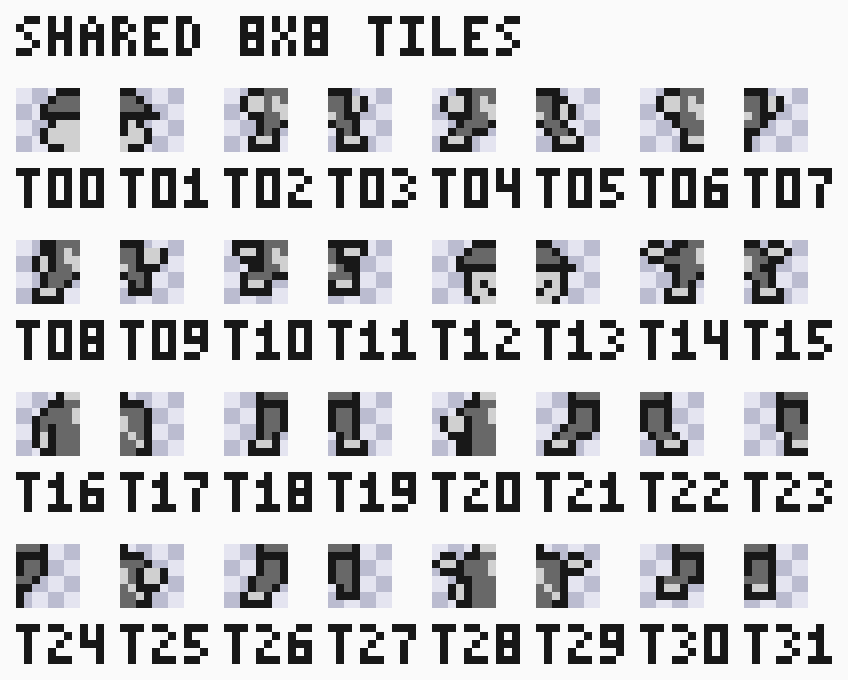
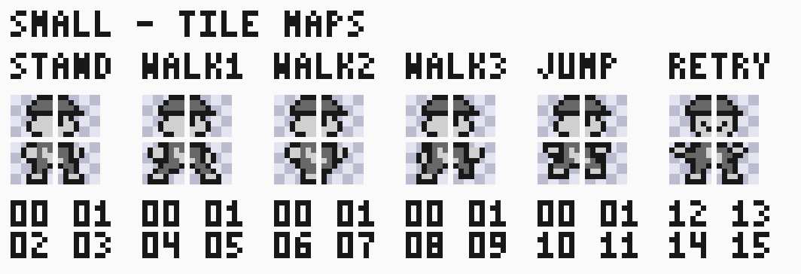
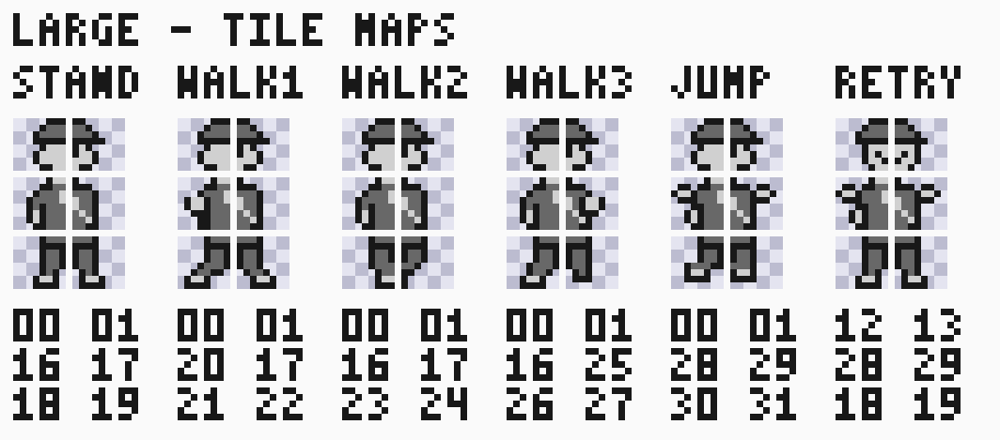

# Approved courier character art

Status: the user approved these original pixel designs on 2026-09-09.
This is an asset reference for planned integration in
[#292](https://github.com/amichai-bd/nand2mario/issues/292), not a change to the
[running game](SPEC.md). Approval covers the depicted pixels, shared tile bank
and small 16x16 / large 16x24 pose geometry. These are original art choices;
they are not verified Super Mario Land 1 character dimensions.

## Tile bank and poses

The [editable tile bank](../../../../src/sw/springtrail/assets/courier/unique-tiles.json)
is the authoritative shade data. It is a 256x8 atlas containing 32 unique 8x8
tiles, indexed 0..31 from left to right. Each tile occupies 16 bytes in standard
Game Boy 2bpp form: two bytes per row, low plane then high plane, with the
leftmost pixel in bit 7. The bank encodes to 512 bytes; twelve separate poses
would use 960 bytes. Both sizes exclude pose tables and other game data.
Reuse is exact tile equality; no flip-based deduplication was applied.



The [pose map](../../../../src/sw/springtrail/assets/courier/poses.json) groups
six named poses under each of `small` and `large`: `STAND`, `WALK1`, `WALK2`,
`WALK3`, `JUMP` and `RETRY`. A piece has `x` and `y` pixel offsets from its
pose's top-left, a zero-based `tile` index, and `x_flip` / `y_flip` flags.
All stored flags are false. Pieces are ordered by row then column, with four
pieces per small pose and six per large pose. Offsets describe artwork
placement; they do not yet specify OAM coordinate bias or gameplay anchors.





The tile-map sheets insert a one-pixel gutter between tiles for inspection.
Gutters, captions and tile numbers are not sprite data. Draw pieces directly
adjacent at their stored offsets. Numbers beneath each pose list its tile IDs
row by row. The renderer shows shade 0 as a transparency checkerboard;
shades 1, 2 and 3 use RGB (208,208,208), (104,104,104) and (24,24,24).
These preview RGB values do not assign an in-game object palette register.

## Reproduction and provenance

The original project art was authored as integer shade grids, then factored
into identical 8x8 tiles by a Python script and rendered with the repository's
[sprite preview tool](../../../tools/sw/SPEC.md). No commercial pixel data is
included. JSON files retain the exact editable source; SVGs are review views.

From the repository root, a fresh preview tag renders the tile bank:

```text
python -m tools.sw.preview src/sw/springtrail/assets/courier/unique-tiles.json --tag courier-bank-review --frame-width 8 --frame-height 8 --scale 8
```

The command writes to `workdir/builds/courier-bank-review/sprite-preview/`.
Its ordinary sheet layout differs from the grouped SVG above. To reconstruct
a pose, start a transparent 16x16 or 16x24 shade grid, extract columns
`8*tile` through `8*tile+7` from the bank, and place those eight rows at `(x,y)`
for each piece. Use the same preview tool on the resulting shade grid.
The SVG layout is explanatory; JSON owns pixel and placement values.

## Integration still pending

[#292](https://github.com/amichai-bd/nand2mario/issues/292) owns loading and
assembling these assets with 8x8 objects, defining facing/mirroring and anchors,
and checking OAM capacity. It must preserve the approved geometry unless the
user approves a later art revision. Reference-game anchor and assembly evidence
remains useful without treating its pixel dimensions as approved replacements.
[#301](https://github.com/amichai-bd/nand2mario/issues/301) owns movement and
animation cadence; [#302](https://github.com/amichai-bd/nand2mario/issues/302)
owns damage and power-state behavior. Pose names are asset identifiers, not a
completed gameplay state machine. Collision boxes, transitions, palette writes
and timing are not established by this art approval. No game layout, assembly,
RTL or existing game asset file is changed here.

The [approved core asset pack](CORE_ART.md) adds player actions, terrain, items,
enemies, platforms, effects, fonts and UI compositions. It retains separate
feature integration and visual approval boundaries.
