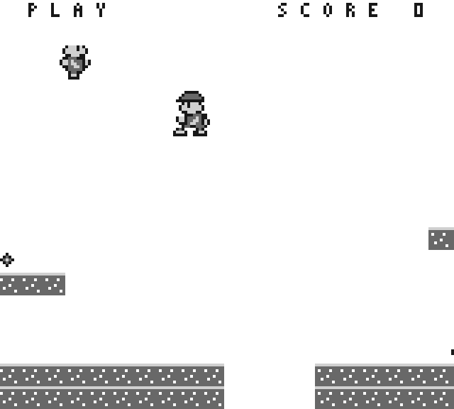
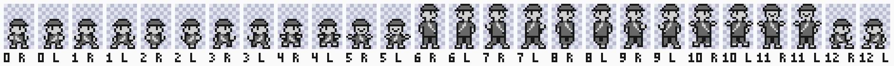

# Courier composition

The [composer](../../../../src/sw/springtrail/courier.asm) emits ordinary OAM pieces.
The [approved courier art](CHARACTER_ART.md) owns the twelve base pose maps.
The [approved core art](CORE_ART.md) supplies the additional small skid pixels.

## Coordinates and allocation

Keep the logical 8x16 collision box and all movement/input/update rules.
The original artwork is centered on that box: its left is floor(PlayerX/16)-4,
its feet are floor(PlayerY/16)+16. Small top is floor(PlayerY/16); large top is floor(PlayerY/16)-8 pixels.
These are intentional original anchors, not claimed SML1 dimensions.
For camera subtraction use full signed pixel coordinates before OAM encoding.
Each 8x8 piece is visible only when -7 <= x < 160 and -7 <= y < 144;
partially visible pieces retain their coordinates. Entirely clipped/hidden pieces
use Y=0. Hardware handles the remaining partial pixel clipping.

Existing tiles 0..41 stay at VRAM8000..829F. The approved 32-tile courier bank
uses IDs42..73, VRAM82A0..849F (512 bytes). OBP0=E4 preserves shade ordering;
shade0 stays transparent. Tiles and map plus courier bank remain in the assets
ROM section0C00..13FF; composer tables/code use a separate ROM1 section at5200, after
collision, with linker overlap checks. Mapperless32768-byte profile is unchanged.

Base pose order is STAND,WALK1,WALK2,WALK3,JUMP,RETRY for small, then large.
All twelve base maps remain supported. The approved small skid adds composer
pose12 and four tiles94..97, VRAM85E0..861F, from core atlas tiles16..19.
The [power contract](POWER.md) adds poses13..17 (large skid, small hurt,
large hurt, crouch, large throw) and the shot tile from core atlas tiles
21..26, 43..45 and54 at VRAM98..107. InitMotionArt copies all fourteen core
tiles (224 bytes) while LCD is off. A six-piece pose is large and raises its
top-left by eight pixels; crouch composes its four visible pieces as a small
pose sharing the same feet.

Normal play renders stored motion poses STAND, WALK1..3, JUMP or SKID in the
current size; motion pose5 selects composer pose12 or13. Title selects STAND
and retry selects RETRY of the current size. Hurt, throw, crouch and growth
overrides follow the [power contract's pose precedence](POWER.md#visible-poses).
Pause/WON preserve the stored motion pose. The renderer never advances the
animation counter. Accepted directional intent sets facing, including at a wall;
reversal hold preserves facing. Neutral initialization/restart faces right.
Whole-pose reflection maps x to8-x and XORs the tile X-flip bit. Approved Y-flip
flags are preserved.

Global LCDC object-size bit is0. Each enemy, pickup and goal uses a vertical pair
of adjacent tiles with unchanged pixels and anchors. Keep player, enemy, four
pickups and goal OAM priority order; one live shot follows the goal. Score and
mode use the background [HUD](HUD_COLUMNS.md), with no OAM entries. Player
pieces are row-major. At most16 small/18 large entries plus one shot are
emitted; the remaining bytes of the 160-byte shadow are zero. At most2 courier
pieces and one from each of7 other objects intersect a scanline: maximum9,
below the hardware10-object limit.
The HUD disables objects on rows0..15; lower pixels of crossing pieces remain.
Use the [HRAM DMA publisher](../../../../src/sw/springtrail/oam_dma.asm)
unchanged, once per prepared publication.

## Finite acceptance

- Exact approved32-tile encoding, all12 pose maps and24 facing reconstructions;
  compare independently assembled shades, palette, offsets and tile references.
- Actual SM83 composer cases cover all24 facings, screen edges, signed camera,
  hidden/partially clipped pieces, stale-tail clearing and current object bounds.
- Existing game state/collision fixtures qualify unchanged rules; independent
  scene expectations cover every other object in global8x8 mode.
- Short actual Intel-preloaded composed pixel proof and one wrong-piece fault
  use fixed expected pixels and the unchanged publisher. Complete a small
  harness first, including pause/terminal/watchdog; freeze exact dot counts
  after code layout. Target120s per simulation/hard300s each, target300s aggregate.
  No full-game replay or FPGA rebuild for artwork alone.
- Required local/hosted checks and independent current-head review. Historical
  ROM/image proofs keep their producer identity; this changed image is new.

## Reference boundary

Pinned SML1 source618d00ed6c330928e106719533c6e294ae5d5726:
bank0 Call_1736 delegates to bank3 Call_4823. That renderer selects coordinate
and tile tables, reflects offsets for facing and emits OAM attributes. This
supports the composition structure only. Our geometry, asset bytes and code
are original; no commercial data or instruction sequence is copied.

## CPU fixture budget

The following budget and composed-image schedule qualify the historical
20-entry scene with OAM HUD. They do not describe the current background HUD.
The [HUD/column matrix](../../../../src/dv/springtrail/HUD_COLUMNS.md) owns current
scene tails, readiness, split pixels and consumer guards. Direct pose geometry
and unchanged gameplay routines retain their scoped qualification.

The32 cases are24 pose/facing calls, four clip/hidden calls, three directional
start/restart scenes and one signed-camera/fractional scene. Poisoning occurs
only initially and before the first full scene. The one-case harness checks
terminal completion and settled pause before full execution.

A longest syntactic branch path through EmitPiece costs at most580 dots;
CourierPiece overhead is bounded by296 per piece and setup220 per pose.
There are140 direct pieces, then four20-piece scenes. Full-scene overhead
includes signed coordinate conversion, state selection and the80-byte tail.
Allow260000 total dots, including both160-byte poison loops, operand writes,
three UpdateGame calls and terminal readiness. The 70-ms simulation watchdog
and 300-second whole-process wall bound remain fixed.

Conservative dot accounting: direct pieces140*(580+296)+28*220=128800;
four scenes at25000 each=100000 (includes their80 pieces, seven signed
coordinate projections, selection and tail clearing); two poison loops7728;
operand/setup instructions10000; three bounded UpdateGame calls12000; terminal
and pause allowance1024. Sum259552 is below260000. These are ceilings, not
claims that the actual execution consumes them. The game and unit image have
identical bytes for all nine shared non-code/non-asset sections.


## Bounded composed proof

The historical pre-background-HUD game proof uses its ROM and all 74 loaded tiles. It checks
all 23,040 pixels of the initial blank frame and all 23,040 pixels of the next
TITLE frame against independent original-art expectations. INPUT 129 is applied
60,000 through 62,000 dots after the initial LCD-enable write. The next visible
interval executes one ordinary update and prepares its complete 160-byte scene.
The following VBlank publishes those bytes through DMA before the test pauses.
It does not claim to capture pixels of that third frame.

The public LCD-enable write supplies the phase origin, not an expected image or
state. Startup must lie between 100,000 and 130,000 dots: the prior 81,352-dot
initialization gains 512 tile bytes at 52 dots each; replacing its at-least
5,996-dot preparation with the conservative 25,000-dot scene bound gives an
upper bound of 126,980 dots. The unchanged UpdateGame bound is below 20,000 dots;
PrepareScene is below 25,000 and dispatch below 1,000. Thus preparation must
finish within 46,000 visible dots, before the same next VBlank at 65,664.

A complete short harness stops after at least 160 blank pixels, with initial
DMA, trace END, ordinary HALT and settled pause checked. The full target has a
285,000-dot progress limit and an 80-ms simulation watchdog. Each execution
retains the ordinary 300-second whole-process limit.

The negative changes tile 42 to tile 0 once at the actual Intel OAM write
boundary of the first LCD-on publication, after checking the original byte.
It skips the initial LCD-off DMA, which would be overwritten before TITLE is
visible. The unchanged full-frame oracle must reject the resulting image.

The older nine-object frame and renderer helpers are historical-only. Their
ROM/source guards reject that composition. Current selected scenes are checked by the motion/power renderers in the
[verification matrix](../../dv/springtrail/SPEC.md#image-binding). The
[complete current composer operand matrix](https://github.com/amichai-bd/nand2mario/issues/492)
remains required coverage. Historical composition checks retain their guards
but have no execution target; historical endurance cannot validate a new ROM.

## Current reference previews



This is an independent expected render from approved source pixels, not a DUT
capture or FPGA photograph. The fixed renderer places the player at world
(120,12), camera97, with WALK2 facing right. A diagnostic secondary small skid
faces left at screen (60,32); it is not an additional gameplay entity. The HUD
clips the player's upper rows while preserving its pixels at y>=16.



Labels are composer pose IDs and R/L facing. IDs0..5 are small
STAND/WALK1/WALK2/WALK3/JUMP/RETRY, IDs6..11 are the corresponding large maps,
and ID12 is the approved small skid. Checkerboard and padding are review aids.
The [power contract](POWER.md#visible-poses) binds large poses and IDs13..17 to
runtime state; the [player-actions preview](core-art/player-actions.svg) shows
those approved sources.

Reproduce both files from an author worktree with a fresh tag:

```text
python src/dv/springtrail/motion_preview.py --tag motion-preview
```

The [reproducer](../../../../src/dv/springtrail/motion_preview.py) uses the fixed
independent renderer expectation and approved pose/asset sources through the
existing SVG tool. It writes to `workdir/builds/<tag>/motion-preview/` and does
not change assets or obtain expected pixels from an execution trace.
