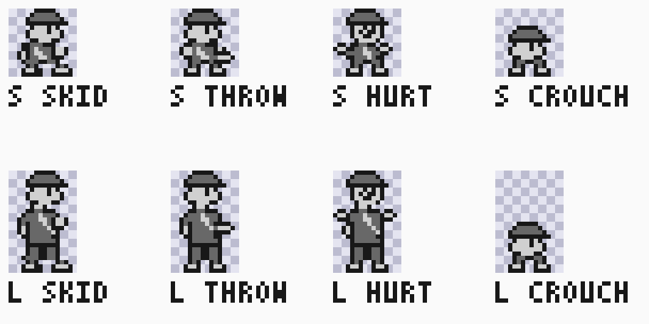
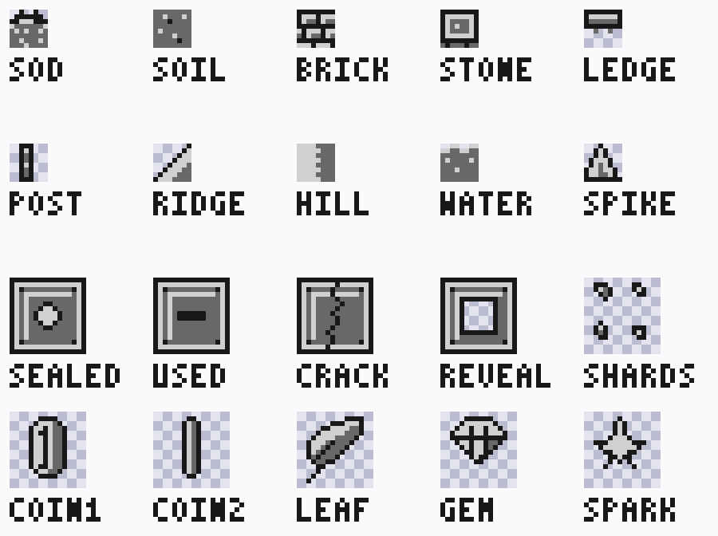
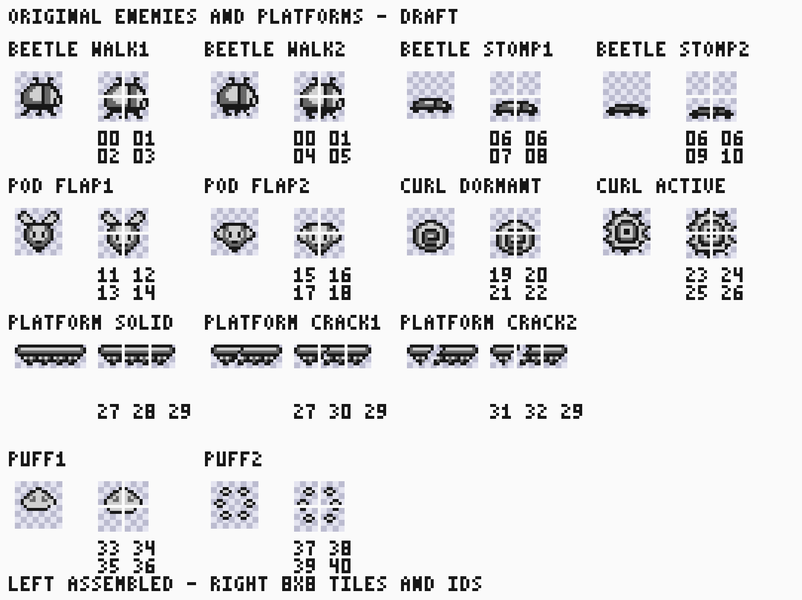
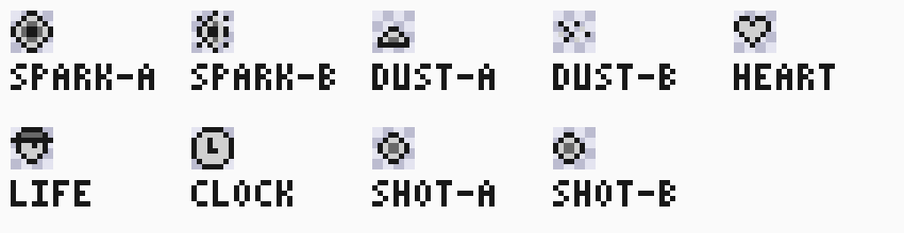
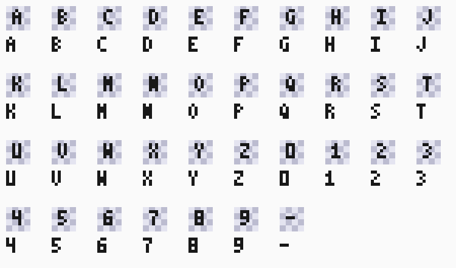
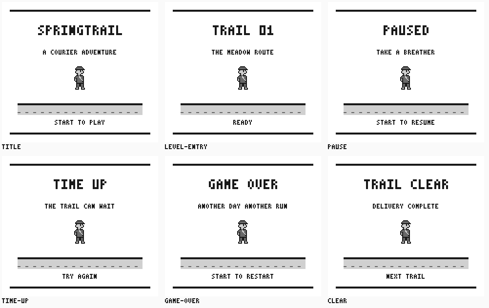
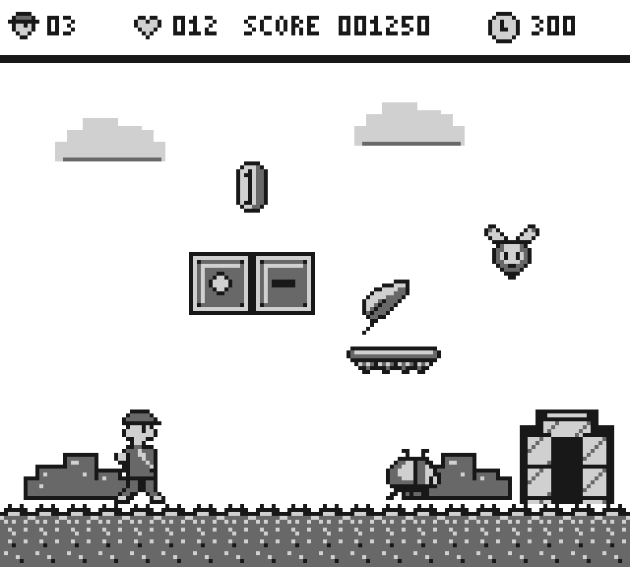

# Approved core game artwork

Status: the user approved every displayed core review sheet on 2026-09-09.
This page extends the [courier reference](CHARACTER_ART.md). All designs are
original project shade grids. The images are scripted review compositions,
not game screenshots or evidence of implemented mechanics.

## Editable sources

The asset owner is [src/sw/springtrail/assets/core](../../../../src/sw/springtrail/assets/core/core-maps.json).
Each group has a one-row 8x8 tile atlas and a named placement map:

| Group | Tile pixels | Asset dimensions and placement |
|---|---|---|
| Actions, effects, font, UI | [core-tiles.json](../../../../src/sw/springtrail/assets/core/core-tiles.json) | [core-maps.json](../../../../src/sw/springtrail/assets/core/core-maps.json) |
| Terrain, blocks, items, scenery | [terrain-tiles.json](../../../../src/sw/springtrail/assets/core/terrain-tiles.json) | [terrain-maps.json](../../../../src/sw/springtrail/assets/core/terrain-maps.json) |
| Enemies and platforms | [enemies-tiles.json](../../../../src/sw/springtrail/assets/core/enemies-tiles.json) | [enemies-maps.json](../../../../src/sw/springtrail/assets/core/enemies-maps.json) |

Pixels are integer shade indices 0..3. Each tile occupies 16 encoded bytes.
Map `width` and `height` describe the full image; each `pieces` entry has an
8-aligned `x,y` placement and a zero-based `tile` index in that group's atlas.
Absent flip flags mean false; explicit `x_flip,y_flip` apply within a tile.
Every image includes a placement for each 8x8 cell, including blank cells.
The twelve original courier poses are reconstructed from their existing owner.
These review bank IDs are not allocated ROM sections or VRAM tile IDs. Banks
remain independent; their union need not be resident simultaneously.

## Approved views and integration owners

### Player actions



Small and large skid, throw, hurt and crouch designs supplement the original
poses. [#292](https://github.com/amichai-bd/nand2mario/issues/292) owns character
assembly; [#301](https://github.com/amichai-bd/nand2mario/issues/301) owns movement
and animation; [#302](https://github.com/amichai-bd/nand2mario/issues/302) owns
power and damage states. Visual approval does not choose collision anchors,
state transitions, frame cadence or optional mechanics.

### Terrain, blocks, items and scenery



[#300](https://github.com/amichai-bd/nand2mario/issues/300) owns world/HUD
integration and [#303](https://github.com/amichai-bd/nand2mario/issues/303) owns
blocks/items. The scene below also shows the cloud, bush and arch sources.
Water/spike and pickup designs do not authorize additional mechanics.

### Enemies and platforms



The historical DRAFT caption is preserved to match the exact approved image;
this page records its approval. [#305](https://github.com/amichai-bd/nand2mario/issues/305)
owns state selection, spawning, collision behavior and integration. Tile gutters
and labels are review overlays, not game pixels.

### Effects, icons and text





These supply dust, sparkle, projectile, life/heart/clock and uppercase letter,
digit and dash designs. The core map also includes the full HUD composition.
Shade zero is transparent for objects but is a visible palette index for
background/window tiles. The review tool's checkerboard is only an inspection
convention; UI screens and the assembled scene show background zero as white.

### Progression screens



[#304](https://github.com/amichai-bd/nand2mario/issues/304) owns progression-state integration under its existing contract. The title and
pause designs are also available to existing UI owners; this approval does not
require a title redesign or broaden that issue. Wording and appearance
are approved; displayed values do not define timers, rewards or progression.
Screen pixel maps are compositions for tilemap integration, not large objects.

### Assembled illustration



The scene combines exact approved sources at illustrative coordinates. It
establishes visual compatibility, not a playable level, OAM capacity proof or
VRAM allocation. Its placement recipe lives in the reproduction helper.
[#306](https://github.com/amichai-bd/nand2mario/issues/306) retains later boss,
vehicle and bonus inventories; those assets are not covered by this pack.
Gameplay contracts may identify additional frames requiring their own review.

## Reproduce and edit

From an author worktree root, run:

```text
python -m tools.sw.core_art --tag core-review
```

The [narrow composition helper](../../../../tools/sw/core_art/__init__.py) reconstructs
all sources and uses [tools.sw.preview](../../../tools/sw/SPEC.md#sprite-review-sheets)
for the approved PNG/SVG layouts. It writes the seven views and per-asset shade
JSON/2bpp files under `workdir/builds/core-review/core-art/`. Use a fresh tag.
No source, wiki or game file is overwritten. The helper's checked-in map inputs
own the pixels; its scene placements and sheet layout own review composition.

For example, inspect the exported small skid pose using the ordinary renderer:

```text
python -m tools.sw.preview workdir/builds/core-review/core-art/core/small-skid.json --tag skid-review --frame-width 16 --frame-height 16 --scale 8 --mirror --labels SKID
```

Follow [game-assets](../../../../.agents/skills/game-assets/SKILL.md) to edit
source, review changed art, integrate selected assets and update specifications.
The focused test checks map bounds, tile flips, 2bpp decode and exact committed
SVG reproduction. Publication does not modify the running game; integration
remains in the named feature issues and the [alignment contract](sml1-alignment.md).
