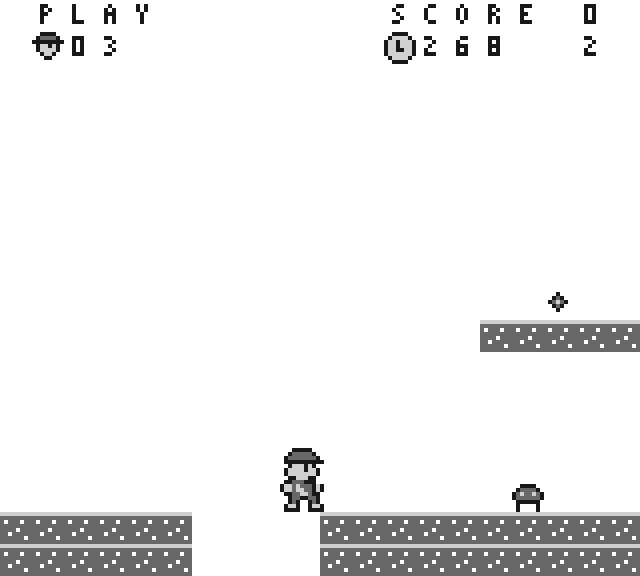
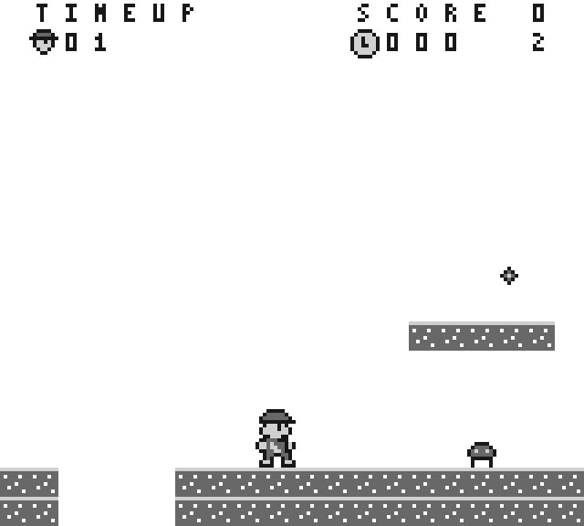
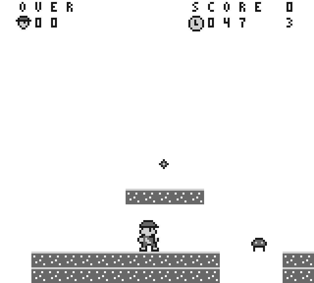
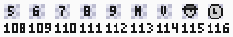

# Lives, timer and stage progression contract

This is the approved progression contract for
[#304](https://github.com/amichai-bd/nand2mario/issues/304). It replaces the
baseline rule that retry restores the whole game and that one goal ends it.
`src/sw/springtrail/progress.asm` implements it against the independent
`src/dv/springtrail/progress_reference.py`, which was frozen before the code.
The [movement contract](MOVEMENT.md) keeps every motion constant; this page
makes its two world bounds per stage. The [power contract](POWER.md) is
unchanged; this page owns what survives a death, a stage change and a reset.

## Reference boundary

Use kaspermeerts/supermarioland revision
`618d00ed6c330928e106719533c6e294ae5d5726`, [bank0][bank0] and
[enemies][enemies]. Nothing is vendored or rebuilt. Routine names locate
external evidence; the original implementation shares no addresses, tables or
instruction sequences. The normal `GameState_00` dispatcher and the world
loaders in banks 1 to 3 remain `INCBIN`, so the reference's per-stage layouts,
its score award per remaining time unit and its exact transition frame counts
are not established. Every value below is an original choice unless the row
says otherwise.

## Confirmed local behavior

| Area | Confirmed rule | Evidence and limit |
| --- | --- | --- |
| Initial lives | Level initialization stores 2 into the lives byte. | `Call_3D1A`, `DA15 - Lives`; the stored 2 counts spare attempts, not remaining deaths. |
| Lives encoding | Lives are packed BCD, adjusted with `daa`, and an award saturates at 99. | `UpdateLives`; two nibbles are written to two adjacent map cells. |
| Life requests | One pending byte carries the request: `$FF` removes a life, any other nonzero value adds one, zero does nothing. The routine clears it after applying it. | `UpdateLives`, `wLivesEarnedLost`; a 1UP pickup writes 1, the death state writes `$FF`. |
| Game over | Removing a life while the count is zero enters the game-over state instead of writing a negative count. | `UpdateLives.loseLife` to `.gameOver`, state `$39`. |
| Death order | The death state clears the power status and only then requests the life loss, so the reload or the game over is decided after the death animation. | `GameState_01`. |
| Timer start | Level initialization stores a 40-frame subdivision and the BCD value 400. | `Call_3D1A`, `$28` then `$00`, `$04`. |
| Timer display | The value is printed as three BCD digits, hundreds first, into three adjacent map cells. | `DisplayTimer.printTimer`. |
| Timer gating | The timer does not advance while the game-over marker is set, nor in states above `$12`. | `DisplayTimer`. |
| Expiry grading | A graded flag records 0 in normal play, 1 below 100, 2 below 50 and 3 at zero; the main loop converts 3 into `$FF` and kills the player. | `.jmp_226`; the thresholds are named in the source comment. |
| Time-up path | A time-up death runs the ordinary death animation and then diverges to the time-up display, which afterwards joins the ordinary dead state. | `GameState_3B`, `GameState_3C`. |
| Stage advance | Clearing a stage increments a level index and a BCD world and level, moving to the next world after three levels. | bank0 level-advance path at `.incrementLevel`. |
| Continue point | Game over records the current world and level for a continue and returns to the menu; an ordinary death reloads the same level. | `GameState_39`, `GameState_38.resetToMenu`, `wContinueWorldAndLevel`. |
| No checkpoint | The reference has no in-level checkpoint: a death reloads the level it was on. | The reload path reads only the current world and level. |

## Original resolution

The reference is silent on this game's stage layouts, its screen budget and its
single-digit score, so the rules below are the contract.

### Stages

Three original stages share one page-aligned 256-column collision world, so
progression costs no extra collision table. `world.asm` is the single literal
source; `columns.asm` is generated from it.

| Stage | Displayed number | Base column | Columns | Camera limit | Player x limit | Goal x | Timer start |
| --- | --- | --- | --- | --- | --- | --- | --- |
| 0 | 1 | 0 | 96 | 608 | 760 | 736 | 400 |
| 1 | 2 | 96 | 80 | 480 | 632 | 608 | 300 |
| 2 | 3 | 176 | 80 | 480 | 632 | 608 | 200 |

Stage 0 keeps every byte, object and bound of the existing world, so all
qualified stage-0 evidence stays valid. The [block layer](BLOCKS.md) keys its
table on the collision page column, and every block sits at page columns 38
to 89, so blocks exist on stage 0 only; the other two stages carry terrain,
items, the enemy and the goal. A collision or display column index is
the stage base plus a local column, so the largest index is 255 and no scan
crosses a page. Every stage starts the player at x 0, y 112.

| Stage | Enemy start, low and high bound | Item boxes, pixel x and y |
| --- | --- | --- |
| 0 | 256, 240, 296 | (96, 88) (264, 72) (464, 88) (656, 80) |
| 1 | 256, 240, 296 | (80, 80) (256, 72) (432, 64) (576, 88) |
| 2 | 288, 272, 328 | (64, 88) (208, 80) (320, 72) (448, 64) |

### Lives

- `Lives` is packed BCD 0 to 99. A reset sets 2, as the reference does.
- `PendingLife` is 0 for no request, `$FF` to remove one and any other nonzero
  value to add one. `UpdateLives` applies it and clears it in the same call.
- An award saturates at 99 and never wraps. A removal at 0 leaves the count at
  0 and enters mode 6 OVER. `UpdateLives` returns 1 when a life was spent or
  awarded and 0 when the removal ended the game.
- Nothing in this release awards a life. The add path exists so the saturation
  and the request encoding are frozen and proved before a reward issue uses it.

### Timer

- `TimerSub` counts PLAY updates within one time unit and reloads at 40, the
  reference's subdivision. `TimerLow` is the BCD ones and tens, `TimerHigh` the
  BCD hundreds. Stage entry loads the stage's start value and `TimerSub` 40.
- The timer advances once per PLAY update, immediately after the power timers
  and before input. It never advances in title, paused, retry, won, time-up or
  over, so a paused or waiting player loses no time.
- A decrement at 000 does nothing; the value never underflows.
- `Expiring` is 0 at 100 or above, 1 below 100, 2 below 50, 3 at 000 and `$FF`
  once consumed. It is recomputed after every decrement.
- A PLAY update that starts with `Expiring` equal to 3 sets it to `$FF` and
  enters mode 5 TIMEUP. The grade is therefore raised on one update and
  consumed on the next, as the reference's main loop does.

### Modes and transitions

Modes 0 title, 1 play, 2 retry, 3 paused and 4 won keep their numbers. Mode 4
now means the stage was cleared; modes 5 TIMEUP and 6 OVER are new.

| Mode | Entered by | A press |
| --- | --- | --- |
| 0 TITLE | reset | enter stage 0 |
| 1 PLAY | stage entry | pause to 3 |
| 2 RETRY | fall death or a hit while small | spend a life and re-enter the current stage, or mode 6 when none remains |
| 3 PAUSED | A while playing | resume to 1; Select resets |
| 4 WON | reaching the stage goal | advance to the next stage, or reset after stage 2 |
| 5 TIMEUP | the consumed zero timer | identical to mode 2 |
| 6 OVER | a life removal at 0 lives | reset |

- A reset sets lives 2 and stage 0 and then enters stage 0, so it resumes in
  mode 1 PLAY exactly as the existing paused Select restart does. It is reached
  from Select while paused, from A in mode 6, and after clearing stage 2.
- Entering a stage resets the player, the enemy, the collected mask, the score,
  every power byte, the timer and `NewLevel`. It never touches `Lives` or
  `StageIndex`.
- Spending a life re-enters the same stage. There is no checkpoint, matching
  the reference.
- `Lives` and `StageIndex` survive a death and a stage change; only a reset
  clears them. `Score` and `Collected` are stage state and clear on every stage
  entry, including a retry, because the approved HUD carries one score glyph.

### Precedence and edges

- PLAY update order: power timers, time-up death, timer tick, power input,
  player motion, enemy patrol, shot, fall death, enemy contact, items, goal.
  The grade is raised by one update and consumed at the top of the next, so a
  zero timer always leaves one visible 000 update.
- Fall death precedes the enemy contact, the items and the goal, so a death and
  a finish in the same update are a death. A consumed time-up precedes all of
  them, so an expired timer beats a goal reached on the same update.
- Every transition mode consumes the A edge and stores the sampled buttons into
  `Previous` and `GamePrevious` before returning, so one held A cannot cross
  two transitions and cannot become a queued jump on the next stage.
- `Collected` is cleared on stage entry and the goal sets the mode, so no
  reward and no stage advance can be taken twice.

## Visible state

The stationary HUD keeps row 0 exactly as the [HUD contract](HUD_COLUMNS.md)
froze it: the mode word in columns 1 to 6, `SCORE` in columns 12 to 16 and the
score glyph in column 18. Row 1 is the progression row, published to both maps.

| Row 1 column | Content |
| --- | --- |
| 1 | life icon |
| 2, 3 | lives, BCD tens then ones |
| 12 | clock icon |
| 13, 14, 15 | timer, BCD hundreds, tens, ones |
| 18 | stage number, 1 to 3 |

All other row 1 cells are blank. The icons are static and published once with
the score label; the six value cells are prepared during visible time and
published in VBlank with the row 0 cache.

Nine approved core tiles join the loaded set at VRAM 140 to 148, after the
[block layer's](BLOCKS.md) terrain copies at 108 to 139:
digits 5 to 9 from `glyph-5` to `glyph-9`, then `glyph-M`, `glyph-V`, `life`
and `clock`. A digit d uses tile 74+d below 5 and 135+d at 5 or above. No pixel
is new or changed; every source is an approved
[core map](../../../../src/sw/springtrail/assets/core/core-maps.json).

The new mode words reuse loaded glyphs only: mode 5 is `TIMEUP` and mode 6 is
`OVER`. `M` and `V` are loaded for them. The approved full-screen
`screen-level-entry`, `screen-time-up`, `screen-game-over` and `screen-clear`
compositions are the design source for this wording; this release integrates
their text through the existing HUD word, which keeps the frozen one-update
publication and the 32 KiB image intact. The published
[progression previews](progress/stage-two.svg) show the row and the two new
mode words, reproduced from the approved sources by
[progress_preview.py](../../../../src/dv/springtrail/progress_preview.py).

## State and integration boundary

New gameplay state occupies C090..C096:

| Byte | Meaning and reset |
| --- | --- |
| C090 | Lives, packed BCD; reset 2 |
| C091 | Pending life request; reset 0 |
| C092 | Timer subdivision; stage entry 40 |
| C093 | Timer BCD ones and tens; stage entry from the stage table |
| C094 | Timer BCD hundreds; stage entry from the stage table |
| C095 | Expiry grade; stage entry 0 |
| C096 | Stage index 0..2; reset 0 |

`C097..C09C` hold the prepared row 1 cache. `InitGame` is the reset;
`EnterStage` is the stage entry; `UpdateLives` is the shared life request
consumer, so a later reward issue writes `PendingLife` rather than the count.
The stage index selects the collision base, the camera and player x limits, the
goal, the enemy bounds and the item boxes through one ROM table, so no bound is
duplicated in code.

Literal anchors fixed independently of DUT output:

- A PLAY update with `TimerSub` 1, `TimerLow` `$00`, `TimerHigh` `$01` leaves
  099, `TimerSub` 40 and `Expiring` 1. The same update from 050 leaves 049 and
  `Expiring` 2. From 001 it leaves 000 and `Expiring` 3, and the next update
  leaves `Expiring` `$FF` and mode 5.
- A PLAY update with `TimerSub` 2 only decrements the subdivision to 1 and
  changes nothing else.
- Mode 2 with `Lives` `$02` and A pressed leaves `Lives` `$01`, mode 1, the same
  stage index, `Collected` 0 and the stage's timer start. With `Lives` `$00` the
  same press leaves `Lives` `$00` and mode 6.
- Mode 4 with `StageIndex` 0 and A pressed leaves `StageIndex` 1, mode 1, the
  stage 1 timer start 300 and `Lives` unchanged. With `StageIndex` 2 the same
  press leaves mode 1, `StageIndex` 0, timer 400 and `Lives` `$02`.
- `Lives` `$99` with `PendingLife` 1 stays `$99`; `PendingLife` becomes 0.
- On stage 1 a player at x 632 cannot move right and the camera stops at 480.
- The stage 2 goal box spans x 608 to 616, so a player at x 600 does not reach
  it and one at x 608 clears the stage.

## Finite proof boundary

Literal cases in `src/dv/springtrail/progress_reference.py` and
`test_progress_reference.py` were frozen before the code. The actual shared SM83
routines run in the short complete CPU harness (`python-gps`), its bounded full
case set in two halves (`python-gpa`, `python-gpb`) and one actual consumer
fault (`python-gpx`). The affected motion, power and flow targets are rerun as
regression. The [owning DV plan](../../../../src/dv/springtrail/PROGRESS.md)
records the matrix and measured walls.

[bank0]: https://github.com/kaspermeerts/supermarioland/blob/618d00ed6c330928e106719533c6e294ae5d5726/bank0.asm
[enemies]: https://github.com/kaspermeerts/supermarioland/blob/618d00ed6c330928e106719533c6e294ae5d5726/enemies.asm
