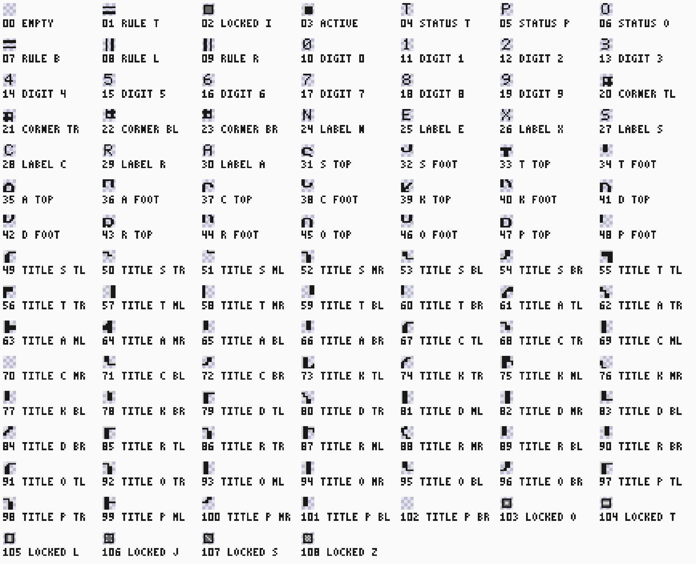
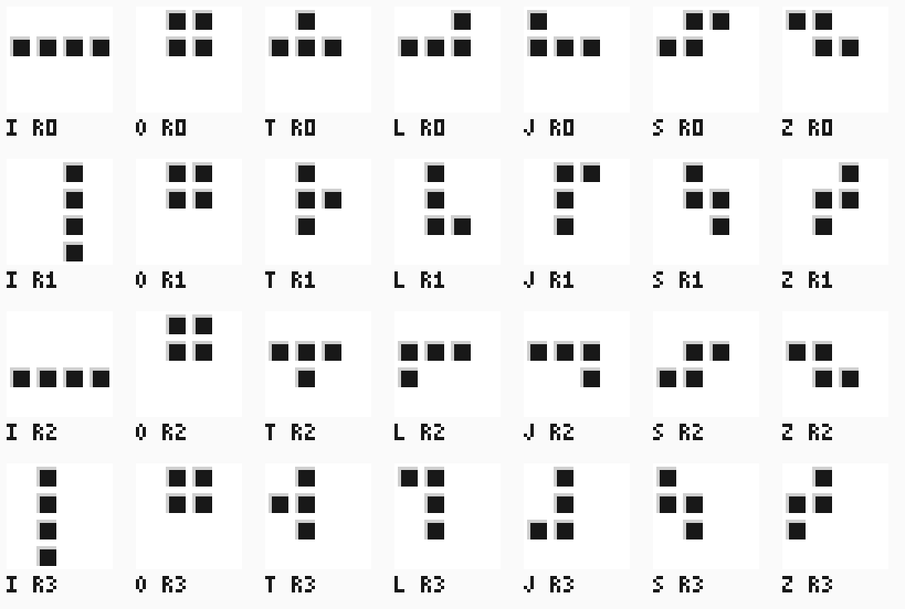
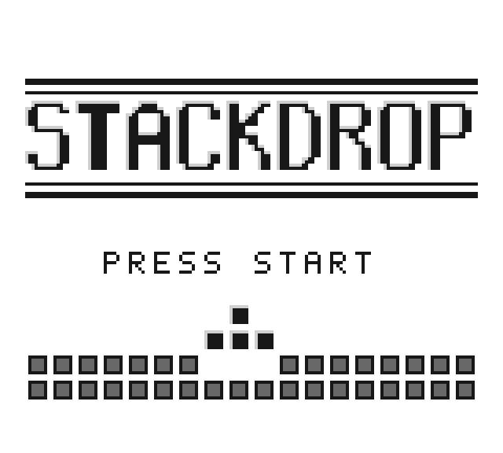
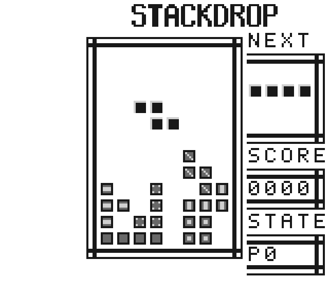
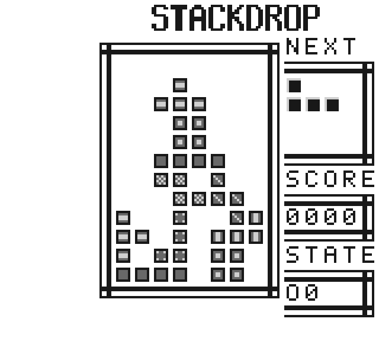

# Stackdrop

Stackdrop is an original, silent falling-block side quest for the existing
32 KiB direct-entry SM83 profile. The [game source](../../../../src/sw/stackdrop/main.asm)
and pixel-based Python strategy do not replace Springtrail
or the hardware milestone criteria. The following rules are frozen for implementation.

## Board and pieces

The well is eight columns by twelve rows, with no hidden rows. Coordinates start
at the upper left. Empty and occupied cells are binary; pieces cannot overlap
occupied cells or cross any edge. The fixed repeating cycle is I, O, T, L, J,
S, Z. These are mathematical four-cell shapes, with original art and layout.
Each uses a 4-by-4 local grid:

| Piece | Spawn cells (x,y) |
|---|---|
| I | (0,1), (1,1), (2,1), (3,1) |
| O | (1,0), (2,0), (1,1), (2,1) |
| T | (1,0), (0,1), (1,1), (2,1) |
| L | (2,0), (0,1), (1,1), (2,1) |
| J | (0,0), (0,1), (1,1), (2,1) |
| S | (1,0), (2,0), (0,1), (1,1) |
| Z | (0,0), (1,0), (1,1), (2,1) |

A piece spawns at local origin (2,0), rotation zero. For I, clockwise rotation
maps (x,y) to (3-y,x); O remains unchanged. For other shapes rotate within their
3-by-3 region using (x,y) to (2-y,x). There are no wall kicks. Reject a colliding
move or rotation without changing state. No random state, held piece, hidden
preview queue, music or speed level is required. Independent table checks require
four distinct occupied cells in every orientation and return to the spawn shape
after four rotations.
## Inputs and update order

Start on the title starts a fresh game; Start after game over returns directly
to a fresh game. Start during play is ignored. A new game clears the board,
score and gravity counter, and starts the cycle at its first I piece. The initial
screen is a title with an empty well. Spawn overlap ends the game.

Read ordinary JOYP once per VBlank, with both row reads forming one software
sample. Actions occur on released-to-pressed edges. Opposed Left/Right cancel;
otherwise move one cell horizontally. Then A attempts one clockwise rotation.
B hard-drops to the last valid row and locks; otherwise Down attempts one row
and resets the gravity counter, locking if blocked. With neither drop edge,
increment the counter; at 60 updates attempt one row, reset the counter and lock
if blocked. Hard drop takes precedence over Down and gravity. Up and Select
have no effect. Holding an action does not repeat it; release is required.

After locking, remove all full rows simultaneously, preserving the relative
order of surviving rows and inserting empty rows at the top. Award 100 points
per removed row, saturating at 9999. Advance the cycle and spawn immediately,
then prepare the next image. A new piece receives no further actions in the locking update.
The previous input sample persists across spawning and restart, preventing a
held button from becoming a new edge. Gameplay advances only on frame updates;
host HALT is separate and freezes emulated time through the existing interface.

## Visible encoding

Use original background tiles with identity palette E4. The 103-tile atlas in
[assets/tiles.json](../../../../src/sw/stackdrop/assets/tiles.json) is the
editable source; `ASSET "Tiles"` emits it at `Tiles`, and initialization copies
all 1648 bytes to $8000 before enabling the LCD. Every frame rule, corner, label,
marquee letter, title letter and panel box belongs to the one 1024-byte
background map copied at the same time, so decoration costs no per-frame work
and the prepared image stays118 bytes.

The well begins at pixel (48,24); each cell is one 8-by-8 tile. Empty cells have
shade0 interiors, locked cells shade2 interiors, and active cells shade3
interiors. Locked cells add a shade3 outline and active cells a shade1 top-left
bevel; both lie in the outer ring, so the center 4-by-4 classification region
stays one shade. Borders and original tile details must not obscure that region.
The well's fixed rectangle is the public visual coordinate system.

A heavy double-ruled frame encloses the well from tile (5,2) to (14,15): each
edge tile carries one thin outer line and one two-pixel inner bar, with four
corner tiles mitring them. The original marquee STACKDROP fills tile rows0..1
at columns 8..16, centred over the frame and panels, one 7-by-11 letterform per
column across two stacked tiles.

Separately framed stats boxes run down tiles15..19, each open against the well
frame and titled in uppercase 5-by-7 letters: NEXT, SCORE and STATE. A
next-piece preview occupies a 4-by-4 tile box at (120,32), using the same spawn
geometry. Four original decimal digit tiles at (120,88) display the score with
leading zeroes. A fixed status tile at (120,120) visibly distinguishes playing
(P) and game over (O); the prepared title image still carries the letter T
there, but it is never displayed. An original decimal tile at (128,120) shows
rotation0..3, including visually equivalent I/O orientations. Document the
literal tile atlas beside its source. Decode board, active cells, next piece,
digits and status from these rendered pixels, rejecting unknown or mixed
encodings, including a T status tile on the play page. No gameplay WRAM reads,
sprite MMIO shortcut or RTL debug port is part of the host interface.

### Title page

The title state shows a separate static page: two double-rule dividers, the
word STACKDROP in large original letters, the prompt PRESS START in the panel
letters, and a falling T above a two-row locked stack with its slot. The letters
are the marquee letterforms at twice the size, 14 by 22 pixels in a 16-by-24
cell, with a shade1 bevel along the top and left edge of every stroke; six
tiles per letter, 49..102 in the atlas, laid out in screen columns 1..18, rows
4..6. The prompt sits in row10, columns 4..14.

The page lives in the same 1024-byte map. A 32-by-32 map cannot hold two
20-by-18 pages, so the title occupies the rows and columns the play view never
shows: initialization writes SCY128 and SCX160 before enabling the LCD, and
screen cell (x,y) shows map cell ((20+x) mod 32, (16+y) mod 32). The two views
intersect only at map rows 16..17, columns 0..7, which both keep zero; the STATE
box bottom (row16, columns 15..19) and the marquee (rows 0..1, columns 8..16)
lie outside the title view, and every map cell outside the two views is zero. The independent [layout](../../../../src/dv/stackdrop/screen.py)
`page()` builds the whole map and the ROM table must equal it.

The relaxed constraint is one scroll register write at the title-to-play
transition, not per frame, and no map cell is ever rewritten. The frame loop
decides before HALT, in visible time, whether the game has started while the
title page is still shown: 32 dots per frame during play, 56 during the title,
none inside VBlank. On that one frame, after the unchanged 4472-dot
ReadButtons/Render bracket, it writes SCY0 and SCX0 and records the shown page,
28 dots for the two register writes and 44 in total, so the scroll changes in
the VBlank that copies the first playing image and no intermediate frame is
shown. The composed check requires both writes inside that VBlank after the
copy's last VRAM write. The title is reached only at reset, so this write
happens once per boot; game over returns to play on the same page.

At each VBlank, sample both JOYP rows, copy the previously prepared image to VRAM, then calculate the sampled action and prepare the next image in ordinary WRAM during visible time. The resulting state becomes visible at the following VBlank: this one-frame pipeline delay is intentional. Initialization prepares the title before enabling LCD. Each update must finish before the next VBlank, including the worst lock, multiple-clear and score case; the prepared map copy must fit within4560 dots. Actual CPU timing checks cover both bounds. All map changes complete in VBlank before the next visible image. The game
uses ordinary CPU code, VRAM and JOYP; it does not disable LCD around updates
or replace the existing PPU. Hardware snapshots are complete immutable images,
not every-frame verification. During manual play the agent may HALT, inspect a
snapshot, decide an action, then INPUT/RUN/HALT through normal commands. It must
retain actual applied and paused dots, release edges and frame metadata rather
than assuming host sleeps advance an exact number of frames.

## Previews

The views below are generated from the built ROM: the tile bytes at `Tiles`,
the initial map at `Map`, the shape table at `Shapes`, and the BGP, SCX and
SCY values the code stores, composed where `Prepare` and `Render` place them.
The game draws only background tiles; it has no object tiles or window.



The bank sheet shows shade 0 as the review checkerboard; on screen it is
BGP colour 0. Tiles 1, 7, 8, 9 and 20 to 23 rule the frames, 24 to 30 spell the
panel labels, 31 to 48 carry the marquee halves and 49 to 102 the six tiles of
each title letter; tiles 4, 5 and 6 are the status letters and double as label
letters.









The title is the first image the ROM displays, composed from the map through
the initial SCX/SCY; the play and game-over screens use the scroll the
transition writes. The frozen [title fixture](../../../../src/dv/stackdrop/fixtures/title.json)
holds the same image in snapshot packing with its CRC32 and SHA-256, so a board
capture compares pixel for pixel; `test_screen` proves it equals the
independent composition. The play screen shows the
state the [independent rules model](../../../../src/dv/stackdrop/reference.py)
reaches after the input script recorded in the generator: six locked pieces,
a falling Z, the I preview and no cleared rows. The game-over screen continues
that script with four more hard drops until a spawn fails. Regenerate with a fresh tag
from the worktree root:

```text
python -m tools.sw.program_art --tag program-review
```

The command writes `workdir/builds/program-review/program-art/stackdrop/`; the
five SVG files are copied here unchanged. Unchanged inputs reproduce identical
bytes; the [focused test](../../../../tools/n2m/tests/test_program_art.py) checks
the committed views and compares the composed frames with the frame oracle.
The [tool contract](../../../tools/sw/SPEC.md#program-previews) owns the generator.

## Finite verification

Independent integer rules and literal images cover every piece rotation,
edge/stack collision, both drops, locking, single and multiple clears, score
saturation, spawn failure and restart. An original CPU unit ROM calls the same
linked game routines and reports through existing passive public write traces;
no expected state is embedded in that ROM. A deliberate changed result must
fail the unchanged checker. A short actual-system test checks startup, input and
rendering through the existing Intel preload and continuous Python facilities,
including normal completion and final pause. Target 120 seconds per simulation;
the existing 300-second whole-process hard cap remains in force.

The manual FPGA proof uses the reviewed board build and verified setup, complete
UART upload/readback, and snapshot-derived action choices. Show legal movement,
rotation, hard drop and a scored line clear from a fresh game, retaining full
images and journals. End PAUSED, UART selected, input/effective mask zero and
session certain. Stop on uncertain transport completion. Automated play uses the
comparative higher-score proof below.

## Pixel player comparison

The pixel player uses the immutable rendered snapshot, including the visible
rotation digit and next-piece preview, to identify the active piece and board.
It rejects ambiguous geometry and stale frame identities. It reads no gameplay
WRAM. Each decision is retained with the actual frame and resulting UART action.

Freeze two runs before physical execution: baseline always hard-drops; strategy
enumerates reachable placements using legal left, right and clockwise rotation
edges, then hard-drops. Score each resulting board as 1000 times cleared rows,
minus50 times holes, minus5 times summed column heights, minus2 times adjacent
height differences. A hole is an empty cell below an occupied cell in its column.
Prefer higher score, then fewer actions, then lexicographic action order
Left, Right, Rotate, Drop. There is no lookahead or parameter tuning between runs.

Both runs load the same original ROM f2a9b159743a202541dd17dedaa99ffcc7ebf6d9d7012b28f4701a0ac9aed927,
start a fresh game, and stop after eight issued B-edge actions or game over.
This is not eight total piece locks: gravity may lock a piece during an action.
Each has the
same64-action ceiling and300-second whole-process deadline, including cleanup.
An action-limit or deadline failure is incomplete evidence, not a selected score.
The strategy must obtain a strictly higher visible score than the baseline;
all outcomes remain recorded without selecting a favorable restart.

Before each edge, advance neutral input across at least two actual frame periods;
hold the chosen edge across at least three. Measure progress through public dots,
not wall-clock sleeps. Decode a new complete image after each action and plan
again from that observation so gravity or pipeline latency is not hidden state.
Execute only the first edge of the selected path, never the entire stored path.
Use the existing verified device/build, immutable package, durable session,
machine lock and packet journals. Warm load derives the new epoch from the
observed old epoch plus two; it does not reset session history. End each certain
session PAUSED with UART input zero; uncertain completion remains blocked.
