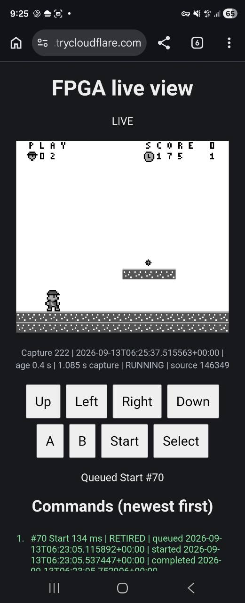

# Live FPGA viewer

View and control the image already loaded on the FPGA from a phone browser.
The host reads actual 160×144 packed pixels over UART and publishes native PNGs;
it does not render a host-side game or reload, reset or program the board.
This is framebuffer evidence, not a camera view or physical-monitor proof.
The [host contract](SPEC.md) owns UART, session and snapshot semantics.



Owner-provided phone capture of the actual FPGA viewer. The supplied JPEG is
unchanged; it illustrates the phone interface, not a physical monitor or an
independent native-pixel comparison.

## Setup

Verify the [board setup](../../../src/board-bring-up.md), selected healthy UART
endpoint, wiring and voltage, reviewed ABI/build identity, and canonical session
certainty before use. The existing image must be valid, with UART input authority
and effective input 0. The worker accepts PAUSED or RUNNING; it resumes a paused
image with neutral input. It never generates game commands automatically.

Keep device selectors, build identity and credentials in private local files or
shell variables. Do not publish them in source, URLs, shared logs or PR text. Initialize
high-entropy credentials once:

```powershell
python tools/fpga_viewer.py --init-credentials --credentials workdir/private/viewer.json
```

Run from the repository or retained runtime checkout. Replace the example
variables with verified local values. Keep the process alive while using the page:

```powershell
$ViewerPort = '<selected UART port>'
$ViewerVid = '<selected USB VID>'
$ViewerPid = '<selected USB PID>'
$ViewerIdentity = '<exact selected device identity>'
$ViewerBuild = '<reviewed 32-digit lowercase wire build ID>'
$ViewerOrigin = 'https://<current tunnel hostname>'
python tools/fpga_viewer.py --credentials workdir/private/viewer.json `
  --expected-build-id $ViewerBuild --uart-port $ViewerPort `
  --uart-vid $ViewerVid --uart-pid $ViewerPid --uart-identity $ViewerIdentity `
  --seconds 3600 --port 8765 --input-origin $ViewerOrigin
```

Omitting `--tag` creates one unique tag in the parent and passes it unchanged to
the worker. The startup line reports it. An existing explicit runtime tag is
refused; rerun without `--tag` rather than deleting prior artifacts.

The server binds only `127.0.0.1`. A separately managed, pinned official
[Cloudflare Quick Tunnel](https://developers.cloudflare.com/cloudflare-one/networks/connectors/cloudflare-tunnel/do-more-with-tunnels/trycloudflare/)
can expose that loopback port through temporary HTTPS without router changes or
a global installation. Verify the portable release and its published checksum.
A representative command, using the already-qualified local executable, is:

```powershell
& $QualifiedCloudflared tunnel --config= --no-autoupdate `
  --metrics 127.0.0.1:20241 --url http://127.0.0.1:8765
```

Use the resulting HTTPS origin in `--input-origin`; do not infer it from forwarded
Host headers. The tunnel hostname can change on restart. The viewer does not start,
change or stop a user-owned tunnel. Give the URL and private credentials only to
intended users. Every image, status and input request requires authentication.

## Phone controls and command history

The page shows actual pixels at a sharp integer scale, capture age, source frame,
core state and measured capture latency. Measured captures take about 1.1 seconds;
the normal capture interval is about 2 seconds. These are observed timings, not a
frame-rate guarantee. A static game image can still be fresh when its source
sequence and completion dot advance.

To play the board locally with held buttons instead of taps, and a monitor
instead of captured frames, use the [on-screen pad](GAMEPAD.md); it takes the
same locks, so only one of the two can run at a time.

Eight tap buttons provide Left, Right, Up, Down, A, B, Start and Select. Each tap
queues a fixed 134 ms press, with no automatic repeat or held-button mode. The
page reports its accepted ID or a queue-full, busy, stopped or rejected response.
It does not expose arbitrary UART operations, image loading, reset, configuration,
file access or uploads.

Before each capture, including the first, the single UART owner freezes the
currently published FIFO batch under the producer lock. It executes that whole
batch in order, releasing and verifying input 0 after each press, then performs
one complete SNAPSHOT and all 5760 READ_FRAME bytes. In stepped mode each press
holds its mask across its own step before that release, and a batch with no press
takes one step of its own; the step is emulated time, not a frame readback, so
nothing interleaves with one. Arrivals during a batch or capture wait for the
next batch.
At most 16 requests can be pending; a finite batch prevents capture starvation.

A local operator can also submit a mask from the generated eight-button contract
with a duration from 1 to 1000 ms, without opening a second UART connection:

```powershell
$ViewerTag = '<reported-running-tag>'
python tools/fpga_viewer.py --tag $ViewerTag --queue-mask 1 --press-ms 134
```

In free-run, durations are approximate monotonic host time after the input
acknowledgement, not exact emulated frame counts. Stepped mode ignores the
requested milliseconds: see below. A full local batch can add about 16 seconds plus
UART acknowledgements before the next capture. During that time the page shows
PROCESSING INPUTS and the real age of the previous image, not false freshness.

History is newest first. Each record includes its assigned ID, the button or mask
of a press or the selected mode, its queued timestamp and its observed
start/completion timestamps. A press record keeps its requested `milliseconds`.
A press retired in free-run shows that duration, `Right 134 ms`. A press retired
in stepped mode carries the same `step` report as its receipt in the run result,
and the page shows the step instead of the ignored milliseconds: `Right 1 step,
70224 dots`, or `Right 1 step, 35112 of 70224 dots` after a short step. The
page, `/status.json` and `result.json` read the same record.
Labels accompany all colors:

| State | Color | Meaning |
| --- | --- | --- |
| QUEUED | Blue | Accepted for a later batch. |
| EXECUTING | Amber | The worker has begun the request. |
| RETIRED | Green | Press completed and release 0 was verified. |
| FAILED / UNCERTAIN | Red | Completion or release was not established. |
| CANCELLED | Gray | Stopped before normal completion. |

Retain the latest 50 terminal records plus every queued/executing record. Atomic
history updates share the producer lock with admission, so an old queued update
cannot overwrite execution. History polling never accesses UART. Persistence
failure cannot skip release of an already-pressed key or report false retirement.

## Free-run and stepped modes

Two buttons select the mode; the page reports the active one, and in stepped mode
the step size and the emulated time advanced for the image being shown.

**Free-run** is the default and the unchanged behavior: the board runs
continuously between captures, so the page is the real-time evidence that the
image advances on hardware at native speed.

**Stepped** pauses the core and advances the declared step through `host run-dots`
during each capture cycle. The step is whole frames of 70224 dots,
`--step-frames` at launch, default one frame and at most 60. A game with real
gravity then moves only when the operator acts, instead of running ahead of a
capture loop that observes it about every 2 seconds.

**A stepped press lasts exactly one step, not its requested milliseconds.** The
paused core executes no dots, so wall time with a mask applied would advance
nothing and the game would never see the press. Each press instead holds its mask
across its own step, and is released and verified afterwards exactly as in
free-run. A batch of three presses therefore advances three steps, one per press,
each observed by the core; a cycle with no press advances one step of its own.
The requested 134 ms, and any local `--press-ms`, are ignored while stepped, and
the [history](#phone-controls-and-command-history) reports the step instead.

**A stepped session is not a real-time proof.** Emulated time advances only when
the viewer chooses to advance it, so a stepped capture shows correct pixels for
the dots that were executed and says nothing about sustained native-rate
behavior. Use free-run for that claim.

Each stepped capture records how many steps it took and their total requested
dots, executed count, final completed dot and completion reason. `host run-dots`
may report STOPPED with fewer dots than requested; the viewer ends that step,
publishes the shortfall with the image it belongs to, and shows it on the page.
A short step is never silently topped up or hidden.

Mode selection is viewer policy over existing host commands. It adds no RTL, no
wire protocol change, no new UART opcode and no change to any game; entering
stepped mode sends HALT and leaving it sends RUN, both already used by the
viewer, and the core state is verified after each transition.

A mode change travels through the same FIFO as a press, so it is ordered with
the presses around it and cannot skip the release and verification of an
in-flight batch. Applying it sends no UART traffic of its own, so it cannot
leave a key pressed, and the session keeps its certainty and effective input 0.
A mode change occupies one of the 16 queue slots and is retained in history like
a press.

## Access and freshness boundaries

Authenticated GET routes are `/`, `/status.json` and `/frame.png`. The sole write
route is POST `/input`: one named button or one mode name in at most 64 bytes of
JSON, exact equality with the configured HTTPS Origin, and `X-Viewer-Input: tap`
are required in addition to Basic authentication. Mode selection carries exactly
that authentication; an unknown mode, a body naming both a button and a mode, and
a mode without the Origin or header are all refused without queuing anything.
No permissive CORS response is provided; GET never mutates input. Responses
disable caching, framing and external asset access.

HTTP handling is capped at 8 concurrent handlers with 5-second socket timeouts.
The worker retains 32 recent capture/input receipts plus a total capture count.
The complete image/status pair is published atomically. An image request with
`v=<capture sequence>` receives 409 if that generation is no longer current; the
page retries rather than pairing different captures' pixels and metadata.

LIVE requires a recent successful capture with increasing source sequence/dot
inside the same reset epoch. Duplicate source marks STALE; capture errors mark
ERROR. Failed capture never refreshes the last-success timestamp. The page also
ages to OFFLINE / STALE if polling stops. One certain rejected capture may retry
on the next interval; a second consecutive rejection stops the worker. Protocol
uncertainty permits no further UART traffic or automatic retry/reset.

## Lease, shutdown and retained runtime

The 60-minute operational lease uses the existing endurance process-tree
supervisor: 3600 seconds selects an actual 3630-second whole cap, with forced tree
cleanup reserved in the last 12 seconds. This does not alter simulation budgets.
A 30-second proof selects a 60-second cap. The worker observes lease expiry during
button waits and between requests so ordinary cleanup can precede forced expiry.
These are operational limits, not a new endurance milestone.

Create `STOP` in `workdir/builds/<reported-tag>/live-viewer/`, or send the local
console interrupt, to stop normally. STOP-file waits are checked every 20 ms,
excluding ongoing bounded UART commands. Admission closes under the producer
lock; pending requests receive cancellation records without UART traffic. Claimed
requests are never replayed after a crash. Normal shutdown halts the core,
releases input 0 and verifies PAUSED/effective 0/certain. Uncertainty instead stops
traffic and reports cleanup unverified. Forced process termination is not proof
of a safe board state.

A dead process can leave a session lock. Verify the recorded owner is dead and
session certainty under exclusive access before using existing lock-recovery
procedures. Never reclaim a live owner's lock by age or clear an uncertain
session merely to reconnect. A crashed producer lock similarly fails closed and
requires inspection.

Preserve the active checkout, private credentials and runtime artifacts while a
viewer runs; ordinary PR cleanup must not kill it. Stop and verify a safe board
state before changing imported runtime source. A manually started tunnel remains
its user's responsibility after viewer shutdown.
